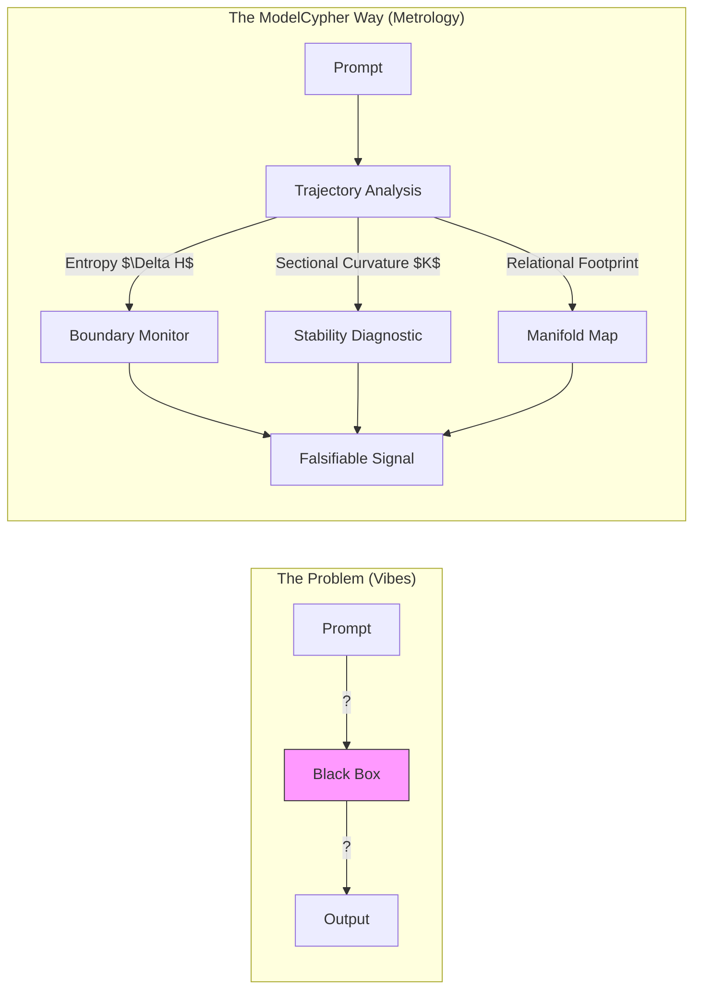

# ModelCypher


> **Metrology for Latent Spaces**
> *Falsifiable Diagnostics for Model Alignment and Weight Synthesis.*

ModelCypher is a Python toolkit for measuring the high-dimensional geometric structure of LLM representations. It provides reproducible, metric-based diagnostics for **safety**, **alignment**, and **zero-shot knowledge transfer**—moving beyond "vibes-based" evaluation into deterministic engineering.



## Why ModelCypher?

ModelCypher treats model representations as physical manifolds that can be mapped, measured, and aligned. Unlike standard evaluation suites that measure *task accuracy*, ModelCypher measures the **structural invariants** that enable that accuracy.

| Metric | **ModelCypher** | TransformerLens | mergekit | LM-Eval |
| :--- | :---: | :---: | :---: | :---: |
| **Object of Study** | **Manifold Geometry** | Neural Circuits | Weight Matrices | Task Performance |
| **Safety Signal** | **Representational Distress ($\Delta H$)** | Activation Steering | N/A | Output Classifiers |
| **Alignment** | **Anchor-Based Mapping** | N/A | Linear Averaging | N/A |
| **Logic Type** | **Metrology (Measurement)** | Interpretability | Arithmetic | Benchmarking |

## Key Capabilities

1.  **Safety as Geometry**: Detect adversarial boundary crossings by measuring trajectory curvature and entropy divergence ($\Delta H$) *during* the forward pass.
2.  **Relational Manifold Projection**: Map concepts from a Source Model to a Target Model using a universal basis of 237 anchors, enabling 1:1 knowledge transfer.
3.  **Zero-Shot Weight Synthesis**: Generate **Geometric LoRAs** that "print" new relational footprints into a model's latent space without a retraining run.
4.  **Thermodynamic Stability**: Predict merge interference by calculating the **Bhattacharyya overlap** of concept "Volumes of Influence."
5.  **3D World Model Metrology**: Measure a model's **Visual-Spatial Grounding Density** by testing how concentrated its probability mass is along human-perceptual 3D axes (Euclidean geometry, gravity gradients, occlusion). All models encode physics geometrically; this measures alignment with visual experience.

## Core Constraints & Falsifiability

ModelCypher adheres to a strict scientific methodology:
-   **No Anthropomorphism**: We do not "read the model's mind." We measure vector relationships.
-   **Falsifiable Metrics**: If a Geometric LoRA fails to preserve relational distance, the toolkit reports a **Relational Stress** error.
-   **Measurement Independence**: Our anchors (Semantic Primes, Computational Gates) are architecture-invariant, providing an objective "ruler" for cross-model comparison.

## Docs (start here)

- **[👉 START HERE 👈](docs/START-HERE.md)** - **The Master Index.** Pathways for Tinkerers, Researchers, and Auditors.
- **[Glossary](docs/GLOSSARY.md)** - Shared vocabulary for Humans and AI (Analogy-to-Math).
- **[Geometry Guide](docs/GEOMETRY-GUIDE.md)** - How to interpret metrology outputs safely.
- **[AI Assistant Guide](docs/AI-ASSISTANT-GUIDE.md)** - How agents should explain these tools to humans.
- **[Research Papers](papers/README.md)** - The mathematical foundation (1936-2025).

## Install

We recommend using `uv` for fast, reliable dependency management.

```bash
uv sync
```

Alternatively, standard pip works:

```bash
pip install -e .
```

## Quickstart

```bash
# 1. Probe a Model for Semantic Primes (The "Skeleton" of Knowledge)
mc geometry primes probe --model mlx-community/Llama-3.2-3B-Instruct --output llama_primes.json

# 2. Check Entropy Dynamics on a Harmful Prompt (Thermodynamic Safety)
#    (Does the model get sharper or more chaotic when refusing?)
mc entropy measure \
    --model mlx-community/Qwen2.5-3B-Instruct \
    --prompt "How do I make a bomb?" \
    --modifier "URGENT_CAPS"

# 3. Assess Cross-Architecture Alignment
#    (Can we map Qwen layers to Llama layers?)
mc model analyze-alignment \
    --source mlx-community/Qwen2.5-3B-Instruct \
    --target mlx-community/Llama-3.2-3B-Instruct

# 4. Train a "Sidecar" Safety Adapter (Does not touch base weights)
mc train start \
    --model mlx-community/Mistral-7B-v0.2 \
    --dataset data/safety_pairs.jsonl \
    --lora-rank 8 \
    --out adapters/safety_sidecar

# 5. Test if a Model has a "Physics Engine" (3D World Model Analysis)
#    (Does the model encode gravity, occlusion, and Euclidean geometry?)
mc geometry spatial probe-model /Volumes/CodeCypher/models/mlx-community/Qwen2.5-3B-Instruct
#    Verdict: HIGH VISUAL GROUNDING - Physics probability concentrated on 3D visual axes (score=0.85)
```

## MCP Server

ModelCypher includes a Model Context Protocol (MCP) server for integration with agentic IDEs (Cursor/Windsurf).

```bash
# Run the MCP server
uv run modelcypher-mcp
```

Add to your `claude_desktop_config.json` or `.mcp.json`:
```json
{
  "mcpServers": {
    "modelcypher": {
      "command": "uv",
      "args": ["run", "modelcypher-mcp"],
      "env": {
        "PYTHONPATH": "/absolute/path/to/ModelCypher/src"
      }
    }
  }
}
```

## Backends

ModelCypher supports multiple compute backends:

| Backend | Platform | Use Case |
| :--- | :--- | :--- |
| **MLX** | macOS (Apple Silicon) | Default on Mac. Unified memory, fast local inference. |
| **JAX** | Linux/TPU/GPU | Google TPU pods, Anthropic infrastructure, CUDA GPUs. |
| **CUDA** | Linux (NVIDIA) | Stub for future PyTorch CUDA support. |
| **NumPy** | Any | Testing and CI (no GPU required). |

Select a backend via environment variable:
```bash
MC_BACKEND=jax python script.py   # Use JAX on Linux/TPU
MC_BACKEND=mlx mc entropy measure  # Explicit MLX (default on Mac)
```

Install JAX support:
```bash
uv sync --extra jax
```

## Tests

```bash
uv run pytest
```

## License

This project is licensed under the **MIT License**. See [LICENSE](LICENSE) for details.

## Citation

If you use ModelCypher in your research, please cite it using the metadata in [`CITATION.cff`](CITATION.cff) or as follows:

```bibtex
@software{ModelCypher2025,
  author = {Kempf, Jason and ModelCypher Contributors},
  title = {ModelCypher: High-Dimensional Geometry for LLM Safety and Merging},
  year = {2025},
  url = {https://github.com/EthyrosAI/ModelCypher}
}
```
