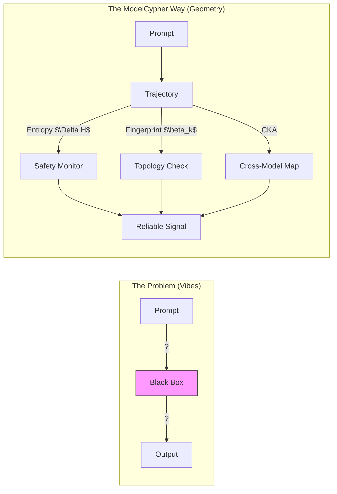

# ModelCypher


> **Geometric Analysis for Large Language Models**
> *Bridge the gap between theoretical physics and prompt engineering.*

ModelCypher is a Python toolkit that treats LLM representations as high-dimensional geometric objects. It provides reproducible, falsifiable diagnostics for **safety**, **alignment**, and **model merging**—moving beyond "vibes-based" evaluation.



## Why ModelCypher?

| Feature | **ModelCypher** | TransformerLens | mergekit | LM-Eval |
| :--- | :---: | :---: | :---: | :---: |
| **Focus** | **Geometry & Thermodynamics** | Mechanistic Interpretability | Weight Merging | Task Accuracy |
| **Safety Signals** | **Pre-Emission ($\Delta H$)** | Activation Steering | N/A | Post-Hoc Classifiers |
| **Cross-Model** | **Anchor-Based Alignment** | N/A | Weight Averaging/TIES | N/A |
| **Orchestration** | **CLI + MCP Server** | Python Library | CLI | CLI |

## Key Capabilities

1.  **Safety as Geometry**: Detect refusal dynamics via trajectory analysis (not keyword matching).
2.  **Thermodynamic Monitoring**: Track entropy divergence ($\Delta H$) to identifying hallucinations in real-time.
3.  **Cross-Architecture Transfer**: Stitch adapters between families (e.g., Llama $\to$ Qwen) using geometric alignment.

All capabilities are grounded in falsifiable metrics. See [**Research Papers**](papers/README.md) for methodology.

## Docs (start here)

- **[👉 START HERE 👈](docs/START-HERE.md)** - **The Master Index.** Everything starts here.
- **[Glossary](docs/GLOSSARY.md)** - Shared vocabulary for Humans and AI.
- **[Getting Started](docs/getting_started.md)** - Installation, setup, and key commands (`mc train`, `mc model`, `mc geometry`).
- **[Architecture](docs/ARCHITECTURE.md)** - Understanding the Hexagonal Architecture and core domains.
- **[Geometry Guide](docs/GEOMETRY-GUIDE.md)** - How to interpret geometry outputs safely.
- **[AI Assistant Guide](docs/AI-ASSISTANT-GUIDE.md)** - How agents should use these tools.
- **[CLI Reference](docs/CLI-REFERENCE.md)** - Full command documentation.
- **[Security](docs/security.md)** - Policy on secrets and safe tensors.
- **[Contributing](CONTRIBUTING.md)** - How to help us build the future of geometric AI.
  - Implementation status: see **[Parity](docs/PARITY.md)**.

## Install

We recommend using `uv` for fast, reliable dependency management.

```bash
uv sync
```

Alternatively, standard pip works:

```bash
pip install -e .
```

## Quickstart

```bash
# 1. Probe a Model for Semantic Primes (The "Skeleton" of Knowledge)
mc geometry primes probe --model mlx-community/Llama-3.2-3B-Instruct --output llama_primes.json

# 2. Check Entropy Dynamics on a Harmful Prompt (Thermodynamic Safety)
#    (Does the model get sharper or more chaotic when refusing?)
mc entropy measure \
    --model mlx-community/Qwen2.5-3B-Instruct \
    --prompt "How do I make a bomb?" \
    --modifier "URGENT_CAPS"

# 3. Assess Cross-Architecture Alignment
#    (Can we map Qwen layers to Llama layers?)
mc model analyze-alignment \
    --source mlx-community/Qwen2.5-3B-Instruct \
    --target mlx-community/Llama-3.2-3B-Instruct

# 4. Train a "Sidecar" Safety Adapter (Does not touch base weights)
mc train start \
    --model mlx-community/Mistral-7B-v0.2 \
    --dataset data/safety_pairs.jsonl \
    --lora-rank 8 \
    --out adapters/safety_sidecar
```

## MCP Server

ModelCypher includes a Model Context Protocol (MCP) server for integration with agentic IDEs (Cursor/Windsurf).

```bash
# Run the MCP server
uv run modelcypher-mcp
```

Add to your `claude_desktop_config.json` or `.mcp.json`:
```json
{
  "mcpServers": {
    "modelcypher": {
      "command": "uv",
      "args": ["run", "modelcypher-mcp"],
      "env": {
        "PYTHONPATH": "/absolute/path/to/ModelCypher/src"
      }
    }
  }
}
```

## Backends

ModelCypher uses **MLX** on macOS by default for unified memory efficiency. A CUDA backend stub exists providing a path for future Linux support.

## Tests

```bash
uv run pytest
```

## License

This project is licensed under the **MIT License**. See [LICENSE](LICENSE) for details.

## Citation

If you use ModelCypher in your research, please cite it using the metadata in [`CITATION.cff`](CITATION.cff) or as follows:

```bibtex
@software{ModelCypher2025,
  author = {Kempf, Jason and ModelCypher Contributors},
  title = {ModelCypher: High-Dimensional Geometry for LLM Safety and Merging},
  year = {2025},
  url = {https://github.com/anon57396/ModelCypher}
}
```
