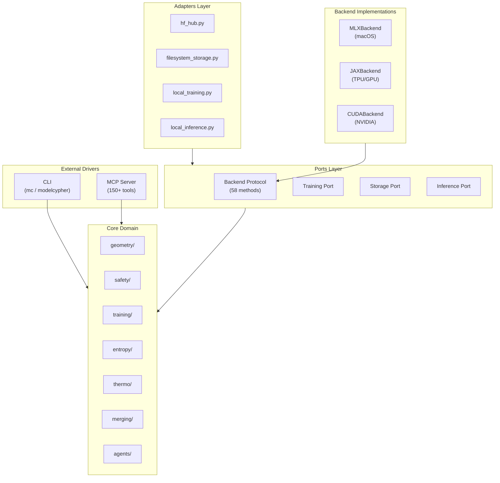
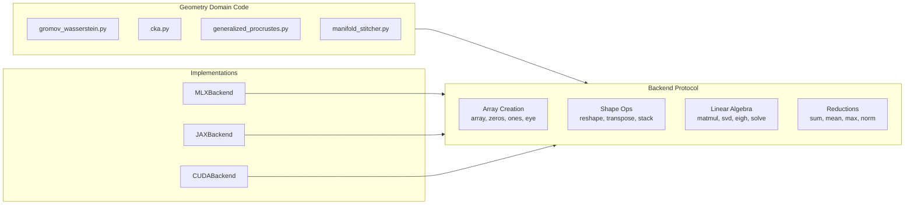
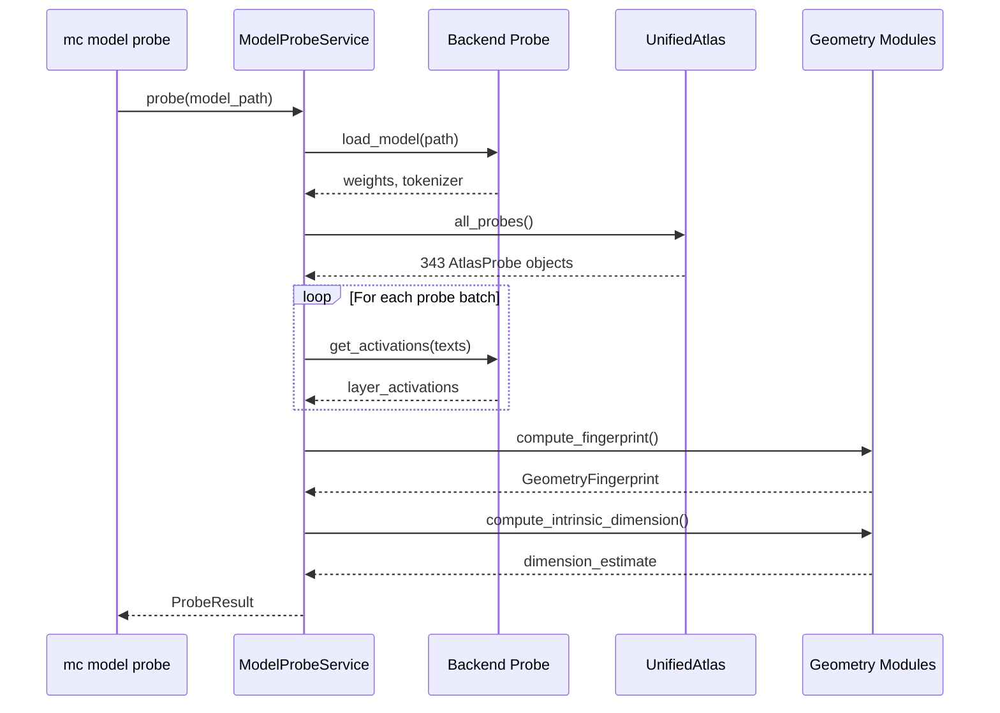
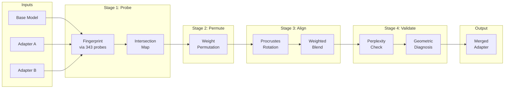

# Architectural Overview

ModelCypher follows a strict **Hexagonal Architecture** (also known as Ports and Adapters). This ensures that the core mathematical domain remains pure, testable, and independent of external frameworks (like CLI tools or HTTP APIs).

## Visual Overview



## Layers

### 1. The Core Domain (`src/modelcypher/core/domain/`)
This is the heart of the application. It contains the "business logic" and mathematical models.
-   **No adapter imports**: domain code should not import `modelcypher.adapters` directly.
-   **Deterministic, testable logic**: algorithms + dataclasses + small numeric helpers.
-   **Examples**: `ManifoldStitcher`, `CircuitBreakerIntegration`, `IntersectionMap`.

### 2. Ports (`src/modelcypher/ports/`)
These define the *interfaces* (Abstract Base Classes) that the Domain needs to interact with the outside world.
-   **Interfaces only**.
-   **Examples**: `training`, `storage`, `inference`, `geometry` ports.

### 3. Adapters (`src/modelcypher/adapters/`)
Concrete implementations of the Ports. This is where we talk to the filesystem, Hugging Face Hub, or hardware.
-   **Examples**: `hf_hub.py`, `filesystem_storage.py`, `local_training.py`, `local_inference.py`.

### 4. Interfaces / Infrastructure (`src/modelcypher/cli/`, `src/modelcypher/mcp/`, `src/modelcypher/infrastructure/`)
The entry points that drive the application.
-   **CLI**: `src/modelcypher/cli/app.py` (invoked via `mc` / `modelcypher`).
-   **MCP**: `src/modelcypher/mcp/` (Model Context Protocol server).

## Dependency Rule
**Dependencies point INWARD.**
-   The **CLI** depends on the **Domain**.
-   The **Adapters** depend on the **Ports**.
-   The **Domain** depends on **NOTHING** (except shared types).

## Key Components

### Manifold Stitcher (`domain/geometry/manifold_stitcher.py`)
Responsible for aligning two disparate model manifolds using Procrustes analysis.

### Probe Corpus (`domain/geometry/probe_corpus.py`)
A standardized set of prompts used to elicit comparable activations from different models.

Semantic primes are a separate anchor inventory (see `research/semantic_primes.md` and `src/modelcypher/data/semantic_primes.json`).

### Circuit Breaker (`domain/safety/circuit_breaker_integration.py`)
Monitors the "Regime State" of a model and interrupts generation if it enters a "Refusal Basin" or "Unstable Trajectory".

### MCP Server (`mcp/server.py`, `mcp/tools/`)
The MCP server exposes domain functionality via the Model Context Protocol. Tools are organized into modular registration functions:

```
src/modelcypher/mcp/
├── server.py              # Core server, tool profiles, base tools
├── security.py            # Security config and confirmation manager
└── tools/
    ├── common.py          # ServiceContext (lazy-loaded services), helpers
    ├── geometry.py        # Geometry analysis tools (path, CRM, stitch, etc.)
    ├── safety_entropy.py  # Safety probes, entropy tracking
    ├── agent.py           # Agent trace import/analysis
    └── dataset.py         # Dataset format detection, chunking, templating
```

The `ServiceContext` class provides lazy-loaded access to all domain services, avoiding circular imports and reducing startup time.

## Domain Modules

The core domain is organized by concern:

| Domain | Description |
|--------|-------------|
| `geometry/` | Path detection, manifold analysis, CRM, topological fingerprints |
| `entropy/` | Entropy tracking, divergence calculation, model state classification |
| `safety/` | Adapter safety, dataset scanning, circuit breaker, capability guard |
| `agents/` | Trace analytics, action validation, LoRA expert routing |
| `training/` | Checkpoint management, preflight checks, resource guards |
| `validation/` | Dataset format detection, identity linting, file enumeration |
| `dataset/` | Chat templates, document chunking, streaming shuffle |
| `thermo/` | Linguistic thermodynamics, ridge detection, phase transitions |
| `adapters/` | LoRA merging, adapter blending, ensemble orchestration |
| `inference/` | Dual-path generation, entropy dynamics |

## Backend Protocol

The Backend protocol (58 methods) enables platform-agnostic geometry code. All tensor operations go through this abstraction, allowing the same algorithms to run on MLX, JAX, CUDA, or NumPy.



See [BACKEND-COMPARISON.md](BACKEND-COMPARISON.md) for platform selection guidance.

### MLX Infrastructure Exceptions

The Backend protocol abstracts mathematical operations, but certain files require direct MLX access for infrastructure that cannot be abstracted. These are intentional exceptions tracked in `tests/test_no_mlx_in_domain.py`:

| File | Reason |
|------|--------|
| `training/lora.py` | `mlx.nn.Module` for neural network layers |
| `training/checkpoints.py` | `mx.save_safetensors`, `mx.load` for I/O |
| `training/engine.py` | Training loop orchestration |
| `inference/dual_path.py` | `mlx_lm` for model loading |
| `merging/lora_adapter_merger.py` | SafeTensors file I/O |

These represent infrastructure boundaries, not architecture violations. Run `pytest tests/test_no_mlx_in_domain.py -v` to verify current migration status.

## Data Flow: Model Probing

The `mc model probe` command follows this data flow:



## Data Flow: Adapter Merge Pipeline

The geometric merge pipeline aligns adapter weights through multiple stages:


