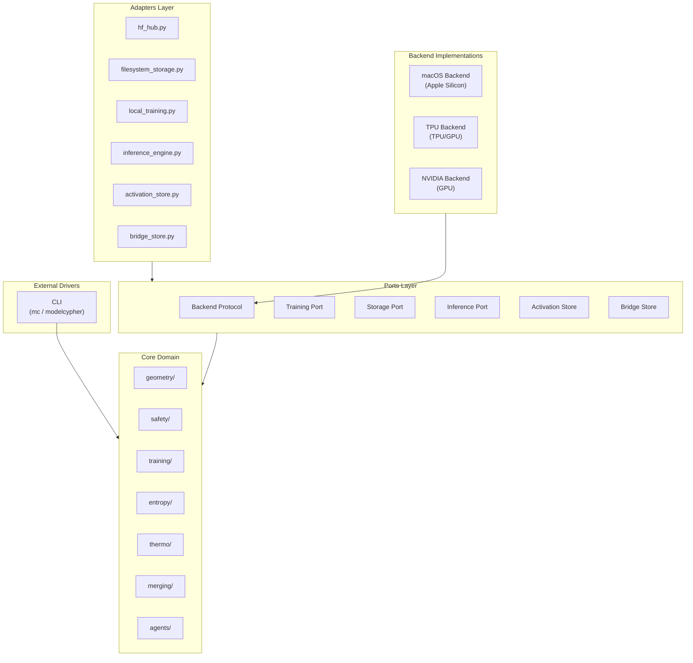
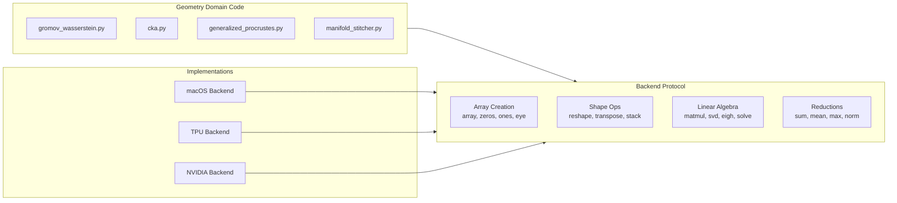
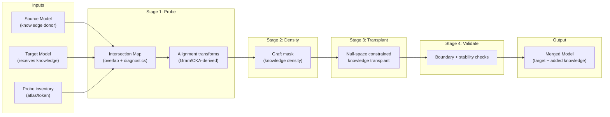

# Architectural Overview

ModelCypher follows a **Hexagonal Architecture** (Ports and Adapters). The goal is to keep core algorithms testable and reusable while pushing I/O (model loading, filesystem, hub clients, inference runtimes) to well-defined boundaries.

Notes:
- In this repo, run commands as `poetry run mc ...`.
- Global CLI options can appear anywhere on the command line (example: `mc model info ./model --output text`).

## Visual Overview


```mermaid
flowchart TB
    subgraph EXTERNAL["External Drivers"]
        CLI["CLI<br/>(mc / modelcypher)"]
    end

    subgraph ADAPTERS["Adapters Layer"]
        HF["hf_hub.py"]
        FS["filesystem_storage.py"]
        LT["local_training.py"]
        LI["inference_engine.py"]
        AS["activation_store.py"]
        BR["bridge_store.py"]
    end

    subgraph PORTS["Ports Layer"]
        BE["Backend Protocol"]
        TR["Training Port"]
        ST["Storage Port"]
        INF["Inference Port"]
        ACT["Activation Store"]
        BRS["Bridge Store"]
    end

    subgraph DOMAIN["Core Domain"]
        GEO["geometry/"]
        SAFE["safety/"]
        TRAIN["training/"]
        ENT["entropy/"]
        THERM["thermo/"]
        MERGE["merging/"]
        AGT["agents/"]
    end

    subgraph BACKENDS["Backend Implementations"]
        MAC["macOS Backend<br/>(Apple Silicon)"]
        TPU["TPU Backend<br/>(TPU/GPU)"]
        NVIDIA["NVIDIA Backend<br/>(GPU)"]
    end

    CLI --> DOMAIN
    ADAPTERS --> PORTS
    PORTS --> DOMAIN
    BACKENDS --> BE
```

## Layers

### 1. The Core Domain (`src/modelcypher/core/domain/`)
This is the heart of the application. It contains the "business logic" and mathematical models.
-   **No adapter imports**: domain code should not import `modelcypher.adapters` directly.
-   **Deterministic, testable logic**: algorithms + dataclasses + small numeric helpers.
-   **Examples**: `ManifoldStitcher`, `CircuitBreakerIntegration`, `IntersectionMap`.

### 2. Ports (`src/modelcypher/ports/`)
These define the *interfaces* (Python `Protocol`s) that the Domain needs to interact with the outside world.
-   **Interfaces only**.
-   **Examples**: `training`, `storage`, `inference`, `activation_store`, `bridge_store` ports.

### 3. Adapters (`src/modelcypher/adapters/`)
Concrete implementations of the Ports. This is where we talk to the filesystem, Hugging Face Hub, or hardware.
-   **Examples**: `hf_hub.py`, `filesystem_storage.py`, `local_training.py`, `local_inference.py`.

### 4. Interfaces / Infrastructure (`src/modelcypher/cli/`, `src/modelcypher/infrastructure/`)
The entry points that drive the application.
-   **CLI**: `src/modelcypher/cli/app.py` (invoked via `mc` / `modelcypher`).

## Dependency Rule
**Dependencies point INWARD.**
-   **Interfaces** (CLI) depend on **use cases** and orchestrators.
-   **Use cases** depend on **domain** and **ports**.
-   **Adapters** implement **ports** and depend on external systems.
-   **Domain** depends only on **ports** and the standard library (not adapters or infrastructure).

## Key Components

### Manifold Stitcher (`src/modelcypher/core/domain/geometry/manifold_stitcher.py`)
Responsible for aligning two disparate model manifolds using Procrustes analysis.

### Probe inventories (`src/modelcypher/core/domain/atlas/`, `src/modelcypher/data/`)
Built-in probe inventories used to elicit comparable activations from different models.

Semantic primes are a separate anchor inventory (see
[ATLAS-BASED-GEOMETRY.md](research/ATLAS-BASED-GEOMETRY.md) and
`src/modelcypher/data/semantic_primes.json`).

### Circuit Breaker (`src/modelcypher/core/domain/safety/`)
Aggregates safety-relevant signals (entropy/refusal/persona drift, etc.) and exposes a circuit-breaker decision for integrations (jobs, inference, dashboards).

## Domain Modules

The canonical core domain is organized by the directories that actually exist:

| Domain | Description |
|--------|-------------|
| `geometry/` | Path detection, manifold analysis, CRM, topological fingerprints |
| `entropy/` | Entropy tracking, divergence calculation, model state classification |
| `safety/` | Adapter safety, circuit breaker, capability guard |
| `training/` | Checkpoint management, preflight checks, resource guards |
| `inference/` | Unified generation, entropy dynamics |
| `atlas/` | Probe inventories and domain anchors |
| `moe/` | Mixture-of-experts selection and routing support |
| `star/` | STAR-style training and reasoning support |
| `cache/` | Canonical cache and memoization helpers |

Experimental work lives under `src/modelcypher/experimental/`.

Important consequence:

- merge workflows are currently experimental
- continual learning and consolidation are currently experimental
- stacking is currently experimental
- user-facing docs should not describe those workflows as if they were canonical

The canonical engine today is centered on `mc train run`, backend-backed model
loading/activation collection, and the core geometry/training stack.

## Backend Protocol

The Backend protocol enables platform-agnostic geometry/merge code. Operations in geometry-heavy modules go through this abstraction so the same algorithms can run on the macOS backend, NVIDIA backend, or TPU backend.


```mermaid
flowchart LR
    subgraph GEOMETRY["Geometry Domain Code"]
        GW["gromov_wasserstein.py"]
        CKA["cka.py"]
        PROC["generalized_procrustes.py"]
        MANI["manifold_stitcher.py"]
    end

    subgraph PROTOCOL["Backend Protocol"]
        ARRAY["Array Creation<br/>array, zeros, ones, eye"]
        SHAPE["Shape Ops<br/>reshape, transpose, stack"]
        LINALG["Linear Algebra<br/>matmul, svd, eigh, solve"]
        REDUCE["Reductions<br/>sum, mean, max, norm"]
    end

    subgraph IMPLS["Implementations"]
        MAC["macOS Backend"]
        TPU["TPU Backend"]
        NVIDIA["NVIDIA Backend"]
    end

    GEOMETRY --> PROTOCOL
    MAC --> PROTOCOL
    TPU --> PROTOCOL
    NVIDIA --> PROTOCOL
```

See [BACKEND-COMPARISON.md](BACKEND-COMPARISON.md) for platform selection guidance.

## Data Flow: Model Profiling

The `mc model info` command follows this data flow:


```mermaid
sequenceDiagram
    participant CLI as mc model info
    participant SVC as ModelProbeService
    participant PROBE as Backend Probe
    participant ATLAS as UnifiedAtlas
    participant GEOM as Geometry Modules

    CLI->>SVC: probe(model_path)
    SVC->>PROBE: load_model(path)
    PROBE-->>SVC: weights, tokenizer

    SVC->>ATLAS: all_probes()
    ATLAS-->>SVC: AtlasProbe objects

    loop For each probe batch
        SVC->>PROBE: get_activations(texts)
        PROBE-->>SVC: layer_activations
    end

    SVC->>GEOM: compute_fingerprint()
    GEOM-->>SVC: GeometryFingerprint

    SVC->>GEOM: compute_intrinsic_dimension()
    GEOM-->>SVC: dimension_estimate

    SVC-->>CLI: ProbeResult
```

## Data Flow: Model Merge Pipeline (Experimental)

The `mc merge run` command currently wraps the experimental merge stack under
`src/modelcypher/experimental/merge/`.

Pipeline order:

- `PROBE → DENSITY → TRANSPLANT → VALIDATE`


```mermaid
flowchart LR
    subgraph INPUT["Inputs"]
        SRC["Source Model<br/>(knowledge donor)"]
        TGT["Target Model<br/>(receives knowledge)"]
        PROBES["Probe inventory<br/>(atlas/token)"]
    end

    subgraph STAGE1["Stage 1: Probe"]
        IM["Intersection Map<br/>(overlap + diagnostics)"]
        XFORM["Alignment transforms<br/>(Gram/CKA-derived)"]
    end

    subgraph STAGE2["Stage 2: Density"]
        MASK["Graft mask<br/>(knowledge density)"]
    end

    subgraph STAGE3["Stage 3: Transplant"]
        TX["Null-space constrained<br/>knowledge transplant"]
    end

    subgraph STAGE4["Stage 4: Validate"]
        CHECKS["Boundary + stability checks"]
    end

    subgraph OUTPUT["Output"]
        MERGED["Merged Model<br/>(target + added knowledge)"]
    end

    SRC --> IM
    TGT --> IM
    PROBES --> IM

    IM --> XFORM
    XFORM --> MASK
    MASK --> TX
    TX --> CHECKS
    CHECKS --> MERGED
```

### Merge Pipeline Stages [EMPIRICAL]

Pipeline order (null-space transplant path):

1. **Probe** (CKA + activations):
   `src/modelcypher/experimental/merge/stages/probe.py`
2. **Density** (graft mask):
   `src/modelcypher/experimental/merge/stages/density.py`
3. **Transplant** (null-space constrained):
   `src/modelcypher/experimental/merge/stages/transplant_stage.py`
4. **Validate** (post-merge checks):
   `src/modelcypher/experimental/merge/stages/validate.py`

CLI wiring and orchestration are also experimental today.

**Entry points:**
- CLI: `mc merge` →
  `src/modelcypher/cli/commands/merge.py` →
  `src/modelcypher/cli/composition.py`
- API: `UnifiedGeometricMerger.merge()` in
  `src/modelcypher/experimental/merge/merger.py`

**Transplant occupancy:**
- Stage 3 persists per-layer occupancy weights to `transplant_occupancy.json` in the output dir
- Subsequent merges load this file from the target model path to protect previously modified dimensions

**Permutation alignment note:**
- The older permutation stage (Git Re-Basin) is intentionally skipped; alignment is handled by the probe stage's Gram/CKA-derived transforms [PROVEN]

### Experimental Merge Directory Layout

```
src/modelcypher/experimental/merge/
├── __init__.py
├── merger.py              # UnifiedGeometricMerger entry point
├── pipeline.py            # experimental pipeline orchestration
├── service.py             # service wrapper
├── models.py              # merge configs and results
├── metrics.py             # geometric metric aggregation
├── helpers.py             # loading/utilities
├── infrastructure.py      # adapter wiring helpers
├── stages/
│   ├── probe.py
│   ├── density.py
│   ├── transplant_stage.py
│   ├── validate.py
│   ├── manifest.py
│   └── __init__.py
```

This workflow remains useful and evidence-bearing, but it should be read as
experimental until the portability certificate and architecture cleanup pass are
closed.

**References:**
- Null-space transplant: *AlphaEdit* ([arXiv:2410.02355](https://arxiv.org/abs/2410.02355))
- Permutation alignment (historical): *Git Re-Basin* ([arXiv:2209.04836](https://arxiv.org/abs/2209.04836))
