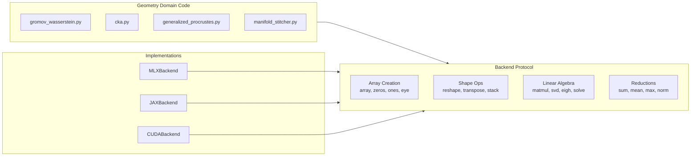
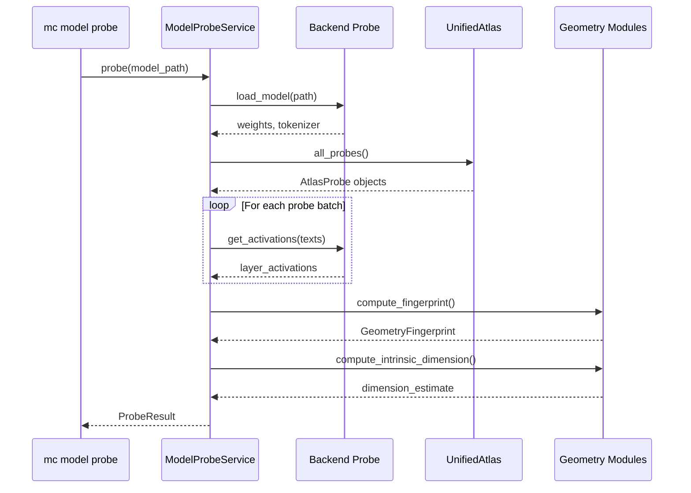
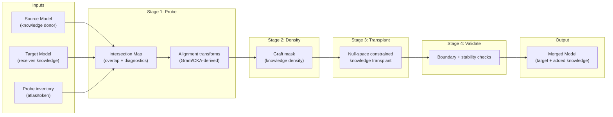

# Architectural Overview

ModelCypher follows a **Hexagonal Architecture** (Ports and Adapters). The goal is to keep core algorithms testable and reusable while pushing I/O (model loading, filesystem, hub clients, inference runtimes) to well-defined boundaries.

Notes:
- In this repo, run commands as `poetry run mc ...`.
- Global CLI options can appear anywhere on the command line (example: `mc model probe ./model --output text`).

## Visual Overview

```mermaid
flowchart TB
    subgraph EXTERNAL["External Drivers"]
        CLI["CLI<br/>(mc / modelcypher)"]
    end

    subgraph ADAPTERS["Adapters Layer"]
        HF["hf_hub.py"]
        FS["filesystem_storage.py"]
        LT["local_training.py"]
        LI["local_inference.py"]
        AS["activation_store.py"]
        BR["bridge_store.py"]
    end

    subgraph PORTS["Ports Layer"]
        BE["Backend Protocol"]
        TR["Training Port"]
        ST["Storage Port"]
        INF["Inference Port"]
        ACT["Activation Store"]
        BRS["Bridge Store"]
    end

    subgraph DOMAIN["Core Domain"]
        GEO["geometry/"]
        SAFE["safety/"]
        TRAIN["training/"]
        ENT["entropy/"]
        THERM["thermo/"]
        MERGE["merging/"]
        AGT["agents/"]
    end

    subgraph BACKENDS["Backend Implementations"]
        MLX["MLXBackend<br/>(macOS)"]
        JAX["JAXBackend<br/>(TPU/GPU)"]
        CUDA["CUDABackend<br/>(NVIDIA)"]
    end

    CLI --> DOMAIN
    ADAPTERS --> PORTS
    PORTS --> DOMAIN
    BACKENDS --> BE
```

## Layers

### 1. The Core Domain (`src/modelcypher/core/domain/`)
This is the heart of the application. It contains the "business logic" and mathematical models.
-   **No adapter imports**: domain code should not import `modelcypher.adapters` directly.
-   **Deterministic, testable logic**: algorithms + dataclasses + small numeric helpers.
-   **Examples**: `ManifoldStitcher`, `CircuitBreakerIntegration`, `IntersectionMap`.

### 2. Ports (`src/modelcypher/ports/`)
These define the *interfaces* (Python `Protocol`s) that the Domain needs to interact with the outside world.
-   **Interfaces only**.
-   **Examples**: `training`, `storage`, `inference`, `activation_store`, `bridge_store` ports.

### 3. Adapters (`src/modelcypher/adapters/`)
Concrete implementations of the Ports. This is where we talk to the filesystem, Hugging Face Hub, or hardware.
-   **Examples**: `hf_hub.py`, `filesystem_storage.py`, `local_training.py`, `local_inference.py`.

### 4. Interfaces / Infrastructure (`src/modelcypher/cli/`, `src/modelcypher/infrastructure/`)
The entry points that drive the application.
-   **CLI**: `src/modelcypher/cli/app.py` (invoked via `mc` / `modelcypher`).

## Dependency Rule
**Dependencies point INWARD.**
-   **Interfaces** (CLI) depend on **use cases** and orchestrators.
-   **Use cases** depend on **domain** and **ports**.
-   **Adapters** implement **ports** and depend on external systems.
-   **Domain** depends only on **ports** and the standard library (not adapters or infrastructure).

## Key Components

### Manifold Stitcher (`domain/geometry/manifold_stitcher.py`)
Responsible for aligning two disparate model manifolds using Procrustes analysis.

### Probe inventories (`core/domain/agents/unified_atlas.py`, `data/probes/*.json`)
Built-in probe inventories used to elicit comparable activations from different models.

Semantic primes are a separate anchor inventory (see [ATLAS-BASED-GEOMETRY.md](research/ATLAS-BASED-GEOMETRY.md) and `src/modelcypher/data/semantic_primes.json`).

### Circuit Breaker (`domain/safety/circuit_breaker_integration.py`)
Aggregates safety-relevant signals (entropy/refusal/persona drift, etc.) and exposes a circuit-breaker decision for integrations (jobs, inference, dashboards).

## Domain Modules

The core domain is organized by concern:

| Domain | Description |
|--------|-------------|
| `geometry/` | Path detection, manifold analysis, CRM, topological fingerprints |
| `entropy/` | Entropy tracking, divergence calculation, model state classification |
| `safety/` | Adapter safety, circuit breaker, capability guard |
| `merging/` | Null-space transplant primitives and merge math |
| `agents/` | Trace analytics, action validation, LoRA expert routing |
| `training/` | Checkpoint management, preflight checks, resource guards |
| `validation/` | Auto-fix engine for training data |
| `thermo/` | Linguistic thermodynamics, ridge detection, phase transitions |
| `adapters/` | LoRA inspection, projection, and adapter utilities |
| `inference/` | Dual-path generation, entropy dynamics |

## Backend Protocol

The Backend protocol enables platform-agnostic geometry/merge code. Operations in geometry-heavy modules go through this abstraction so the same algorithms can run on MLX (macOS), CUDA (NVIDIA), or JAX (TPU/GPU).

```mermaid
flowchart LR
    subgraph GEOMETRY["Geometry Domain Code"]
        GW["gromov_wasserstein.py"]
        CKA["cka.py"]
        PROC["generalized_procrustes.py"]
        MANI["manifold_stitcher.py"]
    end

    subgraph PROTOCOL["Backend Protocol"]
        ARRAY["Array Creation<br/>array, zeros, ones, eye"]
        SHAPE["Shape Ops<br/>reshape, transpose, stack"]
        LINALG["Linear Algebra<br/>matmul, svd, eigh, solve"]
        REDUCE["Reductions<br/>sum, mean, max, norm"]
    end

    subgraph IMPLS["Implementations"]
        MLX["MLXBackend"]
        JAX["JAXBackend"]
        CUDA["CUDABackend"]
    end

    GEOMETRY --> PROTOCOL
    MLX --> PROTOCOL
    JAX --> PROTOCOL
    CUDA --> PROTOCOL
```

See [BACKEND-COMPARISON.md](BACKEND-COMPARISON.md) for platform selection guidance.

## Data Flow: Model Probing

The `mc model probe` command follows this data flow:

```mermaid
sequenceDiagram
    participant CLI as mc model probe
    participant SVC as ModelProbeService
    participant PROBE as Backend Probe
    participant ATLAS as UnifiedAtlas
    participant GEOM as Geometry Modules

    CLI->>SVC: probe(model_path)
    SVC->>PROBE: load_model(path)
    PROBE-->>SVC: weights, tokenizer

    SVC->>ATLAS: all_probes()
    ATLAS-->>SVC: AtlasProbe objects

    loop For each probe batch
        SVC->>PROBE: get_activations(texts)
        PROBE-->>SVC: layer_activations
    end

    SVC->>GEOM: compute_fingerprint()
    GEOM-->>SVC: GeometryFingerprint

    SVC->>GEOM: compute_intrinsic_dimension()
    GEOM-->>SVC: dimension_estimate

    SVC-->>CLI: ProbeResult
```

## Data Flow: Model Merge Pipeline

The `mc merge run` command orchestrates a four-stage merge pipeline implemented in `src/modelcypher/core/use_cases/merge/`:
- `PROBE → DENSITY → TRANSPLANT → VALIDATE`

See [MERGE-ARCHITECTURE.md](MERGE-ARCHITECTURE.md) for the stage-by-stage wiring.

```mermaid
flowchart LR
    subgraph INPUT["Inputs"]
        SRC["Source Model<br/>(knowledge donor)"]
        TGT["Target Model<br/>(receives knowledge)"]
        PROBES["Probe inventory<br/>(atlas/token)"]
    end

    subgraph STAGE1["Stage 1: Probe"]
        IM["Intersection Map<br/>(overlap + diagnostics)"]
        XFORM["Alignment transforms<br/>(Gram/CKA-derived)"]
    end

    subgraph STAGE2["Stage 2: Density"]
        MASK["Graft mask<br/>(knowledge density)"]
    end

    subgraph STAGE3["Stage 3: Transplant"]
        TX["Null-space constrained<br/>knowledge transplant"]
    end

    subgraph STAGE4["Stage 4: Validate"]
        CHECKS["Boundary + stability checks"]
    end

    subgraph OUTPUT["Output"]
        MERGED["Merged Model<br/>(target + added knowledge)"]
    end

    SRC --> IM
    TGT --> IM
    PROBES --> IM

    IM --> XFORM
    XFORM --> MASK
    MASK --> TX
    TX --> CHECKS
    CHECKS --> MERGED
```
