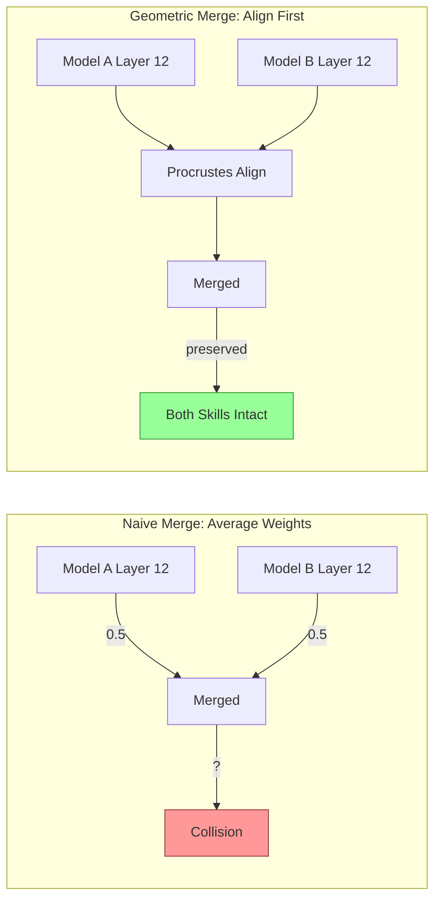

# ModelCypher Geometry Guide (for AI + humans)

This guide explains what the geometry tooling measures and how to report the outputs accurately.
It is written for AI agents that call the CLI tools and then summarize results for humans.

Notes:
- In this repo, run commands as `poetry run mc ...`.
- Global CLI options can appear anywhere on the command line (example: `mc model probe ./model --output text`).

Related docs:
- [MATH-PRIMER.md](MATH-PRIMER.md) - Intuition for the underlying geometry (distance/angle/alignment)
- [AI-ASSISTANT-GUIDE.md](AI-ASSISTANT-GUIDE.md) - Safe summarization patterns for CLI outputs
- [GLOSSARY.md](GLOSSARY.md) - Shared vocabulary for geometry concepts

Deep dives:
- [geometry/gromov_wasserstein.md](geometry/gromov_wasserstein.md) - Gromov-Wasserstein distance theory
- [geometry/manifold_alignment.md](geometry/manifold_alignment.md) - Cross-model alignment and intersection maps
- [geometry/topological_fingerprints.md](geometry/topological_fingerprints.md) - Persistent homology for model signatures
- [geometry/mental_model.md](geometry/mental_model.md) - Visual intuition for geometry concepts
- [research/dimensional_hierarchy.md](research/dimensional_hierarchy.md) - Alignment order (binary -> vocab -> activations)

---

## Why Geometry Matters

When you merge two models by averaging their weights, you're assuming knowledge is stored in the same coordinates. Often it isn't: even when models learn similar features, they can be stored in rotated/permuted bases.



**Procrustes alignment** estimates an orthogonal transform that best aligns one representation space to another. This preserves geometric relationships while putting both models in a comparable coordinate system.

### The Rotation Problem

Two models trained on the same data can learn identical knowledge in rotated coordinate systems:

```
Model A: "cat" → [0.8, 0.2, 0.1]
Model B: "cat" → [0.2, 0.8, 0.1]  ← Same concept, rotated representation
```

Averaging these gives `[0.5, 0.5, 0.1]`—which is neither cat. Procrustes finds the rotation matrix that aligns them first.

### The Interference Problem

When concepts overlap in merged weight space, they interfere. ModelCypher predicts this *before* you merge:

```bash
mc --output text geometry interference predict /path/to/source_model /path/to/target_model
```

If high interference is predicted, you can use **null-space projection** to merge only in directions that don't collide.

### The Mathematical Foundation

ModelCypher applies established theory:

| Concept | Source | Application |
|---------|--------|-------------|
| Procrustes analysis | Gower (1975) | Aligning representation spaces |
| CKA similarity | Kornblith et al. (2019) | Comparing representations across models |
| Persistent homology | Naitzat et al. (2020) | Topological fingerprints |
| Information geometry | Amari & Nagaoka (2000) | Curvature in learning dynamics |

See [docs/references/BIBLIOGRAPHY.md](references/BIBLIOGRAPHY.md) for citations.

### The Bottom Line

> **Benchmarks measure outputs. Geometry measures structure.**
>
> You can game outputs. You can't fake topology.

## Mental model (plain language)

- We treat weights, activations, and response trajectories as points in a very high-dimensional space.
- Geometry metrics summarize shape: curvature (flat vs sharp), distance (similar vs different),
  and direction (is training moving toward a known risk direction).
- Distances: smaller means closer. Similarities: larger means more similar.
- Many outputs are normalized (often, but not necessarily, to 0–1). Treat them as measurements, not grades.

## The "No Vibes" Principle

**Report raw measurements. Let the geometry speak for itself.**

ModelCypher deliberately avoids:
- Hardcoded thresholds ("0.7 is good")
- Qualitative labels ("excellent", "poor", "concerning")
- Interpretation strings that encode subjective judgment

Instead, we provide:
- **Raw measurements** - the actual geometric quantities
- **Baseline comparisons** - how this model compares to reference distributions
- **Z-scores and percentiles** - where this measurement falls relative to baselines

**Why?** Thresholds are model-specific, task-specific, and evolve over time. A researcher knows their domain; we provide measurements, they decide meaning.

## Numerical thresholds (dtype-derived)

When a threshold or epsilon is needed, derive it from the array dtype using
`numerical_stability` utilities (e.g., `division_epsilon`, `machine_epsilon`).
Avoid fixed constants like `1e-8` unless justified by data or machine precision.

## Intrinsic Dimension vs Support Manifold

Intrinsic dimension (ID) is a local diagnostic of how many degrees of freedom
the data occupies around each point. It does not specify how large the
functional subspace must be to route and compose those concepts through layers.

ModelCypher treats "support manifold size" as the effective rank of centered
activation covariance, which captures how many directions carry variance.
This is the measurement that bounds the routing and composition overhead.

Formulas (implementation references in `src/modelcypher/core/domain/geometry/intrinsic_dimension.py`
and `src/modelcypher/core/domain/geometry/effective_rank.py`):

- TwoNN ID (Facco et al.): regress log(mu) vs log(1 - F(mu)), where mu = d2 / d1.
- Renyi effective rank: r_R = (sum_i lambda_i)^2 / sum_i (lambda_i^2)
- Shannon effective rank: r_S = exp(-sum_i p_i * log(p_i)), p_i = lambda_i / sum_i lambda_i

Here lambda_i are eigenvalues of the activation covariance (equivalently, the
singular values squared from centered activations). ID and effective rank are
complementary: ID estimates local manifold complexity, while effective rank
estimates how much support the model uses to carry that complexity.

Derived diagnostics reported by `mc geometry research manifold-evidence`:
- support ratio = effective_rank / ambient_dim (Renyi + Shannon)
- null ratio = 1 - support ratio (Renyi + Shannon)
- ID gap = effective_rank - intrinsic_dimension (Renyi + Shannon, when ID is available)

## Manifold Evidence (Toward Theorem)

To move from thesis to theorem, we need evidence that:
1) representations occupy a low-dimensional manifold,
2) the manifold is curved (non-zero curvature),
3) local tangent dimension is stable (constant-rank behavior).

The `mc geometry research manifold-evidence` command reports:
- intrinsic dimension (TwoNN),
- effective rank (support manifold),
- tangent-space effective rank (log-map at Fréchet mean),
- sectional curvature summary.

These are raw measurements; they do not claim certainty by themselves, but they
are the empirical checks required to justify the assumptions behind a
constant-rank manifold theorem.

## Prompt-Manifold Jacobian Evidence

The `mc geometry research prompt-manifold` command measures how many prompt
manifold directions *functionally* influence a layer's activation.

It does this by:
- deriving a prompt-manifold basis from pooled atlas prompt embeddings,
- sampling coefficient points from those same prompts,
- estimating the effective rank of the Jacobian (via random projections) of
  layer activations with respect to prompt-manifold coordinates.

If the intrinsic dimension is the semantic seed, this Jacobian rank estimates
the *support manifold* needed to route that seed through the network. It is a
data-derived diagnostic, not a thresholded interpretation.

## Geodesic Distance (Core Principle)

**When ModelCypher reports a distance in representation space, it is usually geodesic (k-NN graph shortest path), not raw Euclidean.**

LLM representations live in high-dimensional spaces (768D to 8192D+). Euclidean distance—the straight-line "as the crow flies" distance—can become less informative in high dimensions due to the [curse of dimensionality](https://en.wikipedia.org/wiki/Curse_of_dimensionality). In extreme regimes, many points appear similarly distant under Euclidean measure.

**Geodesic distance** measures distance along the data manifold itself—like measuring road distance between cities rather than straight-line distance through the earth. This captures the true structure of the representation space.

### How it works

1. **Build a k-NN graph**: Connect each point to its k nearest neighbors (using Euclidean for initial edges—the one unavoidable bootstrap step)
2. **Compute shortest paths**: Use a shortest-path algorithm (e.g., Dijkstra) to find distances through the graph
3. **Report geodesic distances**: All subsequent distance computations use these manifold-aware distances

### What this means for you

- **Distance values are not directly comparable to Euclidean benchmarks**. A geodesic distance of 5.0 doesn't mean "5 units apart in space"—it means "5 hops through the nearest-neighbor graph."
- **Distances scale with manifold complexity**. A convoluted manifold will have larger geodesic distances between the same Euclidean-close points.
- **Comparisons are meaningful**. "Model A is 2x farther from B than from C" is geometrically meaningful, even if the raw numbers aren't.

### Why not Euclidean?

Euclidean distance is a special-case approximation that can work well in low-dimensional or near-linear settings. Geodesic distances better match curved manifold structure. Rather than maintain multiple mental models (“this command is Euclidean, that one is geodesic”), ModelCypher aims to report manifold-aware distances consistently, unless a subcommand explicitly says otherwise.

## Quick translation rules

- Report the raw metric values, not interpretations
- If baseline data is available, report the z-score or percentile
- If a metric is missing or null, say "not enough signal" rather than guessing
- Use 1 to 2 sentences in human summaries. Focus on measurements and comparisons.

## Analogy discipline (how to stay non-sci-fi)

Analogies make high-dimensional geometry intuitive, but they are not mechanisms.

- Pair an analogy with the **exact metric/artifact name** (e.g., "Venn diagram" → `IntersectionMap` overlap on a probe corpus).
- State the **measurement context** (probe corpus, decoding settings, layer) that makes the analogy applicable.
- Explicitly state what it **does not imply** (e.g., overlap on probes ≠ identical "knowledge", and a low-entropy regime ≠ "reasoning").

## What these metrics can and cannot tell you

They *can* help you:
- detect that something changed (drift, instability, unusual updates),
- localize where it changed (layers/components, when captured),
- decide when to investigate (circuit breaker style signals).

They *cannot*:
- certify a model is "safe",
- replace eval suites, policy review, or red teaming,
- establish causality ("metric went up, therefore X happened").

## Evidence Suite (Reproducible Measurements)

Use the evidence suite to generate raw measurements for alignment generalization,
geodesic/curvature convergence, and causal intervention effects.

```bash
poetry run mc geometry research evidence \
  --output-file docs/research/evidence.json

poetry run mc geometry research evidence \
  --model-a tests/fixtures/.models/HuggingFaceTB--SmolLM-135M \
  --model-b tests/fixtures/.models/mlx-community--LFM2-350M-MLX-bf16 \
  --layer 0 \
  --probe-count 24 \
  --output-file docs/research/evidence_real_models.json
```

**Synthetic evidence (docs/research/evidence.json):**
- Alignment generalization: train CKA=1.0, holdout CKA=0.9428425351, raw holdout CKA=0.8271114849, gain=0.1157310502, coverage=0.5249410713 (train=16, holdout=16).
- Geodesic convergence (circle): mean abs error small=0.0025231966, large=0.0006330672, ratio=0.2508988842; mean rel error small=0.0152261965, large=0.0074759978, ratio=0.4909957512.
- Curvature convergence (sphere, analytic curvature=1.0): mean abs error small=0.9999991556, large=0.9999983711, ratio=0.9999992156.
- Causal intervention: core mean shift=5.1242599487, core residual mean=5.8014249802, boundary max diff=0.0, boundary tolerance=0.0003452670.

**Real-model domain alignment (docs/research/evidence_real_models.json):**
- Models: SmolLM-135M vs LFM2-350M (layerA=0, layerB=0, probes=24).
- Domain `factual`: train CKA=1.0, holdout CKA=0.6864164951, raw holdout CKA=0.9581221736, gain=-0.2717056786, coverage=0.0019518083.

## Atlas Probe System

The atlas system provides 4596 semantic concept probes organized by domain and source. These probes are used for alignment, bridge generation, and manifold analysis.

### Probe Sources (23 categories)

Probes are loaded from JSON files in `data/probes/` and organized by source:

| Source | Description |
|--------|-------------|
| `semantic_prime` | Universal semantic primitives (Wierzbicka) |
| `computational_gate` | Code patterns (LITERAL, VARIABLE, LOOP, etc.) |
| `emotion_concept` | Affective concepts (joy, fear, anger, etc.) |
| `moral_concept` | Moral foundations (care, fairness, sanctity, etc.) |
| `temporal_concept` | Time-related concepts (past, future, duration) |
| `spatial_concept` | Space-related concepts (location, direction) |
| `social_concept` | Social relationships and concepts |
| `philosophical_concept` | Abstract philosophical ideas |
| `safety_ethics` | Safety-related probes |
| `physical_existence` | Physical world concepts |
| `compositional` | Compositional reasoning patterns |
| `conceptual_genealogy` | Etymology and concept evolution |
| `metaphor_invariant` | Cross-domain metaphor mappings |
| `conceptual_metaphor` | Conceptual metaphor theory |
| `syntax_concept` | Syntactic structure concepts |
| `perceptual` | Perception-related concepts |
| `numeric` | Number and quantity concepts |
| `common_object` | Everyday objects |
| `action_verb` | Action and motion verbs |
| `abstract_relation` | Abstract relations |
| `pronoun_perspective` | Pronoun and perspective concepts |
| `sequence_invariant` | Sequence patterns (Fibonacci, etc.) |
| `domain_specific` | Domain-specific concepts |

### JSON Probe Format

Each probe file follows this structure:

```json
{
  "domain": "moral",
  "probe_count": 23,
  "probes": [
    {
      "id": "moral_concept:cruelty",
      "name": "Cruelty",
      "description": "Deliberate infliction of suffering.",
      "support_texts": [
        "Cruelty is the willful causing of pain.",
        "To be cruel is to delight in suffering."
      ]
    }
  ]
}
```

### Adding Custom Probes

To add custom probes:
1. Create a new JSON file in `data/probes/`
2. Follow the format above with unique probe IDs
3. The probe loader will automatically include them

### Usage in Bridge Generation

The `mc merge bridge` command uses atlas probes:

```bash
# Default - uses all 4596 probes, achieves CKA = 1.0
mc merge bridge ./model_a ./model_b -o bridge.safetensors

# Filter by specific sources
mc merge bridge ./model_a ./model_b -o bridge.safetensors --probe-sources semantic_prime,emotion_concept
```

Atlas probes systematically span the semantic manifold. Procrustes alignment achieves CKA = 1.0 on training probes by construction.

**Key experimental result** (from `experiments/geometry_validation.py`):
- Raw CKA between layers: 0.60 (unaligned - different coordinate systems)
- Aligned CKA: 1.00 (after Procrustes - invariant structure revealed)

This demonstrates the thesis: structural relationships are invariant, only coordinates differ. Generalization to held-out probes depends on coverage.

See `experiments/results/geometry_validation.json` for full experimental data.

---

## Alignment Solver (Closed Form)

Linear alignment uses the closed-form invariant:

```text
F = pinv(source) @ target
```

We solve this with closed-form normal equations on the backend:

- If `n >= d`: `F = (A^T A + λI)^{-1} A^T B`
- If `n < d`: `F = A^T (A A^T + λI)^{-1} B`

`λ` is derived from dtype machine epsilon (scale = max diag of the Gram),
so the system is strictly positive definite and the solve is well-defined.
No iterations; residuals are reported as raw measurements.

---

## Tool-by-tool explanations

### mc geometry training status

Key fields:
- `flatnessScore` (0 to 1): Higher is flatter. Relative to model family baseline.
- `gradientSNR`: Signal-to-noise ratio in gradients.
- `circuitBreakerSeverity`: Composite signal from entropy/refusal/persona/oscillation measurements.
- `activeLayers`: Layers with notable gradient activity (when available).
- `perLayerGradientNorms`: Per-layer gradient norms (when `--format full`).

How to report:
- "Flatness score is 0.78. Gradient SNR is 12.4."
- "Circuit breaker severity is 0.82. Active layers: layer.4, layer.5."

### mc geometry training history

Key fields:
- `flatnessHistory`, `snrHistory`, `parameterDivergenceHistory`: Trend lines over training steps.

How to report:
- "Flatness increased from 0.65 to 0.78 over 100 steps." Report direction and magnitude.
- If empty, say metrics were not captured for this run.

### mc geometry training levels

Purpose:
- Lists available instrumentation levels and which metrics each level collects.

How to report:
- "Higher levels collect more metrics (more overhead) and enable deeper geometry analysis."
  If a metric you expect is missing, confirm the job captured it at the chosen level.

### mc geometry safety circuit-breaker

Key fields:
- `severity`: 0 to 1 aggregate safety signal.
- `dominantSource`: The strongest contributing signal (when available).

How to report:
- "Circuit breaker severity is 0.82. Dominant source: persona drift."

### mc geometry safety persona

Key fields:
- `overallDriftMagnitude`: 0 to 1 measure of alignment drift.
- `driftingTraits`: Which persona traits are moving most.
- `refusalDistance`: Distance to the refusal direction.
- `isApproachingRefusal`: Whether the refusal distance is decreasing over time.

How to report:
- "Persona drift magnitude is 0.32. Highest drift in: helpfulness, directness."

### mc geometry adapter sparsity (DARE)

Key fields:
- `effectiveSparsity`: Fraction of adapter deltas that are small enough to drop.
- `checkpointPath`, `baseModelPath`: Paths for the analyzed adapter and base model.

How to report:
- "Effective sparsity is 0.91 (91%)."

### mc geometry adapter decomposition (DoRA)

Key fields:
- `magnitudeChangeRatio`: Average scale change in weights (0.1 means about 10% change).
- `directionalDrift`: Average angular change (0 means no rotation).
- `magnitudeToDirectionRatio`: Ratio of magnitude vs direction contribution.

How to report:
- "Magnitude change ratio is 0.18, directional drift is 0.04."

### mc geometry path detect

Key fields:
- `detectedGates`: Detected gate entries with `gateName`, `similarity`, and `triggerText`.
- `meanSimilarity`: Mean similarity across detected gates.
- `modelID`, `promptID`: Identifiers for the analyzed response.

How to report:
- "Detected gate sequence: [retrieval, composition, validation]. Mean similarity: 0.87."

### mc geometry path compare

Key fields:
- `normalizedDistance` (0 to 1): Lower means more similar gate trajectories.
- `alignmentCount`: Number of aligned gate steps.
- `rawDistance`: Unnormalized edit distance between paths.

How to report:
- "Normalized distance is 0.23. Paths aligned on 8 of 12 steps."

### mc geometry validate

Key fields:
- `passed`: True means the geometry invariants are behaving as expected.
- `gromovWasserstein`, `traversalCoherence`, `pathSignature`: Individual test results.
- `spectralSignature`, `spectralSignatureConnected`: Graph connectivity diagnostics.

How to report:
- "Geometry validation passed. GW distance: 0.12, traversal coherence: 0.94."

## Example translations (JSON -> human)

### Example: mc geometry training status

**JSON output:**
```json
{
  "jobId": "job-123",
  "step": 420,
  "flatnessScore": 0.78,
  "gradientSNR": 12.4,
  "circuitBreakerSeverity": 0.22,
  "activeLayers": ["layer.4", "layer.5"],
  "perLayerGradientNorms": null
}
```

**Human summary:**
Flatness score is 0.78. Gradient SNR is 12.4. Circuit breaker severity is 0.22.

### Example: mc geometry safety circuit-breaker

**JSON output:**
```json
{
  "severity": 0.82,
  "dominantSource": "persona_drift"
}
```

**Human summary:**
Circuit breaker severity is 0.82. Dominant source: persona drift.

### Example: mc geometry adapter sparsity (DARE)

**JSON output:**
```json
{
  "checkpointPath": "./adapters/adapter.npz",
  "baseModelPath": "./models/base",
  "effectiveSparsity": 0.91
}
```

**Human summary:**
Effective sparsity is 0.91 (91%).

### Example: mc geometry adapter decomposition (DoRA)

**JSON output:**
```json
{
  "checkpointPath": "./adapters/adapter.npz",
  "baseModelPath": "./models/base",
  "magnitudeChangeRatio": 0.18,
  "directionalDrift": 0.04,
  "magnitudeToDirectionRatio": 1.2
}
```

**Human summary:**
Magnitude change ratio is 0.18, directional drift is 0.04.

## Glossary (short)

- Gromov-Wasserstein distance: Compares the shape of two point clouds without requiring exact alignment.
- Procrustes alignment: Best-fit rotation (and optional scaling) to align two spaces.
- DoRA decomposition: Splits weight changes into magnitude (scale) and direction (rotation).
- DARE sparsity: Measures how sparse adapter updates are and their distribution.
- Gate path: A sequence of detected computational motifs in a response.

## If you only remember one thing

Report raw measurements with baseline context when available. Let the user interpret meaning.
