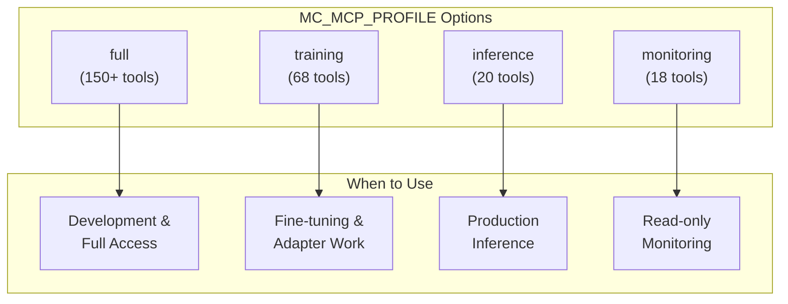

# MCP Configuration Guide

Detailed configuration for MCP servers used in ModelCypher development.

## Firecrawl Configuration

### Server Setup

**Cloud endpoint:**
```
https://mcp.firecrawl.dev/{FIRECRAWL_API_KEY}/v2/mcp
```

**Local/CLI:**
```bash
env FIRECRAWL_API_KEY=fc-... npx -y firecrawl-mcp
# For HTTP transport: add HTTP_STREAMABLE_SERVER=true
```

### MCP Server Config (`.mcp.json`)

```json
{
  "mcpServers": {
    "firecrawl-mcp": {
      "command": "npx",
      "args": ["-y", "firecrawl-mcp"],
      "timeout": 300000,
      "env": {
        "FIRECRAWL_API_KEY": "YOUR_API_KEY",
        "FIRECRAWL_RETRY_MAX_ATTEMPTS": "5",
        "FIRECRAWL_RETRY_INITIAL_DELAY": "2000",
        "FIRECRAWL_RETRY_MAX_DELAY": "30000",
        "FIRECRAWL_RETRY_BACKOFF_FACTOR": "3"
      }
    }
  }
}
```

### Timeout Configuration

Two timeout layers must be configured for slow sites:

1. **MCP Transport Timeout** — Protocol-level (TypeScript SDK has 60s hard limit)
2. **Firecrawl Scrape Timeout** — Per-request scraper timeout

**Per-request scrape config:**
```json
{
  "url": "https://slow-site.gov/page",
  "formats": ["markdown"],
  "timeout": 90000,
  "maxAge": 172800000,
  "onlyMainContent": true,
  "waitFor": 5000
}
```

**Timeout strategy by site type:**
- Fast sites (docs, blogs): scrape `timeout: 30000`, `maxAge: 172800000`
- Slow sites (government): MCP `timeout: 300000`, scrape `timeout: 60000-90000`
- Very slow/dynamic: MCP `timeout: 300000`, scrape `timeout: 90000`, actions with wait

### Token Impact

| Tool | Token Impact |
|------|--------------|
| `search` (no scrapeOptions) | LOW (~5KB) |
| `map` | LOW (~10KB) |
| `scrape` + `extract` | MEDIUM |
| `scrape` (markdown) | HIGH (~50KB/page) |
| `crawl` | VERY HIGH |

### Available Tools

1. `firecrawl_scrape` — Single URL with actions
2. `firecrawl_batch_scrape` — Multi-URL queue
3. `firecrawl_check_batch_status` — Poll batch jobs
4. `firecrawl_map` — Discover site URLs
5. `firecrawl_search` — Web/news/images search
6. `firecrawl_crawl` — Multi-level crawl
7. `firecrawl_check_crawl_status` — Track crawl progress
8. `firecrawl_extract` — LLM-powered structured extraction

## ModelCypher MCP

See `docs/MCP.md` for full documentation.

**Quick setup:**
```bash
uv sync
uv run modelcypher-mcp
```

**Claude Desktop config:**
```json
{
  "mcpServers": {
    "modelcypher": {
      "command": "uv",
      "args": ["run", "modelcypher-mcp"],
      "env": {
        "MC_MCP_PROFILE": "training"
      }
    }
  }
}
```

### Security Configuration

For production deployments, enable security features:

```json
{
  "mcpServers": {
    "modelcypher": {
      "command": "uv",
      "args": ["run", "modelcypher-mcp"],
      "env": {
        "MC_MCP_PROFILE": "full",
        "MC_MCP_REQUIRE_CONFIRMATION": "1",
        "MC_MCP_AUTH_ENABLED": "1",
        "MC_MCP_AUTH_ISSUER": "https://auth.example.com",
        "MC_MCP_AUTH_AUDIENCE": "https://mcp.example.com",
        "MC_MCP_AUTH_JWKS_URI": "https://auth.example.com/.well-known/jwks.json"
      }
    }
  }
}
```

See `docs/security.md` section 4 for full security documentation.

## Swift Navigation MCP

**Setup:**
```bash
cd tools/swift-nav-mcp
./install-mcp.sh
```

**Tools:**
- `find_symbol` — Find classes, structs, actors, functions
- `find_definition` — Locate symbol definitions
- `find_references` — Find all references
- `list_symbols_in_file` — List top-level declarations

Server auto-detects Xcode's DerivedData index.

## Context7

No configuration needed. Use for curated library documentation:
- `resolve-library-id` — Find library ID
- `get-library-docs` — Fetch documentation

## GitHub MCP

Use GitHub search syntax with `search_code`:
```
repo:owner/repo path:Domain "SafeGPU" language:swift
```

Best practices:
1. Always include `repo:` filter
2. Add `path:` or `language:` when possible
3. Iterate: broad search → refine with facets
4. Pair with `get_file_contents` after finding paths

## Profile Selection Guide

ModelCypher MCP supports multiple tool profiles to reduce token overhead. Set via `MC_MCP_PROFILE` environment variable.



### Profile Comparison

| Profile | Tools | Token Impact | Use Case |
|---------|-------|--------------|----------|
| `full` | 150+ | High | Development, exploration |
| `training` | 68 | Medium | Fine-tuning workflows |
| `inference` | 20 | Low | Production inference |
| `monitoring` | 18 | Low | Read-only health checks |

### Profile Contents

**training** includes:
- Core: `mc_inventory`, `mc_settings`, `mc_system`
- Training: `mc_train_*`, `mc_job_*`, `mc_checkpoint_*`
- Data: `mc_dataset_*`, `mc_doc_*`
- Geometry: `mc_geometry_*`
- Safety: `mc_safety_*`

**inference** includes:
- Core: `mc_inventory`, `mc_settings`, `mc_system`
- Inference: `mc_infer`, `mc_generate`

**monitoring** includes:
- Core: `mc_inventory`, `mc_system`
- Status: `mc_job_status`, `mc_task_list`
- Geometry (read-only): `mc_geometry_compare`

## Environment Variables Reference

| Variable | Default | Description |
|----------|---------|-------------|
| `MC_MCP_PROFILE` | `full` | Tool profile to expose |
| `MC_MCP_REQUIRE_CONFIRMATION` | `0` | Require 2-step confirmation for destructive ops |
| `MC_MCP_AUTH_ENABLED` | `0` | Enable OAuth 2.1 authentication |
| `MC_MCP_AUTH_ISSUER` | - | OAuth issuer URL |
| `MC_MCP_AUTH_AUDIENCE` | - | OAuth audience |
| `MC_MCP_AUTH_JWKS_URI` | - | JWKS endpoint for token verification |
| `MC_LOG_LEVEL` | `info` | Logging level (debug, info, warning, error) |
| `MODELCYPHER_CACHE_DIR` | `~/.modelcypher` | Cache directory location |
| `MODELCYPHER_BACKEND` | `mlx` | Default compute backend |

## Troubleshooting

### Server Won't Start

**Symptoms:** `Connection refused` or `Failed to spawn`

**Solutions:**
1. Check for conflicting processes:
   ```bash
   pgrep -f modelcypher-mcp
   pkill -f modelcypher-mcp  # Kill if stuck
   ```

2. Verify Python version (requires 3.11+):
   ```bash
   python --version
   ```

3. Check MLX availability:
   ```bash
   python -c "import mlx; print(mlx.__version__)"
   ```

4. Verify installation:
   ```bash
   poetry install
   poetry run modelcypher-mcp --version
   ```

### Tool Not Found

**Symptoms:** `Tool 'mc_*' not found`

**Solutions:**
1. Check profile includes the tool:
   ```bash
   MC_MCP_PROFILE=full poetry run modelcypher-mcp
   ```

2. Verify tool exists:
   ```bash
   poetry run mc --help | grep <tool_name>
   ```

### Slow Response Times

**Symptoms:** Tools take >30s to respond

**Solutions:**
1. Reduce geometry batch sizes in tool parameters
2. Use `maxAge` caching for Firecrawl scrapes:
   ```json
   {"maxAge": 172800000}
   ```
3. Consider `monitoring` profile for read-only operations
4. Check system resources:
   ```bash
   mc system status
   ```

### Memory Issues

**Symptoms:** `MemoryError` or system slowdown

**Solutions:**
1. Monitor with status command:
   ```bash
   mc system status --watch
   ```

2. Reduce concurrent operations

3. Use streaming for large datasets:
   ```bash
   mc dataset chunk --streaming ./large_file.jsonl
   ```

4. Restart the MCP server to clear memory

### Authentication Failures

**Symptoms:** `401 Unauthorized` or `Token validation failed`

**Solutions:**
1. Verify JWKS endpoint is accessible:
   ```bash
   curl $MC_MCP_AUTH_JWKS_URI
   ```

2. Check token expiration

3. Verify issuer and audience match token claims

4. Temporarily disable auth for debugging:
   ```bash
   MC_MCP_AUTH_ENABLED=0 poetry run modelcypher-mcp
   ```

### Confirmation Timeout

**Symptoms:** Destructive operations never complete

**Solutions:**
1. Ensure client supports 2-step confirmation flow
2. Check timeout settings (default: 30s)
3. Temporarily disable for development:
   ```bash
   MC_MCP_REQUIRE_CONFIRMATION=0 poetry run modelcypher-mcp
   ```
