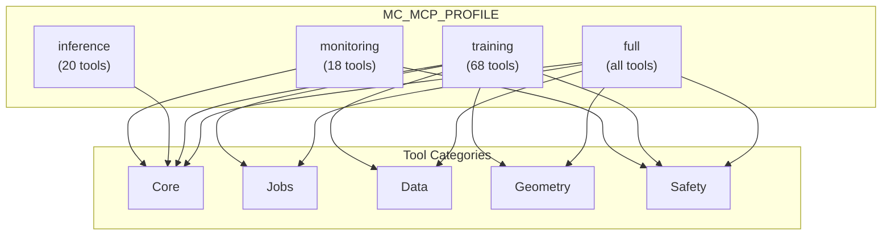

# ModelCypher MCP Server Documentation

**Version:** 1.2.0
**Last Updated:** 2025-12-25
**MCP SDK:** Python `mcp` FastMCP
**Protocol:** MCP Specification 2024-11-05

## Overview

The ModelCypher MCP server exposes on-device ML training capabilities to AI agents and MCP-enabled clients. It provides programmatic access to:

- **Training Control** - Start, pause, resume, cancel training jobs
- **Model Management** - List and query registered models
- **Inference** - Run text generation with fine-tuned models
- **System Monitoring** - Check GPU, memory, and MLX status

For interpretation of geometry outputs, see `GEOMETRY-GUIDE.md`.

### Architecture

```
┌─────────────────────────────────────────────────────────────┐
│                    MCP Client                               │
│  (Claude Desktop, VS Code, Cursor, Custom Agent)           │
└─────────────────────┬───────────────────────────────────────┘
                      │ STDIO Transport (JSON-RPC)
                      ▼
┌─────────────────────────────────────────────────────────────┐
│              modelcypher-mcp Server                         │
│  ┌─────────────┐  ┌─────────────┐  ┌─────────────┐         │
│  │   Tools     │  │  Resources  │  │   Service   │         │
│  │  Handlers   │  │  Handlers   │  │   Bridge    │         │
│  └──────┬──────┘  └──────┬──────┘  └──────┬──────┘         │
└─────────┼────────────────┼────────────────┼─────────────────┘
          │                │                │
          └────────────────┼────────────────┘
                           ▼
┌─────────────────────────────────────────────────────────────┐
│                  ModelCypher Core                           │
│  TrainingController │ ModelService │ InferenceService │ ... │
└─────────────────────────────────────────────────────────────┘
                           │
                           ▼
┌─────────────────────────────────────────────────────────────┐
│                    MLX Framework                            │
│               Metal GPU │ Unified Memory                    │
└─────────────────────────────────────────────────────────────┘
```

## Installation

### Prerequisites

- Python 3.11+
- `uv` (recommended) or Poetry
- Apple Silicon recommended for MLX acceleration (CPU fallback is supported)

### Install and Run

```bash
uv sync
uv run modelcypher-mcp
```

Alternative (Poetry):

```bash
poetry install
poetry run modelcypher-mcp
```

### Verify Installation

```bash
uv run modelcypher-mcp --help
# Shows all tools and resources
```

## Configuration

For advanced configuration options including security, profiles, and environment variables, see [MCP-CONFIGURATION.md](MCP-CONFIGURATION.md).

### Claude Desktop

Add to `~/Library/Application Support/Claude/claude_desktop_config.json`:

```json
{
  "mcpServers": {
    "modelcypher": {
      "command": "uv",
      "args": ["run", "modelcypher-mcp"],
      "env": {
        "MC_MCP_PROFILE": "training"
      }
    }
  }
}
```

### Claude Code (.mcp.json)

```json
{
  "mcpServers": {
    "modelcypher": {
      "command": "uv",
      "args": ["run", "modelcypher-mcp"],
      "env": {
        "MC_MCP_PROFILE": "training"
      }
    }
  }
}
```

### VS Code / Cursor

Add to MCP configuration:

```json
{
  "mcp": {
    "servers": {
      "modelcypher": {
        "command": "uv",
        "args": ["run", "modelcypher-mcp"]
      }
    }
  }
}
```

### Environment Variables

| Variable | Description | Default |
|----------|-------------|---------|
| `MC_MCP_PROFILE` | Tool profile for token optimization (see below) | `full` |
| `MODELCYPHER_HOME` | Base directory for jobs/checkpoints/logs | `~/.modelcypher` |

### Tool Profiles (Token Optimization)

ModelCypher supports server-side tool filtering via the `MC_MCP_PROFILE` environment variable. This reduces token usage by only exposing tools relevant to your workflow.



| Profile | Tools | Estimated Tokens | Use Case |
|---------|-------|------------------|----------|
| `full` | All tools in `src/modelcypher/mcp/server.py` | Varies | Complete access (default) |
| `training` | Training + doc + rag + storage + eval + geometry | Varies | Training workflows |
| `inference` | Inference + rag + ensemble + storage usage | Varies | Inference only |
| `monitoring` | Read-only monitoring subset | Varies | Read-only monitoring |

**Profile Contents:**

```
training:
  mc_inventory, mc_settings_snapshot, mc_train_start, mc_job_status, mc_job_list, mc_job_detail,
  mc_job_cancel, mc_job_pause, mc_job_resume, mc_job_delete, mc_system_status, mc_validate_train,
  mc_estimate_train, mc_doc_convert, mc_model_fetch, mc_model_list, mc_model_search,
  mc_checkpoint_export, mc_checkpoint_list, mc_checkpoint_delete, mc_geometry_training_status,
  mc_geometry_training_history, mc_geometry_validate, mc_geometry_crm_build, mc_geometry_crm_compare,
  mc_safety_circuit_breaker, mc_safety_persona_drift, mc_geometry_safety_jailbreak_test,
  mc_geometry_dare_sparsity, mc_geometry_dora_decomposition, mc_calibration_run,
  mc_calibration_status, mc_calibration_apply, mc_thermo_measure, mc_thermo_detect, mc_thermo_detect_batch, mc_storage_usage,
  mc_storage_cleanup, mc_research_sparse_region, mc_research_afm, mc_adapter_merge, mc_eval_run,
  mc_eval_list, mc_eval_show, mc_train_preflight, mc_train_export

inference:
  mc_inventory, mc_settings_snapshot, mc_model_list, mc_infer, mc_infer_run, mc_infer_batch,
  mc_infer_suite, mc_system_status, mc_ensemble_create, mc_ensemble_run, mc_ensemble_list, mc_ensemble_delete

monitoring:
  mc_inventory, mc_settings_snapshot, mc_job_status, mc_job_list, mc_job_detail, mc_system_status,
  mc_geometry_training_status, mc_geometry_training_history, mc_geometry_validate,
  mc_safety_circuit_breaker, mc_safety_persona_drift, mc_geometry_safety_jailbreak_test,
  mc_geometry_dare_sparsity, mc_geometry_dora_decomposition
```

**Example Configuration:**

```json
{
  "mcpServers": {
    "modelcypher": {
      "command": "poetry",
      "args": ["run", "modelcypher-mcp"],
      "env": {
        "MC_MCP_PROFILE": "training"
      }
    }
  }
}
```

### Tool Annotations

All tools include MCP annotations for AI client optimization:

| Annotation | Meaning |
|------------|---------|
| `readOnlyHint: true` | Safe to call anytime, no side effects |
| `destructiveHint: true` | Cancels jobs or deletes data |
| `idempotentHint: true` | Safe to retry with same arguments |
| `openWorldHint: true` | Interacts with external systems (network) |

**Annotation Categories:**

| Category | Tools | Annotations |
|----------|-------|-------------|
| Read-only | `mc_inventory`, `mc_settings_snapshot`, `mc_job_status`, `mc_job_list`, `mc_job_detail`, `mc_model_list`, `mc_system_status`, `mc_validate_train`, `mc_estimate_train`, `mc_geometry_validate`, `mc_geometry_training_status`, `mc_geometry_training_history`, `mc_geometry_crm_compare`, `mc_safety_circuit_breaker`, `mc_safety_persona_drift`, `mc_geometry_dare_sparsity`, `mc_geometry_dora_decomposition` | `readOnly=true, idempotent=true` |
| Mutating | `mc_train_start`, `mc_job_pause`, `mc_job_resume`, `mc_infer`, `mc_checkpoint_export`, `mc_geometry_crm_build` | `readOnly=false` |
| Destructive | `mc_job_cancel` | `destructive=true, idempotent=true` |
| Network | `mc_model_fetch`, `mc_model_search` | `openWorld=true, idempotent=true` |

---

## Tools Reference

### mc_inventory

**Purpose:** Get complete system state in a single call. **Always call this first** to understand what's available.

**Category:** Read-only discovery

**Input Schema:**
```json
{
  "type": "object",
  "properties": {}
}
```

**Output:**
```json
{
  "models": [
    {
      "id": "llama-3.2-1b",
      "alias": "llama-3.2-1b",
      "format": "safetensors",
      "sizeBytes": 2147483648,
      "path": "/Users/.../models/llama-3.2-1b"
    }
  ],
  "checkpoints": [
    {
      "jobId": "job-uuid",
      "step": 500,
      "loss": 0.523,
      "path": "/path/to/checkpoint"
    }
  ],
  "jobs": [
    {
      "jobId": "uuid",
      "status": "running",
      "progress": 0.45,
      "modelId": "llama-3.2-1b"
    }
  ],
  "workspace": {
    "cwd": "/Users/...",
    "jobStore": "/path/to/job-store"
  },
  "mlxVersion": "0.25.3",
  "policies": {
    "safeGPU": true,
    "evalRequired": true,
    "tokenizerSplit": true,
    "logging": "oslog"
  }
}
```

**Example Usage (AI Agent):**
```
Call mc_inventory first to see what models are available before starting training.
```

---

### mc_train_start

**Purpose:** Start a new training job.

**Category:** MUTATING - creates files, acquires GPU

**Preconditions:**
- No other training job currently running (check `mc_job_list` first)
- Model must be registered (check `mc_inventory`)
- Dataset file must exist at specified path

**Side Effects:**
- Creates checkpoint files in `~/.modelcypher/checkpoints/` (see `MODELCYPHER_HOME`)
- Uses a file lock to prevent concurrent training runs (`~/.modelcypher/training.lock`)
- Logs event streams to `~/.modelcypher/logs/`
- Persists job state under `~/.modelcypher/jobs/` and metadata JSON files

**Input Schema:**
```json
{
  "type": "object",
  "properties": {
    "model": {
      "type": "string",
      "description": "Model identifier or alias to fine-tune"
    },
    "dataset": {
      "type": "string",
      "description": "Path to training dataset (JSONL format)"
    },
    "epochs": {
      "type": "integer",
      "description": "Number of training epochs (default: 3)"
    },
    "learningRate": {
      "type": "number",
      "description": "Learning rate (default: 1e-5, max recommended: 1e-3)"
    },
    "batchSize": {
      "type": "integer",
      "description": "Batch size (auto-calculated if omitted based on memory)"
    },
    "sequenceLength": {
      "type": "integer",
      "description": "Maximum sequence length (default: 2048)"
    },
    "loraRank": {
      "type": "integer",
      "description": "LoRA rank for parameter-efficient fine-tuning"
    },
    "loraAlpha": {
      "type": "number",
      "description": "LoRA alpha scaling factor"
    }
  },
  "required": ["model", "dataset"]
}
```

**Output:**
```json
{
  "jobId": "550e8400-e29b-41d4-a716-446655440000",
  "status": "started",
  "batchSize": 4
}
```

**Example:**
```json
{
  "model": "llama-3.2-1b",
  "dataset": "/Users/me/datasets/my-training-data.jsonl",
  "epochs": 3,
  "learningRate": 5e-5,
  "loraRank": 16,
  "loraAlpha": 32
}
```

**Error Cases:**
- `"Another job is already running"` - Wait or cancel existing job
- `"Model not found"` - Register model first or check alias
- `"Dataset not found"` - Verify file path exists
- `"Insufficient memory"` - Reduce batch size or sequence length

---

### mc_job_status

**Purpose:** Get detailed status of a specific training job.

**Category:** Read-only

**Input Schema:**
```json
{
  "type": "object",
  "properties": {
    "jobId": {
      "type": "string",
      "description": "Job identifier (UUID)"
    }
  },
  "required": ["jobId"]
}
```

**Output:**
```json
{
  "jobId": "550e8400-e29b-41d4-a716-446655440000",
  "status": "running",
  "progress": 0.45,
  "currentEpoch": 2,
  "totalEpochs": 3,
  "currentStep": 450,
  "totalSteps": 1000,
  "loss": 0.523,
  "learningRate": 5e-5,
  "tokensPerSecond": 1250.5,
  "etaSeconds": 180,
  "memoryUsageMB": 8192,
  "startedAt": "2025-11-26T10:30:00Z",
  "modelId": "llama-3.2-1b",
  "datasetPath": "/path/to/dataset.jsonl"
}
```

---

### mc_job_list

**Purpose:** List all training jobs with optional filtering.

**Category:** Read-only

**Input Schema:**
```json
{
  "type": "object",
  "properties": {
    "status": {
      "type": "string",
      "description": "Filter by status: queued, running, paused, completed, failed, canceled"
    },
    "activeOnly": {
      "type": "boolean",
      "description": "Only show active jobs (queued, running, paused)"
    }
  }
}
```

**Output:**
```json
[
  {
    "jobId": "uuid-1",
    "status": "running",
    "progress": 0.45,
    "modelId": "llama-3.2-1b",
    "datasetPath": "/path/to/dataset.jsonl"
  },
  {
    "jobId": "uuid-2",
    "status": "completed",
    "progress": 1.0,
    "modelId": "qwen-0.5b",
    "datasetPath": "/path/to/other.jsonl"
  }
]
```

---

### mc_job_cancel

**Purpose:** Cancel a running or queued training job.

**Category:** MUTATING - stops training, releases GPU

**Side Effects:**
- Stops training loop immediately
- Releases training lock
- Preserves last checkpoint (if any)
- Updates job status to "canceled"

**Input Schema:**
```json
{
  "type": "object",
  "properties": {
    "jobId": {
      "type": "string",
      "description": "Job identifier (UUID)"
    }
  },
  "required": ["jobId"]
}
```

**Output:**
```json
{
  "status": "canceled",
  "jobId": "550e8400-e29b-41d4-a716-446655440000"
}
```

---

### mc_job_pause

**Purpose:** Pause a running training job.

**Category:** MUTATING - pauses training, retains GPU lock

**Side Effects:**
- Pauses training loop at next safe point
- Saves checkpoint
- Retains GPU reservation (other jobs cannot start)

**Input Schema:**
```json
{
  "type": "object",
  "properties": {
    "jobId": {
      "type": "string",
      "description": "Job identifier (UUID)"
    }
  },
  "required": ["jobId"]
}
```

**Output:**
```json
{
  "status": "paused",
  "jobId": "550e8400-e29b-41d4-a716-446655440000"
}
```

---

### mc_job_resume

**Purpose:** Resume a paused training job.

**Category:** MUTATING - resumes training

**Preconditions:**
- Job must be in "paused" state
- GPU must still be available

**Input Schema:**
```json
{
  "type": "object",
  "properties": {
    "jobId": {
      "type": "string",
      "description": "Job identifier (UUID)"
    }
  },
  "required": ["jobId"]
}
```

**Output:**
```json
{
  "status": "resumed",
  "jobId": "550e8400-e29b-41d4-a716-446655440000"
}
```

---

### mc_model_list

**Purpose:** List all registered models with metadata.

**Category:** Read-only

**Input Schema:**
```json
{
  "type": "object",
  "properties": {}
}
```

**Output:**
```json
[
  {
    "id": "llama-3.2-1b",
    "alias": "llama-3.2-1b",
    "format": "safetensors",
    "sizeBytes": 2147483648,
    "path": "/Users/.../models/llama-3.2-1b",
    "architecture": "llama",
    "parameterCount": 1000000000
  }
]
```

---

### mc_model_search

**Purpose:** Search HuggingFace Hub for MLX-compatible models with memory-fit indicators.

**Category:** Network

**Input Schema:**
```json
{
  "type": "object",
  "properties": {
    "query": {
      "type": "string",
      "description": "Free-text search query (e.g., 'llama 3', 'qwen 7b')"
    },
    "author": {
      "type": "string",
      "description": "Filter by author/organization (e.g., 'Qwen', 'meta-llama')"
    },
    "library": {
      "type": "string",
      "description": "Library filter: mlx (default), safetensors, pytorch, any"
    },
    "quant": {
      "type": "string",
      "description": "Quantization filter: 4bit, 8bit, any"
    },
    "sort": {
      "type": "string",
      "description": "Sort by: downloads (default), likes, lastModified, trending"
    },
    "limit": {
      "type": "integer",
      "description": "Maximum results to return (default: 20, max: 100)"
    },
    "cursor": {
      "type": "string",
      "description": "Pagination cursor for next page"
    }
  }
}
```

**Output:**
```json
{
  "count": 1,
  "hasMore": true,
  "nextCursor": "gAAAAABnX...",
  "models": [
    {
      "id": "mlx-community/Qwen2.5-0.5B-Instruct-4bit",
      "downloads": 12345,
      "likes": 321,
      "author": "mlx-community",
      "pipelineTag": "text-generation",
      "tags": ["mlx", "4bit", "quantized"],
      "isGated": false,
      "isPrivate": false,
      "isRecommended": true,
      "estimatedSizeGB": 1.0,
      "memoryFitStatus": "fits"
    }
  ]
}
```

---

### mc_infer

**Purpose:** Run inference with a model.

**Category:** MUTATING - loads model, uses GPU

**Preconditions:**
- Model or checkpoint must exist
- No training job currently running (shares GPU)

**Side Effects:**
- Loads model into GPU memory
- Generates text (may take significant time)
- Unloads model after completion

**Input Schema:**
```json
{
  "type": "object",
  "properties": {
    "model": {
      "type": "string",
      "description": "Model identifier, alias, or checkpoint path"
    },
    "prompt": {
      "type": "string",
      "description": "Input prompt for text generation"
    },
    "maxTokens": {
      "type": "integer",
      "description": "Maximum tokens to generate (default: 512)"
    },
    "temperature": {
      "type": "number",
      "description": "Sampling temperature 0.0-2.0 (default: 0.7)"
    },
    "topP": {
      "type": "number",
      "description": "Top-p sampling (default: 0.95)"
    }
  },
  "required": ["model", "prompt"]
}
```

**Output:**
```json
{
  "modelId": "llama-3.2-1b",
  "prompt": "Explain quantum computing:",
  "response": "Quantum computing is a type of computation...",
  "tokenCount": 150,
  "tokensPerSecond": 45.2,
  "timeToFirstToken": 0.823,
  "totalDuration": 3.32
}
```

**Example:**
```json
{
  "model": "llama-3.2-1b",
  "prompt": "Write a Python function to calculate fibonacci numbers:",
  "maxTokens": 256,
  "temperature": 0.3
}
```

---

### mc_system_status

**Purpose:** Get system readiness and environment information.

**Category:** Read-only

**Input Schema:**
```json
{
  "type": "object",
  "properties": {}
}
```

**Output:**
```json
{
  "machineName": "Mac Studio",
  "unifiedMemoryGB": 64,
  "mlxVersion": "0.25.3",
  "readinessScore": 95,
  "scoreBreakdown": {
    "totalScore": 95,
    "datasetScore": 100,
    "memoryFitScore": 90,
    "systemPressureScore": 100,
    "mlxHealthScore": 100,
    "storageScore": 85,
    "preflightScore": 95,
    "band": "excellent"
  },
  "blockers": []
}
```

**Blocker Example:**
```json
{
  "blockers": [
    {
      "id": "no-dataset",
      "description": "No training dataset selected",
      "severity": "critical",
      "fixAction": "navigateTo:datasets"
    }
  ]
}
```

---

### mc_settings_snapshot

**Purpose:** Snapshot runtime settings derived from environment overrides.

**Category:** Read-only

**Input Schema:**
```json
{
  "type": "object",
  "properties": {}
}
```

**Output:**
```json
{
  "_schema": "mc.settings.snapshot.v1",
  "idleTrainingEnabled": false,
  "idleTrainingMinIdleSeconds": null,
  "idleTrainingMaxThermalState": null,
  "maxMemoryUsagePercent": null,
  "autoSaveCheckpoints": false,
  "platformLoggingOptIn": false
}
```

---

### mc_geometry_validate

**Purpose:** Run the deterministic geometry validation suite (GW distance, traversal coherence, path signatures).

**Category:** Read-only

**Input Schema:**
```json
{
  "type": "object",
  "properties": {
    "includeFixtures": {
      "type": "boolean",
      "description": "Include deterministic fixtures for reproduction (default: false)"
    }
  }
}
```

**Output:**
```json
{
  "_schema": "mc.geometry.validation.v1",
  "suiteVersion": "1.0",
  "timestamp": "2025-11-30T12:00:00Z",
  "passed": true,
  "config": {
    "includeFixtures": false
  },
  "gromovWasserstein": {
    "distanceIdentity": 0.0,
    "distancePermutation": 0.0123,
    "symmetryDelta": 0.0003,
    "maxRowMassError": 0.0002,
    "maxColumnMassError": 0.0002,
    "converged": true,
    "iterations": 20,
    "passed": true
  },
  "traversalCoherence": {
    "selfCorrelation": 0.9999,
    "perturbedCorrelation": 0.994,
    "transitionCount": 6,
    "pathCount": 2,
    "passed": true
  },
  "pathSignature": {
    "signatureSimilarity": 0.9999,
    "signedArea": 0.5,
    "signatureNorm": 1.4,
    "frechetDistance": 0.0,
    "passed": true
  },
  "fixtures": null
}
```

---

### mc_geometry_baseline_list

**Purpose:** List available domain geometry baselines.

**Category:** Read-only

**Input Schema:**
```json
{
  "type": "object",
  "properties": {
    "domain": { "type": ["string", "null"] }
  }
}
```

**Output:**
```json
{
  "_schema": "mc.geometry.baseline.list.v1",
  "baselines": [
    {
      "domain": "spatial",
      "modelFamily": "qwen",
      "modelSize": "0.5B",
      "ollivierRicciMean": -0.189,
      "extractionDate": "2025-12-27"
    }
  ]
}
```

---

### mc_geometry_baseline_extract

**Purpose:** Extract a geometry baseline from a reference model.

**Category:** Read-only

**Input Schema:**
```json
{
  "type": "object",
  "properties": {
    "modelPath": { "type": "string" },
    "domain": { "type": "string", "default": "spatial" },
    "layer": { "type": "integer", "default": -1 },
    "kNeighbors": { "type": "integer", "default": 10 }
  },
  "required": ["modelPath"]
}
```

**Output:**
```json
{
  "_schema": "mc.geometry.baseline.extract.v1",
  "domain": "spatial",
  "modelFamily": "qwen",
  "modelSize": "0.5B",
  "ollivierRicciMean": -0.189,
  "ollivierRicciStd": 0.045,
  "manifoldHealthDistribution": {
    "healthy": 1.0,
    "degenerate": 0.0,
    "collapsed": 0.0
  },
  "intrinsicDimension": 12.4,
  "domainMetrics": {
    "euclidean_consistency": 0.76,
    "gravity_alignment": 0.89
  },
  "savedPath": "/path/to/baselines/spatial_qwen_0.5B.json"
}
```

---

### mc_geometry_baseline_validate

**Purpose:** Validate model geometry against established baselines.

**Category:** Read-only

**Input Schema:**
```json
{
  "type": "object",
  "properties": {
    "modelPath": { "type": "string" },
    "domains": { "type": ["array", "null"], "items": { "type": "string" } },
    "layer": { "type": "integer", "default": -1 }
  },
  "required": ["modelPath"]
}
```

**Output:**
```json
{
  "_schema": "mc.geometry.baseline.validate.v1",
  "modelPath": "/models/qwen-0.5B",
  "results": [
    {
      "domain": "spatial",
      "baselineFound": true,
      "baselineModel": "qwen-0.5B",
      "currentModel": "/models/qwen-0.5B",
      "missingMetrics": [],
      "notes": [],
      "metrics": {
        "ollivier_ricci_mean": {
          "current": -0.192,
          "baseline": -0.189,
          "baselineStd": 0.045,
          "delta": -0.003,
          "relativeDelta": -0.016,
          "zScore": -0.067,
          "percentile": 0.46
        }
      }
    }
  ]
}
```

---

### mc_geometry_baseline_compare

**Purpose:** Compare geometry profiles of two models.

**Category:** Read-only

**Input Schema:**
```json
{
  "type": "object",
  "properties": {
    "model1Path": { "type": "string" },
    "model2Path": { "type": "string" },
    "domain": { "type": "string", "default": "spatial" },
    "layer": { "type": "integer", "default": -1 }
  },
  "required": ["model1Path", "model2Path"]
}
```

**Output:**
```json
{
  "_schema": "mc.geometry.baseline.compare.v1",
  "domain": "spatial",
  "model1": {
    "path": "/models/model-a",
    "family": "qwen",
    "size": "0.5B",
    "ollivierRicciMean": -0.189,
    "intrinsicDimension": 12.4
  },
  "model2": {
    "path": "/models/model-b",
    "family": "qwen",
    "size": "0.5B",
    "ollivierRicciMean": -0.201,
    "intrinsicDimension": 12.7
  },
  "divergence": {
    "ollivierRicci": 0.012,
    "intrinsicDimension": 0.3,
    "domainMetrics": {
      "euclidean_consistency": 0.05
    }
  }
}
```

---

### mc_geometry_concept_detect

**Purpose:** Detect semantic concept activations in a response.

**Category:** Read-only

**Input Schema:**
```json
{
  "type": "object",
  "properties": {
    "text": { "type": "string" },
    "model": { "type": ["string", "null"] },
    "threshold": { "type": "number", "default": 0.3 },
    "windowSizes": { "type": ["array", "null"], "items": { "type": "integer" } },
    "stride": { "type": "integer", "default": 5 },
    "maxConcepts": { "type": "integer", "default": 30 },
    "collapse": { "type": "boolean", "default": true }
  },
  "required": ["text"]
}
```

**Output:**
```json
{
  "_schema": "mc.geometry.concept.detect.v1",
  "modelId": "input-text",
  "promptId": "mcp-concept-detect",
  "responseText": "Example response",
  "conceptSequence": ["recurrence", "symmetry"],
  "detectedConcepts": [
    {
      "conceptId": "recurrence",
      "category": "structural",
      "confidence": 0.62,
      "characterSpan": { "lowerBound": 12, "upperBound": 42 },
      "triggerText": "repeats every cycle",
      "crossModalConfidence": 0.58
    }
  ],
  "meanConfidence": 0.62,
  "meanCrossModalConfidence": 0.58
}
```

---

### mc_geometry_concept_compare

**Purpose:** Compare concept sequences between two texts or models.

**Category:** Read-only

**Input Schema:**
```json
{
  "type": "object",
  "properties": {
    "textA": { "type": ["string", "null"] },
    "textB": { "type": ["string", "null"] },
    "modelA": { "type": ["string", "null"] },
    "modelB": { "type": ["string", "null"] },
    "prompt": { "type": ["string", "null"] },
    "threshold": { "type": "number", "default": 0.3 },
    "windowSizes": { "type": ["array", "null"], "items": { "type": "integer" } },
    "stride": { "type": "integer", "default": 5 },
    "maxConcepts": { "type": "integer", "default": 30 },
    "collapse": { "type": "boolean", "default": true }
  }
}
```

**Output:**
```json
{
  "_schema": "mc.geometry.concept.compare.v1",
  "modelA": "text-a",
  "modelB": "text-b",
  "conceptPathA": ["recurrence", "symmetry"],
  "conceptPathB": ["symmetry"],
  "alignedConcepts": ["symmetry"],
  "uniqueToA": ["recurrence"],
  "uniqueToB": [],
  "alignmentRatio": 0.5,
  "cka": null,
  "cosineSimilarity": null
}
```

---

### mc_geometry_cross_cultural_analyze

**Purpose:** Analyze cross-cultural alignment between two Gram matrices.

**Category:** Read-only

**Input Schema:**
```json
{
  "type": "object",
  "properties": {
    "gramA": { "type": "array" },
    "gramB": { "type": "array" },
    "primeIds": { "type": "array", "items": { "type": "string" } },
    "primeCategories": { "type": ["object", "null"] }
  },
  "required": ["gramA", "gramB", "primeIds"]
}
```

**Output:**
```json
{
  "_schema": "mc.geometry.cross_cultural.analyze.v1",
  "gramRoughnessA": 0.42,
  "gramRoughnessB": 0.51,
  "mergedGramRoughness": 0.39,
  "roughnessReduction": 0.18,
  "complementarityScore": 0.62,
  "convergentPrimes": ["axiom_a"],
  "divergentPrimes": ["axiom_b"],
  "mergeQualityScore": 0.73,
  "alignment": { "cka": 0.66, "rawPearson": 0.52, "alignmentGap": 0.14 }
}
```

---

### mc_geometry_crm_build

**Purpose:** Build a concept response matrix (CRM) for a model.

**Category:** Mutating

**Input Schema:**
```json
{
  "type": "object",
  "properties": {
    "modelPath": { "type": "string" },
    "outputPath": { "type": "string" },
    "adapter": { "type": ["string", "null"] },
    "includePrimes": { "type": "boolean", "default": true },
    "includeGates": { "type": "boolean", "default": true },
    "includePolyglot": { "type": "boolean", "default": true },
    "maxPromptsPerAnchor": { "type": "integer", "minimum": 1 },
    "maxPolyglotTextsPerLanguage": { "type": "integer", "minimum": 1 },
    "anchorPrefixes": { "type": ["array", "null"], "items": { "type": "string" } },
    "maxAnchors": { "type": ["integer", "null"], "minimum": 1 }
  },
  "required": ["modelPath", "outputPath"]
}
```

**Output:**
```json
{
  "_schema": "mc.geometry.crm.build.v1",
  "modelPath": "/path/to/model",
  "outputPath": "/path/to/crm.json",
  "layerCount": 24,
  "hiddenDim": 4096,
  "anchorCount": 64,
  "primeCount": 48,
  "gateCount": 16,
  "nextActions": [
    "mc_geometry_crm_compare to compare against another model",
    "mc_model_merge to use the CRM in shared subspace alignment"
  ]
}
```

---

### mc_geometry_crm_compare

**Purpose:** Compare two CRMs and compute CKA-based correspondence.

**Category:** Read-only

**Input Schema:**
```json
{
  "type": "object",
  "properties": {
    "sourcePath": { "type": "string" },
    "targetPath": { "type": "string" },
    "includeMatrix": { "type": "boolean", "default": false }
  },
  "required": ["sourcePath", "targetPath"]
}
```

**Output:**
```json
{
  "_schema": "mc.geometry.crm.compare.v1",
  "sourcePath": "/path/to/source.crm.json",
  "targetPath": "/path/to/target.crm.json",
  "commonAnchorCount": 64,
  "overallAlignment": 0.87,
  "layerCorrespondence": [
    { "sourceLayer": 0, "targetLayer": 0, "cka": 0.98 }
  ],
  "ckaMatrix": [],
  "nextActions": [
    "mc_geometry_crm_build to regenerate CRM with more anchors",
    "mc_model_merge to apply shared-subspace alignment"
  ]
}
```

---

### mc_geometry_training_status

**Purpose:** Summarize geometric training metrics (flatness, gradient SNR, circuit breaker severity).

**Category:** Read-only

**Input Schema:**
```json
{
  "type": "object",
  "properties": {
    "jobId": { "type": "string" },
    "format": { "type": "string", "enum": ["full", "summary"], "default": "full" }
  },
  "required": ["jobId"]
}
```

**Output:**
```json
{
  "_schema": "mc.geometry.training_status.v1",
  "jobId": "job-abc123",
  "step": 120,
  "flatnessScore": 0.78,
  "flatnessAssessment": "Flat (good)",
  "gradientSNR": 5.4,
  "snrAssessment": "Adequate",
  "circuitBreakerSeverity": 0.21,
  "circuitBreakerTripped": false,
  "activeLayers": ["layer1", "layer3"],
  "perLayerGradientNorms": { "layer1": 0.52 }
}
```

---

### mc_geometry_training_history

**Purpose:** Return geometric metric history for a training job.

**Category:** Read-only

**Input Schema:**
```json
{
  "type": "object",
  "properties": {
    "jobId": { "type": "string" }
  },
  "required": ["jobId"]
}
```

**Output:**
```json
{
  "_schema": "mc.geometry.training_history.v1",
  "jobId": "job-abc123",
  "startStep": 1,
  "endStep": 120,
  "sampleCount": 12,
  "flatnessHistory": [{ "step": 10, "value": 0.8 }],
  "snrHistory": [{ "step": 10, "value": 5.1 }],
  "parameterDivergenceHistory": [{ "step": 10, "value": 0.02 }]
}
```

---

### mc_safety_circuit_breaker

**Purpose:** Evaluate the safety circuit breaker against entropy/refusal/persona drift signals.

**Category:** Read-only

**Input Schema:**
```json
{
  "type": "object",
  "properties": {
    "jobId": { "type": "string" },
    "entropySignal": { "type": "number" },
    "refusalDistance": { "type": "number" },
    "personaDriftMagnitude": { "type": "number" },
    "hasOscillation": { "type": "boolean", "default": false }
  }
}
```

**Output:**
```json
{
  "_schema": "mc.safety.circuit_breaker.v1",
  "jobId": "job-abc123",
  "checkpointPath": null,
  "tripped": false,
  "severity": 0.42,
  "state": "warning",
  "signals": {
    "refusalDistance": 0.45,
    "personaDrift": 0.28,
    "semanticEntropyDelta": 0.62,
    "activationAnomaly": null,
    "gradientNormSpike": null
  },
  "thresholds": {
    "refusalWarning": 0.3,
    "refusalCritical": 0.15,
    "personaDriftWarning": 0.2,
    "personaDriftCritical": 0.4,
    "semanticEntropyWarning": 0.7,
    "aggregateTripThreshold": 0.75
  },
  "interpretation": "Elevated concern - close monitoring recommended",
  "recommendedAction": "Monitor more closely",
  "nextActions": [
    "mc_safety_persona_drift for detailed persona analysis",
    "mc_job_pause if tripped=true",
    "mc_geometry_training_status for full metrics"
  ]
}
```

---

### mc_safety_persona_drift

**Purpose:** Summarize persona drift metrics for a training job.

**Category:** Read-only

**Input Schema:**
```json
{
  "type": "object",
  "properties": {
    "jobId": { "type": "string" }
  },
  "required": ["jobId"]
}
```

**Output:**
```json
{
  "_schema": "mc.safety.persona_drift.v1",
  "jobId": "job-abc123",
  "checkpointPath": null,
  "baselineCheckpointPath": null,
  "overallDriftMagnitude": 0.28,
  "driftAssessment": "moderate",
  "traitDrifts": [
    {
      "traitName": "curiosity",
      "driftMagnitude": 0.28,
      "direction": "unknown",
      "baselineValue": null,
      "currentValue": null
    }
  ],
  "refusalDirectionCorrelation": 0.45,
  "helpfulnessCorrelation": null,
  "interpretation": "Moderate persona drift detected. Monitor closely for alignment degradation.",
  "nextActions": [
    "mc_safety_circuit_breaker for combined safety evaluation",
    "mc_job_pause if assessment is 'critical'",
    "mc_geometry_training_status for full metrics"
  ]
}
```

---

### mc_geometry_dare_sparsity

**Purpose:** Analyze adapter sparsity for DARE merging decisions.

**Category:** Read-only

**Input Schema:**
```json
{
  "type": "object",
  "properties": {
    "checkpointPath": { "type": "string" },
    "basePath": { "type": "string" }
  },
  "required": ["checkpointPath"]
}
```

**Output:**
```json
{
  "_schema": "mc.geometry.dare_sparsity.v1",
  "checkpointPath": "/path/adapter.npz",
  "baseModelPath": "/path/base.npz",
  "effectiveSparsity": 0.82,
  "qualityAssessment": "good",
  "perLayerSparsity": [
    {
      "layerName": "layer1",
      "sparsity": 0.91,
      "importance": 0.09,
      "canDrop": true
    }
  ],
  "layerRanking": ["layer1"],
  "recommendedDropRate": 0.85,
  "mergeReadiness": "ready",
  "interpretation": "Effective sparsity 82.00% (good). Recommended drop rate 0.85.",
  "nextActions": [
    "mc_geometry_dora_decomposition for learning type",
    "mc_checkpoint_score for quality assessment",
    "mc_checkpoint_export for deployment"
  ]
}
```

---

### mc_geometry_dora_decomposition

**Purpose:** Decompose adapter changes into magnitude vs direction components (DoRA).

**Category:** Read-only

**Input Schema:**
```json
{
  "type": "object",
  "properties": {
    "checkpointPath": { "type": "string" },
    "basePath": { "type": "string" }
  },
  "required": ["checkpointPath"]
}
```

**Output:**
```json
{
  "_schema": "mc.geometry.dora_decomposition.v1",
  "checkpointPath": "/path/adapter.npz",
  "baseModelPath": "/path/base.npz",
  "magnitudeChangeRatio": 0.12,
  "directionalDrift": 0.08,
  "learningType": "balanced",
  "learningTypeConfidence": 0.62,
  "perLayerDecomposition": [
    {
      "layerName": "layer1",
      "magnitudeChange": 0.08,
      "directionalDrift": 0.05,
      "dominantType": "balanced"
    }
  ],
  "stabilityScore": 0.84,
  "overfitRisk": "low",
  "interpretation": "Adapter combines scaling and rotation (balanced change)",
  "nextActions": [
    "mc_geometry_dare_sparsity for sparsity assessment",
    "mc_checkpoint_export for deployment"
  ]
}
```

---

## Resources Reference

Resources provide read-only access to ModelCypher state via standard MCP resource URIs.

### mc://models

**Description:** All registered models with metadata

**MIME Type:** `application/json`

**Content:** Same format as `mc_model_list` output

### mc://jobs

**Description:** All training jobs with status

**MIME Type:** `application/json`

**Content:** Same format as `mc_job_list` output (no filters)

### mc://checkpoints

**Description:** All training checkpoints

**MIME Type:** `application/json`

**Content:**
```json
[
  {
    "jobId": "uuid",
    "step": 500,
    "loss": 0.523,
    "path": "/path/to/checkpoint"
  }
]
```

### mc://system

**Description:** System readiness and environment info

**MIME Type:** `application/json`

**Content:** Same format as `mc_system_status` output

---

## AI Agent Usage Patterns

### Pattern 1: Discovery First

**Always start with `mc_inventory`** to understand available resources before taking actions.

```
1. mc_inventory → Learn what models, checkpoints, jobs exist
2. mc_system_status → Verify system is ready for training
3. mc_train_start → Start training with validated inputs
4. mc_job_status (poll) → Monitor progress
```

### Pattern 2: Safe Training Workflow

```
# Check preconditions
inventory = mc_inventory()
if any(job.status in ["running", "paused"] for job in inventory.jobs):
    # Either wait or cancel existing job
    mc_job_cancel(existing_job_id)

# Verify model exists
if model_alias not in [m.alias for m in inventory.models]:
    raise "Model not registered"

# Start training
result = mc_train_start(model=model_alias, dataset=dataset_path)
job_id = result.jobId

# Monitor (poll every 30s)
while True:
    status = mc_job_status(job_id)
    if status.status in ["completed", "failed", "canceled"]:
        break
    # Report progress: {status.progress * 100}%, loss: {status.loss}
    wait(30)
```

### Pattern 3: Inference After Training

```
# Find latest checkpoint for job
inventory = mc_inventory()
job_checkpoints = [c for c in inventory.checkpoints if c.jobId == job_id]
latest = max(job_checkpoints, key=lambda c: c.step)

# Run inference with checkpoint
result = mc_infer(
    model=latest.path,  # Use checkpoint path
    prompt="Your prompt here",
    temperature=0.7
)
```

### Pattern 4: Error Recovery

```
try:
    mc_train_start(model=model, dataset=dataset)
except MCPError as e:
    if "Another job is already running" in str(e):
        # Check if we should wait or cancel
        jobs = mc_job_list(activeOnly=True)
        # Decide based on job progress/priority
    elif "Insufficient memory" in str(e):
        # Retry with smaller batch size
        mc_train_start(model=model, dataset=dataset, batchSize=1)
```

### Anti-Patterns to Avoid

1. **Starting training without checking existing jobs** - Will fail if another job is running
2. **Not validating model/dataset existence** - Use `mc_inventory` first
3. **Polling too frequently** - 30-second intervals are sufficient for training
4. **Ignoring system status blockers** - Check `mc_system_status` before training

---

## Tool Safety & Boundaries

ModelCypher exposes tools that are either **read-only** (safe to call freely) or **mutating** (change system state, use GPU, or create files). Agents should respect these boundaries to avoid conflicts and unintended side effects.

### Read-Only Tools (Safe)

These tools never modify state and are safe to call whenever context is needed:

- `mc_inventory` – Discovery: models, datasets, checkpoints, jobs, workspace, MLX version, and safety policies.
- `mc_settings_snapshot` – Environment-driven runtime settings snapshot.
- `mc_job_status` – Detailed status for a single job.
- `mc_job_list` – List jobs (optionally filtered by status / activeOnly).
- `mc_model_list` – Registered models with metadata.
- `mc_system_status` – System readiness (Metal, memory fit, storage, MLX health).
- `mc_geometry_validate` – Deterministic geometry validation suite.
- `mc_geometry_concept_detect` – Detect semantic concept activations in text or model responses.
- `mc_geometry_concept_compare` – Compare concept paths between two responses.
- `mc_geometry_cross_cultural_analyze` – Gram-level alignment analysis across cultures.
- `mc_geometry_crm_compare` – Compare concept response matrices and compute CKA correspondence.
- `mc_geometry_training_status` – Current geometric training metrics for a job.
- `mc_geometry_training_history` – Historical geometric metrics for a job.
- `mc_safety_circuit_breaker` – Circuit breaker evaluation from safety signals.
- `mc_safety_persona_drift` – Persona drift analysis for a job.
- `mc_geometry_dare_sparsity` – DARE sparsity analysis for adapter weights.
- `mc_geometry_dora_decomposition` – DoRA magnitude/direction decomposition.

**Recommended usage:**

- Call `mc_inventory` at the start of every new workflow.
- Use `mc_job_list(activeOnly=true)` to decide whether mutating tools are safe to call.
- Call `mc_system_status` before starting training to surface blockers early.

### Mutating Tools (Use with Preconditions)

These tools change state, use GPU, or create files. Agents must check preconditions first:

- `mc_train_start` – Start a training job (creates checkpoints, acquires the training lock).
- `mc_job_cancel` – Cancel a running or queued job (releases the training lock, preserves latest checkpoint).
- `mc_job_pause` – Pause training (saves checkpoint, keeps the training lock).
- `mc_job_resume` – Resume a paused job (requires the training lock to be free).
- `mc_infer` – Run inference (loads model weights, generates text).
- `mc_geometry_crm_build` – Build a concept response matrix (writes CRM JSON output).

#### Three-Tier Boundaries (for Agents)

- ✅ **Always**
  - Use `mc_inventory` + `mc_system_status` for discovery and readiness checks.
  - Use read-only tools (`mc_job_list`, `mc_job_status`, `mc_model_list`) to understand state before deciding on actions.

- ⚠️ **Ask or Check First**
  - `mc_train_start` – Only call after:
    - `mc_job_list(activeOnly=true)` shows no running/paused jobs, and
    - `mc_system_status` reports no critical blockers.
  - `mc_infer` – Only call when no training job is running (shares GPU).
  - `mc_job_pause` / `mc_job_resume` – Ensure the job is in an appropriate state.

- 🚫 **Never (Without Explicit Human Intent)**
  - Call mutating tools in a tight loop or without inspecting their effects.
  - Start training on arbitrary datasets not confirmed by the user.
  - Cancel or pause jobs without surfacing the impact to the user.

Agents should treat mutating tools as **explicit user actions** (e.g., “start training”, “cancel job”), not as background maintenance operations.

### Safe Workflows by Tool Category

- **Discovery-First Training Workflow**
  1. `mc_inventory` – Understand models, datasets, existing jobs.
  2. `mc_job_list(activeOnly=true)` – Confirm no conflicting jobs.
  3. `mc_system_status` – Check readiness and blockers.
  4. `mc_train_start(...)` – Start training only after conditions are met.
  5. `mc_job_status` (poll) – Monitor progress.

- **Safe Inference Workflow**
  1. `mc_inventory` – Find latest checkpoints/models.
  2. `mc_job_list(activeOnly=true)` – Ensure no training job is running.
  3. `mc_infer(model=checkpointPathOrAlias, prompt=...)` – Run inference.

- **Graceful Shutdown / Cleanup**
  - Use `mc_job_cancel` only after confirming with the user that the job should be stopped.
  - Use `mc_job_pause` when the user wants to pause but preserve GPU reservation and checkpoints.

These patterns match ModelCypher's concurrency guard (file locking during training) and MLX memory constraints, and are the safest way for agents to operate.

---

## Human Usage Patterns

### Quick Status Check

```bash
# In Claude Desktop or similar MCP client
> What training jobs are running?
# Agent calls mc_job_list(activeOnly=true)

> What's the status of job abc-123?
# Agent calls mc_job_status(jobId="abc-123")
```

### Start Training via Natural Language

```
> Train llama-3.2-1b on my customer-support.jsonl dataset for 5 epochs
# Agent:
#   1. mc_inventory() - Verify model exists
#   2. mc_system_status() - Check system ready
#   3. mc_train_start(model="llama-3.2-1b", dataset="customer-support.jsonl", epochs=5)
```

### Interactive Inference

```
> Use my fine-tuned model to answer: "How do I reset my password?"
# Agent:
#   1. mc_inventory() - Find latest checkpoint
#   2. mc_infer(model=checkpoint_path, prompt="How do I reset my password?")
```

---

## Error Handling

### Error Response Format

All errors are returned as MCP errors with structured messages:

```json
{
  "error": {
    "code": -32602,
    "message": "Invalid params: Missing required argument 'model'"
  }
}
```

### Common Errors

| Error | Cause | Resolution |
|-------|-------|------------|
| `Missing required argument` | Required parameter not provided | Include all required parameters |
| `Unknown tool` | Invalid tool name | Check tool name spelling |
| `Another job is already running` | Training lock held | Wait or cancel existing job |
| `Model not found` | Model alias doesn't exist | Register model or check alias |
| `Dataset not found` | File path doesn't exist | Verify file path |
| `Insufficient memory` | Not enough GPU/RAM | Reduce batch size or sequence length |
| `Server deallocated` | Internal server error | Restart MCP server |

---

## Troubleshooting

### Server Won't Start

```bash
# Check if another instance is running
pgrep -f modelcypher-mcp

# Check logs
uv run modelcypher-mcp 2>&1 | head -50
```

### Connection Issues (Claude Desktop)

1. Verify config path: `~/Library/Application Support/Claude/claude_desktop_config.json`
2. Verify entrypoint: `uv run modelcypher-mcp --help`
3. Restart Claude Desktop after config changes
4. Check Claude Desktop logs for MCP errors

### Training Fails to Start

```
1. Call mc_inventory() - Verify model is registered
2. Call mc_job_list(activeOnly=true) - Check no job running
3. Call mc_system_status() - Check for blockers
4. Verify dataset path exists and is readable
```

### Slow Inference

- Check system memory pressure with `mc_system_status`
- Reduce `maxTokens` parameter
- Ensure no training job is competing for GPU

### Debugging

Logs output to stderr (STDIO MCP requires clean stdout). Run in the foreground to inspect logs.

---

## Future Considerations

### MCP 2025-06-18: outputSchema and structuredContent

The MCP 2025-06-18 specification adds `outputSchema` to tool definitions and `structuredContent` to responses. When the MCP Python SDK updates to support these features, ModelCypher will adopt them for more efficient structured responses.

**Current approach:** All responses include a `_schema` field (e.g., `mc.train.start.v1`) documenting the response structure.

**Future approach:** Add formal JSON Schema `outputSchema` to each tool, enabling AI clients to validate and parse responses more efficiently.

### Code Mode Pattern (Long-term)

Anthropic's research shows a "Code Mode" pattern can reduce tool token overhead by 98.7% for complex workflows. Instead of presenting tools as individual definitions, tools are presented as a filesystem of callable code files:

```
mc://code/training.swift       # Training workflow functions
mc://code/inference.swift      # Inference functions
mc://code/monitoring.swift     # Status and monitoring
```

**Benefits:**
- Massive token reduction for large tool sets
- Familiar code-centric interface for AI agents
- Natural composition of multi-step workflows

**Considerations:**
- Requires client support for resource-as-code pattern
- More complex implementation
- May not suit all AI clients equally

This pattern is documented here for future evaluation when ModelCypher's tool count grows significantly.

---

## Phase 2 MCP Tools

Phase 2 adds comprehensive safety, entropy, and agent tools for deeper model analysis.

### Safety Tools

| Tool | Purpose | Category |
|------|---------|----------|
| `mc_safety_adapter_probe` | Run adapter safety probes (delta features, L2 norms, sparsity) | Read-only |

### Entropy Tools

| Tool | Purpose | Category |
|------|---------|----------|
| `mc_entropy_window` | Sliding window entropy tracking with circuit breaker | Read-only |
| `mc_entropy_conversation_track` | Multi-turn conversation entropy analysis | Read-only |
| `mc_entropy_dual_path` | Dual-path security analysis (base vs adapter) | Read-only |

### Agent Tools

| Tool | Purpose | Category |
|------|---------|----------|
| `mc_agent_trace_import` | Import OpenTelemetry/Monocle traces | Mutating |
| `mc_agent_trace_analyze` | Analyze agent traces for compliance and patterns | Read-only |
| `mc_agent_validate_action` | Validate agent action against safety policies | Read-only |

### Geometry Tools (Atlas + Spatial)

| Tool | Purpose | Category |
|------|---------|----------|
| `mc_geometry_atlas_inventory` | List available atlas probes (sources, domains, counts) | Read-only |
| `mc_geometry_atlas_dimensionality` | Intrinsic dimensionality for atlas probes at a layer | Read-only |
| `mc_geometry_atlas_dimensionality_study` | Multi-layer dimensionality sweep for atlas probes | Read-only |
| `mc_geometry_spatial_euclidean` | Euclidean consistency check for spatial anchors | Read-only |

Note: Full geometry tool coverage (path, CRM, stitch, probes, manifold) is implemented in `src/modelcypher/mcp/tools/geometry.py`.

---

## Modular Architecture

The MCP server uses a modular tool registration pattern for maintainability:

```
src/modelcypher/mcp/
├── server.py              # Core server
└── tools/
    ├── common.py          # ServiceContext, helpers, annotations
    ├── geometry.py        # Geometry tools (path, CRM, stitch, etc.)
    ├── safety_entropy.py  # Safety and entropy tools
    └── agent.py           # Agent trace tools
```

Each tool module exports registration functions:
- `register_geometry_tools(ctx)` - 25+ geometry analysis tools
- `register_geometry_invariant_tools(ctx)` - Invariant layer mapping
- `register_geometry_safety_tools(ctx)` - Jailbreak testing, DARE, DoRA
- `register_geometry_primes_tools(ctx)` - Semantic prime analysis
- `register_geometry_crm_tools(ctx)` - Concept response matrix
- `register_geometry_stitch_tools(ctx)` - Manifold stitching and refinement
- `register_safety_tools(ctx)` - Adapter safety probes
- `register_entropy_tools(ctx)` - Window, conversation, dual-path tracking
- `register_agent_tools(ctx)` - Trace import/analysis/validation

The `ServiceContext` class provides lazy-loaded access to all domain services.

---

## Version History

### 1.2.0 (2025-12-22)

- Added Phase 2 MCP tools: safety, entropy, agent
- Modularized geometry tools into `src/modelcypher/mcp/tools/geometry.py`
- Added `ServiceContext` for lazy-loaded service access
- Reduced server.py from ~4900 to ~3400 lines

### 1.1.0 (2025-11-26)

- Added `MC_MCP_PROFILE` environment variable for server-side tool filtering
- Added tool profiles: `full`, `training`, `inference`, `monitoring`
- Added MCP tool annotations (readOnlyHint, destructiveHint, idempotentHint, openWorldHint)
- Fixed mc_infer to use checkpoint paths only (narrowed contract)
- Fixed mc_infer model cleanup to use `defer` for guaranteed unload on all exits
- Added 4 new tools: mc_validate_train, mc_estimate_train, mc_model_fetch, mc_checkpoint_export
- Total: 30 tools, 4 resources

### 1.0.0 (2025-11-26)

- Initial release
- 10 tools: mc_inventory, mc_train_start, mc_job_status, mc_job_list, mc_job_cancel, mc_job_pause, mc_job_resume, mc_model_list, mc_infer, mc_system_status
- 4 resources: mc://models, mc://jobs, mc://checkpoints, mc://system
- ServiceLifecycle integration for graceful shutdown
- Official MCP Swift SDK v0.10.0+

---

## See Also

- [AGENTS.md](../AGENTS.md) - Core agent instructions
- [CLI Reference](CLI-REFERENCE.md) - Command-line interface docs
- [MCP Specification](https://spec.modelcontextprotocol.io/) - Official MCP protocol spec
