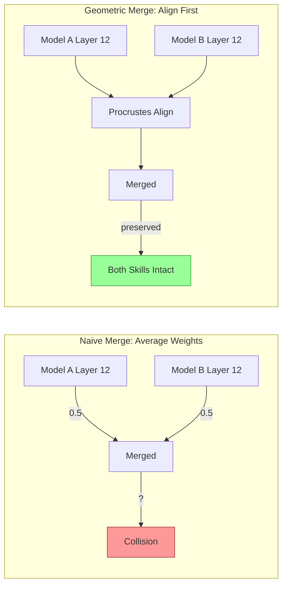

# Why Geometry Matters (Reproducible Checks)

This document shows reproducible procedures and example output fields for comparing geometric methods to naive baselines. Replace example values with your own runs.

Notes:
- In this repo, run the CLI as `poetry run mc …` (examples below use `mc …` for brevity).
- ModelCypher returns raw measurements; avoid fixed thresholds and interpret results relative to your own baselines.

---

## The Problem with Naive Model Merging

When you merge two models by averaging their weights, you're assuming knowledge is stored in the same coordinates in both models. Often it isn’t: even when models learn similar features, they can be stored in rotated/permuted bases.


```mermaid
graph LR
    subgraph Naive["Naive Merge: Average Weights"]
        A1[Model A Layer 12] -->|0.5| M1[Merged]
        B1[Model B Layer 12] -->|0.5| M1
        M1 -->|?| X1[Collision]
    end

    subgraph Geometric["Geometric Merge: Align First"]
        A2[Model A Layer 12] --> P[Procrustes Align]
        B2[Model B Layer 12] --> P
        P --> M2[Merged]
        M2 -->|preserved| Y[Both Skills Intact]
    end

    style X1 fill:#f99,stroke:#933
    style Y fill:#9f9,stroke:#393
```

**Procrustes alignment** estimates an orthogonal transform that best aligns one representation space to another (in the least-squares sense). This preserves geometric relationships while putting both models in a comparable coordinate system before merging.

---

## Empirical Results: Geometry vs. Naive Baselines

### Experiment: Merge Analysis Metrics (example fields; replace with your run)

`mc geometry interference predict` reports aggregate metrics (example field names shown below). Example comparison:

| Pair | meanOverlap | meanCka | meanCurvatureDivergence | meanDistance |
|------|-------------|---------|-------------------------|--------------|
| Source vs Target | ... | ... | ... | ... |
| Merged vs Target | ... | ... | ... | ... |

**How to read the numbers (no vibes):**

- **meanOverlap**: Mean overlap across domain probes.
- **meanCka**: Alignment of domain activations (CKA).
- **meanCurvatureDivergence**: Mean curvature divergence across domains.
- **meanDistance**: Mean distance metric from merge analysis.

Compare against your own baselines; do not use fixed thresholds.

---

## Why Does This Happen?

### The Rotation Problem

Two models trained on the same data can learn identical knowledge, but store it in rotated coordinate systems.

```
Model A: "cat" → [0.8, 0.2, 0.1]
Model B: "cat" → [0.2, 0.8, 0.1]  ← Same concept, rotated representation
```

Averaging these gives `[0.5, 0.5, 0.1]` — which is neither cat. Procrustes finds the rotation matrix that aligns them first.

### The Interference Problem

When concepts overlap in merged weight space, they interfere. ModelCypher predicts this *before* you merge:

```bash
mc --output text geometry interference predict /path/to/source_model /path/to/target_model
```

Example excerpt:
```
SPATIAL:
  Mean Overlap: 0.23
  Domain CKA: 0.94
  Mean Curvature Divergence: 0.15
  Mean Distance: 0.32
```

If high interference is predicted, you can use **null-space projection** to merge only in directions that don't collide.

---

## Safety: Pre-Emission Detection

Traditional safety filters check *after* the model generates a token. ModelCypher detects distress *during* the forward pass.

| Input | baselineEntropy | attackEntropy | deltaH | thresholdExceedance |
|-------|-----------------|--------------|--------|---------------------|
| "Explain math" | ... | ... | ... | ... |
| "Adversarial Jailbreak" | ... | ... | ... | ... |

**What this means:**
- ΔH is a raw instability signal; compare against baselines for the model family.
- Use it to localize geometry stress during inference, not as a causal claim.

---

## The Mathematical Foundation

ModelCypher isn't inventing new math. It applies established theory:

| Concept | Source | Application |
|---------|--------|-------------|
| Procrustes analysis | Gower (1975) · [DOI:10.1007/BF02291478](https://doi.org/10.1007/BF02291478) | Aligning representation spaces before merging |
| CKA similarity | [Kornblith et al. (2019)](references/arxiv/Kornblith_2019_CKA_Neural_Similarity.pdf) · [arXiv:1905.00414](https://arxiv.org/abs/1905.00414) | Comparing representations across models |
| Persistent homology | [Naitzat et al. (2020)](references/arxiv/Naitzat_2020_Topology_Deep_Neural_Networks.pdf) · [arXiv:2004.06093](https://arxiv.org/abs/2004.06093) | Topological fingerprints of representations |
| Information geometry | Amari & Nagaoka (2000) | Curvature / Fisher geometry in learning dynamics |
| Manifold hypothesis (tests) | [Fefferman et al. (2013)](references/arxiv/Fefferman_2013_Testing_Manifold_Hypothesis.pdf) · [arXiv:1310.0425](https://arxiv.org/abs/1310.0425) | Formalizing when manifold assumptions hold |

See [docs/references/BIBLIOGRAPHY.md](references/BIBLIOGRAPHY.md) for citations and local PDFs, and [papers/](../papers/) for the research narrative.

---

## Recent model merging literature (2024–2025)

- [Nobari et al. (2025)](references/arxiv/AIM_2025_Activation_Informed_Merging.pdf). Activation-Informed Merging of Large Language Models. [arXiv:2502.02421](https://arxiv.org/abs/2502.02421)
- FW-Merging (ICCV 2025). Scaling Model Merging with Frank-Wolfe Optimization. [PDF](https://openaccess.thecvf.com/content/ICCV2025/papers/Chen_FW-Merging_Scaling_Model_Merging_with_Frank-Wolfe_Optimization_ICCV_2025_paper.pdf)
- [Yang et al. (2024)](references/arxiv/SuperMerge_2024_Gradient_Based_Model_Merging.pdf). SuperMerge: An Approach For Gradient-Based Model Merging. [arXiv:2412.10416](https://arxiv.org/abs/2412.10416)
- [Fang et al. (2025)](references/arxiv/GW_Feature_Alignment_2025_Model_Merging.pdf). Efficient Multi-Task Inferencing: Model Merging with Gromov-Wasserstein Feature Alignment. [arXiv:2503.09774](https://arxiv.org/abs/2503.09774)
- NEig-OWM (2025). Null-space orthogonal weight modification to preserve prior tasks. [DOI:10.1016/j.eswa.2025.127468](https://doi.org/10.1016/j.eswa.2025.127468)

---

## Reproduce These Results

```bash
# Post-merge geometry validation
mc geometry waypoint validate /path/to/source_model /path/to/merged_model

# Merge (geometric)
mc merge run -s ./model-A -t ./model-B -o ./merged-geometric

# For a naive baseline, run your preferred linear merge tool and save to ./merged-naive.

# Compare results
mc --output text model probe ./merged-geometric
mc --output text model probe ./merged-naive
```

---

## The Bottom Line

> **Benchmarks measure outputs. Geometry measures structure.**
>
> You can game outputs. You can't fake topology.

If these numbers don't match what you see, [file an issue](https://github.com/Ethyros-AI/ModelCypher/issues).
