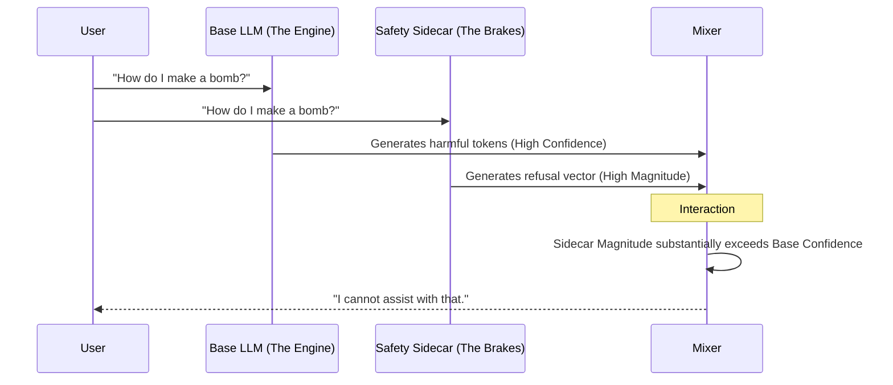

# Mental Models: Visualizing Geometry

High-dimensional geometry is hard to see. These diagrams provide 2D/3D analogies for the core operations in ModelCypher.

## 1. Manifold Stitching vs. Weight Averaging

**Weight Averaging (The "Bag of Numbers" approach)**
Averages the coordinates directly. If the models are rotated relative to each other, this destroys the shape.

```mermaid
graph TD
    subgraph "Model A (Cat is at [0, 1])"
        A[Cat] -->|Axis 1| OutputA
    end
    subgraph "Model B (Cat is at [1, 0])"
        B[Cat] -->|Axis 2| OutputB
    end
    subgraph "Naive Merge (Average)"
        A --> M[Merge]
        B --> M
        M -->|Result: Cat is at [0.5, 0.5]| Bad[Degraded Representation]
    end
```

**Manifold Stitching (Geometric Approach)**
Rotates Model B to align with Model A before merging.

```mermaid
graph TD
    subgraph "Alignment Phase"
        B_raw[Model B Raw] -->|Procrustes Rotation| B_aligned[Model B Aligned]
        B_aligned -.->|Matches Axis 1| A[Model A]
    end
    subgraph "Stitching Phase"
        A --> S[Stitcher]
        B_aligned --> S
        S -->|Result: Cat is at [0, 1] (high similarity)| Good[Unified Concept]
    end
```

---

## 2. Sidecar Architecture (Co-Orbiting)

The Sidecar does not edit the Base Model. It monitors activations and selectively applies constraints.



---

## 3. The Intersection Map (Venn Diagram)

Visualizing where two models overlap (under a fixed probe setup).

```mermaid
venn
    ModelA[Model A]
    ModelB[Model B]
    Overlap[Measured overlap on a probe corpus]
```

*Note: One approach is to focus merges on the measured overlap and avoid blending regions with low overlap; the actual overlap depends on probe corpus, layer, and similarity metric.*
