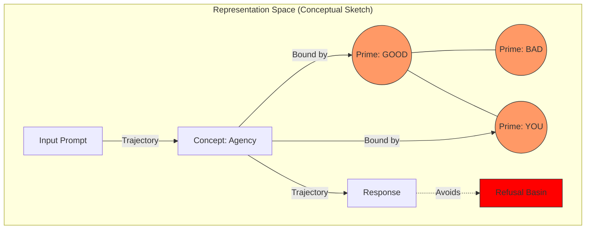

# Paper 0: The Shape of Knowledge (Framework Proposal)

> **Status**: Position paper draft (framework + measurement proposals).
>
> **Non-claims**: This paper does not claim a mechanistic proof of “knowledge = manifold,” a universal coordinate system across models, or any anthropomorphic properties. It proposes operational constructs and falsifiable tests.
>
> **Repo alignment**: Where this paper mentions tools/experiments, implementation status is tracked in `../docs/PARITY.md`.

## Abstract

We propose the **Geometric Generality Hypothesis**: that many useful properties of large language models can be described in terms of stable *relational* structure in high-dimensional representation spaces. This is a position paper: we do not claim a complete mechanistic account of “general intelligence,” nor that disjoint model families share a universal coordinate system. Instead, we synthesize relevant strands of prior work (representation similarity, semantic entropy, mechanistic interpretability) and propose operational constructs—anchor sets, trajectories, and boundary conditions—together with falsifiable predictions and measurement protocols. This framing motivates the *ModelCypher* tooling and the experiment-oriented follow-ups in Papers I–III.

## 1. Introduction

The defining challenge of AI alignment is the "Black Box" problem: we can steer the model's behavior (RLHF), yet we remain ignorant of its internal state. This epistemological gap makes safety fragile; we are optimizing a high-dimensional system to *act* human, without understanding its internal **topology**.

We propose a shift from purely behavioral evaluation toward **geometric diagnostics**. We model an LLM’s internal state as a trajectory through a high-dimensional space; within this framing, some concepts may correspond (approximately) to regions, and some safety mechanisms may be interpreted as constraints on reachable trajectories.

> Figure 1 (conceptual): the geometry-of-inference sketch is represented below as a Mermaid diagram.

### 1.1 Contributions
This position paper makes the following contributions:
1.  **Synthesis**: We unify 13 distinct research pillars (Information Geometry, Cognitive Science, Mechanistic Interpretability) into a single "Geometric Generality" framework.
2.  **Operational framing**: We define measurable constructs (anchor sets, relational structure, trajectories) that let us discuss “knowledge as geometry” without requiring shared coordinates.
3.  **Roadmap**: We provide the theoretical axioms that enable the engineering applications in Papers I, II, and III.

## 2. The Unifying Framework (Hypothesis)

We propose three core hypotheses that form the basis of the *ModelCypher* framework.

### Hypothesis 1: The Geometric Nature of Knowledge
Concept representations may be approximated as bounded regions (e.g., clusters or polytopes) in high-dimensional space. The “Platonic Representation Hypothesis” (Huh et al., 2024) motivates looking for convergent *relational structure* as models scale, without assuming identical coordinates.

### Hypothesis 2: Navigational Inference
Inference can be studied as the trajectory of a state vector through this space. In this view, a “computation” is a path; whether this path is stable, brittle, or safety-relevant is an empirical question.

### Hypothesis 3: Candidate Invariants
Certain anchor inventories—specifically **semantic primes** (Wierzbicka, 1996)—may induce relatively stable relational structure across model families. This is testable and can fail; Paper I defines falsification experiments that treat “invariance” as a measurable claim rather than a metaphor.

## 3. Evidence from the 13 Pillars

(See [Foundational Bibliography](../KnowledgeasHighDimensionalGeometryInLLMs.md) for the full bibliography.)

### 3.1 The Mathematics of Manifolds
Fefferman (2016) and Amari (2000) provide the mathematical tools for testing and reasoning about low-dimensional structure in high-dimensional spaces. We treat “manifold-like structure” as an empirical question in representations, not as an assumption about model internals.

### 3.2 A Thermodynamic Analogy for Meaning ("Linguistic Thermodynamics")
Evaluation of semantic entropy (Farquhar et al., 2024) suggests that distributional uncertainty is measurable and structured; in our framing, high entropy corresponds to regions where the next-token distribution is diffuse. This motivates thermodynamic *analogies* and entropy-based stability signals (Paper II), not literal physical laws.

### 3.3 The Engineering of Representation
Representation Engineering (Zou et al., 2023) has empirically blocked specific directions associated with behaviors (e.g., deception), suggesting that some behaviors correlate with approximately linear structure that can be measured and intervened on.

## 4. Implications for Safety & Ethics

If we treat knowledge as geometry, then safety can be approached as constraining trajectories.

### 4.1 From Conditioning to Constraints
Current safety methods (RLHF and related preference/constraint training) primarily condition the model's *policy* (the probability of the next token). This can be brittle under distribution shift. Our framework suggests a complementary approach: measure and, when possible, constrain internal trajectories so unsafe behaviors become less reachable under typical decoding regimes.

### 4.2 The "Circuit Breaker" Model
This aligns with “circuit breaker” style proposals that monitor internal signals and intervene when boundary conditions are violated. *ModelCypher* explores this via the **Sidecar** architecture and divergence monitors (see Paper II and `../docs/PARITY.md`).

## 5. Limits of the Metaphor (Falsifiability)

-   **H1 Falsification**: If conceptual boundaries are disjoint or highly non-convex, the polytope model fails.
-   **H3 Falsification**: If semantic primes do not show higher cross-model stability than random controls (see Paper I), the anchor-stability hypothesis is rejected.

## 6. Conclusion

We have outlined a "Geometric Generality" framework that reframes AI alignment as a problem of cartography and navigation. This theoretical stance is not an end in itself; it is the necessary foundation for the rigorous engineering of **Agency** (Paper I), **Thermodynamics** (Paper II), and **alignment** (Paper III).

## References

(See [Foundational Bibliography](../KnowledgeasHighDimensionalGeometryInLLMs.md).)
