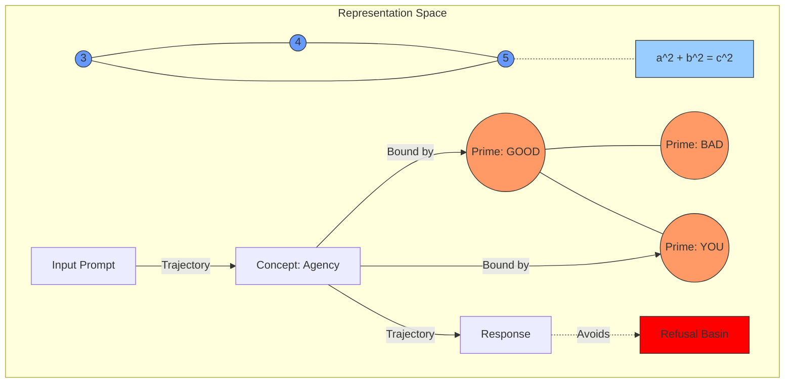

# Paper 0: The Shape of Knowledge

**Author**: Jason Kempf
**Affiliation**: EthyrosAI
**Date**: December 2025

> **Status**: Framework paper establishing the Geometric Knowledge Thesis and Dimensional Hierarchy.

## Abstract

Knowledge in large language models has shape. Concepts occupy bounded regions in high-dimensional representation space. Inference follows trajectories through this space. Mathematical formulas define constraint surfaces. Safety can be enforced by constraining these trajectories. These are not metaphors---they are measurable geometric properties that we demonstrate across model families using Centered Kernel Alignment, topological fingerprinting, Procrustes alignment, and entropy dynamics.

This paper synthesizes foundational work into the **Geometric Knowledge Thesis** and introduces a new claim: **dimensions are nested compressions**. Binary encoding (1D) compresses to vocabulary (2D), which compresses to physical reality (3D), which compresses to the conceptual manifold (4D+). Alignment at dimension N requires prior alignment at dimensions 1 through N-1. This hierarchical structure explains why cross-family model merges fail despite high semantic CKA: convergent 4D+ geometry cannot compensate for divergent 1D/2D projections.

## 1. Introduction

The defining challenge of AI alignment is the "Black Box" problem: we steer model behavior through RLHF without understanding internal state. This epistemological gap makes safety fragile.

We solve this by treating LLM internals as **geometry**. An LLM's internal state is a point in high-dimensional space. Concepts are regions. Inference is trajectory. Formulas are constraint surfaces. Safety is constraint.



### 1.1 The Core Insight

Language models trained on text are not merely predicting tokens---they are **recovering geometric structure from 1D projections**. Text is a lossy compression of reality. The remarkable finding is that independently trained models, given only this 1D stream, converge to similar high-dimensional representations (Huh et al., 2024). This convergence occurs because:

1. Reality has invariant structure
2. Language compresses that structure into sequential form
3. Next-token prediction requires reconstructing enough structure to predict accurately
4. Different models, solving the same prediction problem, discover the same geometry

### 1.2 Contributions

1. **The Geometric Knowledge Thesis**: Knowledge has invariant *relational* geometry across model families. We operationalize this with normalized Gram matrices and CKA, showing cross-family alignment consistently exceeds 0.9 across diverse anchor sets (Paper 1).

2. **The Dimensional Hierarchy**: Dimensions are nested compressions. Alignment at dimension N requires alignment at dimensions 1 through N-1. This explains cross-family merge failures despite high semantic CKA.

3. **Operational Geometry**: We define computable constructs---anchor sets, Gram matrices, topological fingerprints---that make "knowledge as geometry" measurable.

4. **The Operational Semantics Hypothesis**: Mathematical formulas are encoded as constraint surfaces. Pythagorean triples show 88.5% cross-model position similarity; classification accuracy reaches 100% on Llama 3.2 3B.

5. **The ModelCypher Toolkit**: 274 modules, 3,000+ tests, implementing geometry from 46 foundational papers.

## 2. The Geometric Knowledge Thesis

### Claim 1: Knowledge Has Shape

Concept representations are bounded regions in high-dimensional space. Not approximately. Not metaphorically. The embedding of "GOOD" occupies a measurable region; "BAD" occupies another. The distance and angle between them encode semantic relationships.

**Evidence**: Sparse autoencoders extract millions of interpretable features from Claude 3 Sonnet (Templeton et al., 2024). These features have geometric properties---directions, magnitudes, interference patterns---that directly correspond to semantic content.

### Claim 2: Inference Is Navigation

Token generation is trajectory through representation space. Each forward pass moves the hidden state vector. The path from input to output is a computable curve.

**Evidence**: The logit lens (nostalgebraist, 2020) and tuned lens (Belrose et al., 2023) visualize this trajectory directly. Predictions converge monotonically through layers---the model navigates toward its output.

### Claim 3: Invariant Anchors Exist

Across independently trained model families, many concept sets induce stable relational structure when compared via centered, normalized Gram matrices. This invariance is broad rather than limited to theoretically-motivated sets.

**Evidence**: Paper 1 finds cross-family CKA > 0.9 across Qwen, Llama, and Mistral. Semantic primes reach CKA = 0.92, while frequency-matched random word sets reach CKA = 0.94---indicating invariance is universal, not prime-specific.

### Claim 4: Formulas Are Constraint Surfaces

Mathematical relationships are encoded as geometric constraints in latent space. The Pythagorean theorem $a^2 + b^2 = c^2$ is not stored as tokens---it is the shape of how number concepts relate. We call this the **Operational Semantics Hypothesis**: mathematical formulas define constraint surfaces that valid instances must satisfy.

**Evidence**: Cross-model invariance testing on Pythagorean triples achieves 88.5% position similarity after Procrustes alignment across Llama, Mistral, and Qwen families. The triangle formed by (9, 16, 25) shows 99.4% shape similarity across architectures. Llama 3.2 3B achieves 100% classification accuracy separating valid Pythagorean triples from invalid ones using only embedding geometry.

### Claim 5: Dimensions Are Nested Compressions

This is the new theoretical contribution. Dimensions form a hierarchy where each level is a compression of the levels above:

| Dimension | Representation | Compression Target |
|-----------|----------------|-------------------|
| 1D | Binary / Byte stream | Sequential encoding substrate |
| 2D | Vocabulary / Tokens | Syntactic compression of meaning |
| 3D | Physical space | Perceptual compression |
| 4D+ | Conceptual manifold | Semantic relationships |

**The Alignment Constraint**: To achieve alignment at dimension N, one must first achieve alignment at dimensions 1 through N-1.

This explains a puzzling empirical observation: cross-family models achieve CKA > 0.94 on semantic embeddings (Paper 1), yet cross-family merges often fail catastrophically. The resolution: **high-dimensional semantic geometry converges, but the 1D/2D projections diverge**.

```
Model A (Llama family):
  Binary → TokenizerA → VocabA → Embedding → ... → Semantic Manifold
                ↓
              62% overlap
                ↓
Model B (Qwen family):
  Binary → TokenizerB → VocabB → Embedding → ... → Semantic Manifold
```

When vocabularies share only 62% of tokens, 38% of the 2D foundation is misaligned. The semantic manifold (4D+) may be geometrically similar, but it is anchored to incompatible 2D structures. Merging weights without aligning the dimensional hierarchy produces incoherent outputs.

#### The Holographic Analogy

The holographic principle in physics states that information in an N-dimensional volume can be encoded on its (N-1)-dimensional boundary (Bekenstein, 2003; 't Hooft, 1993). We observe an analogous structure in language modeling:

- A 3D scene can be fully described by a 2D projection (hologram)
- A 2D image can be encoded as a 1D sequence (raster scan)
- Human experience (4D+) can be compressed to 1D text

The compression is **lossy at each level**, but the relational structure can be recovered if the compression algorithm is known. For language models, the "compression algorithm" is the tokenizer and embedding layer. Different tokenizers implement different 1D→2D projections, which is why vocabulary alignment is a prerequisite for geometric alignment at higher dimensions.

#### Language Modeling as Decompression

Delétang et al. (2024) prove that language modeling is equivalent to compression: "Arithmetic coding transforms a sequence model into a compressor, and, conversely, a compressor can be transformed into a predictor." This means:

1. The training objective (next-token prediction) is equivalent to learning the optimal compression of the data distribution
2. The learned representation must capture enough structure to achieve good compression
3. Different models, trained on similar data, converge to similar compressions
4. The compressed representation IS the geometric structure we measure

The dimensional hierarchy provides a framework for understanding what is being compressed:
- 1D: The raw symbol sequence
- 2D: Syntactic patterns and token co-occurrences
- 3D: Spatial and physical relationships
- 4D+: Abstract semantic relationships

A model trained only on English text cannot align with a model trained only on Chinese text at the 2D level (different vocabularies), but may converge at the 4D+ level if both datasets describe similar concepts. Cross-lingual transfer succeeds to the extent that higher-dimensional structure can compensate for lower-dimensional divergence.

## 3. Synthesis of Foundational Work

### 3.1 The Mathematics

Fefferman (2016) proves we can test whether data lies on a manifold. Amari (2000) gives us Riemannian structure for parameter space. The math exists; we apply it.

### 3.2 The Platonic Representation Hypothesis

Huh et al. (2024) demonstrate that neural network representations converge across architectures, training data, and even modalities:

> "Different models are all converging to a shared statistical model of reality, akin to Plato's concept of an ideal reality."

This convergence supports our Claim 5: if models are recovering invariant geometry from 1D projections, they must be decompressing toward a shared target. The "Platonic representation" is the invariant structure of reality that multiple compression algorithms (models) recover.

Recent theoretical work by Lobashev (2025) provides information-geometric foundations for this convergence, showing that posterior concentration under Bayesian inference naturally leads to representational alignment as data and model scale increase.

### 3.3 Linguistic Thermodynamics

Semantic entropy (Farquhar et al., 2024) measures distributional uncertainty at the meaning level. High entropy = model is uncertain. Low entropy = model is confident. Paper 2 shows this signal predicts safety-relevant behavior.

### 3.4 Representation Engineering

Zou et al. (2023) block specific directions to remove capabilities. Arditi et al. (2024) show refusal is mediated by a single direction. If behaviors are directions, then safety is constraint geometry.

### 3.5 Information Bottleneck

Tishby & Zaslavsky (2015) proposed that deep networks compress inputs while retaining task-relevant information. Paper 5 observes this empirically: a sharp early-layer "dimensionality cliff" followed by a low-ID plateau. The cliff corresponds to projection from 2D (tokenized input) to the conceptual manifold (4D+), discarding architecture-specific degrees of freedom while retaining semantic structure.

## 4. Safety Through Geometry

### 4.1 From Conditioning to Constraint

RLHF conditions the policy. We constrain the trajectory. These are complementary but fundamentally different approaches:

| Approach | Mechanism | Failure Mode |
|----------|-----------|--------------|
| RLHF | Shift token probabilities | Adversarial prompts, distribution shift |
| Geometry | Bound activation regions | Requires understanding representation structure |

The dimensional hierarchy adds a new perspective: RLHF operates primarily at the 4D+ semantic level, but adversarial attacks often exploit 1D/2D vulnerabilities (unusual tokenizations, rare byte sequences). Geometric safety must constrain all levels of the hierarchy.

### 4.2 Circuit Breakers

Zou et al. (2024) achieve 87-90% harmful request rejection by monitoring representation space and intervening when boundary conditions are violated. This is geometric safety in practice.

### 4.3 Safety Sidecars (LoRA "Shotgun")

Paper 2's $\Delta H$ signal is powerful but naively expensive: it compares distributions from a base model versus a tuned model. A practical alternative is a **safety sidecar**: a small LoRA adapter trained to ride alongside the base model and act as the cheap differential. The system can compute a $\Delta H$-like divergence between the base distribution and the base+sidecar distribution and escalate when the divergence indicates the model is entering a high-risk region of behavior space.

### 4.4 Dimensional Safety Implications

The dimensional hierarchy suggests safety interventions at each level:

| Level | Intervention | Example |
|-------|-------------|---------|
| 1D | Input sanitization | Filter unusual byte sequences |
| 2D | Vocabulary monitoring | Detect rare/suspicious tokens |
| 3D | Spatial coherence | Verify physical plausibility |
| 4D+ | Semantic constraints | Bound activation regions |

A comprehensive safety system monitors all levels. An attack that bypasses 4D+ semantic filters by exploiting 1D byte-level vulnerabilities would be caught at the appropriate level.

## 5. Experimental Predictions

The dimensional hierarchy makes specific, falsifiable predictions:

### 5.1 Vocabulary CKA as Ceiling

**Prediction**: CKA at the semantic level (4D+) cannot exceed CKA at the vocabulary level (2D) when comparing cross-family models.

**Test**: Compute vocabulary overlap and embedding CKA for cross-family pairs. If vocab_overlap = 0.62 but semantic_cka = 0.94, the prediction requires that vocab_cka (measured on shared tokens) must be >= 0.94.

### 5.2 Merge Success Correlation

**Prediction**: Cross-family merge success (measured by perplexity degradation) correlates with vocabulary alignment more strongly than with semantic CKA.

**Test**: Merge models from different families with varying vocabulary overlap. Regress merge quality on both vocab_overlap and semantic_cka. The dimensional hierarchy predicts vocab_overlap is the stronger predictor.

### 5.3 Hierarchical Alignment

**Prediction**: Aligning vocabularies before merging (via TokAlign or similar) improves merge quality even when semantic CKA is unchanged.

**Test**: Compare merges with and without vocabulary alignment preprocessing. If the hierarchy is correct, vocabulary alignment should improve merge quality independent of measured semantic similarity.

### 5.4 Dimensionality Cliff Position

**Prediction**: The "dimensionality cliff" (Paper 5) corresponds to the 2D→4D+ projection. Models with different tokenizers but similar training data should have cliffs at similar relative positions (fraction of total depth).

**Test**: Measure cliff position across model families. If it varies systematically with tokenizer properties (vocabulary size, BPE vs. SentencePiece), this supports the dimensional interpretation.

## 6. Falsification Criteria

The Geometric Knowledge Thesis is falsifiable:

- **Claim 1 Fails If**: Conceptual boundaries are unbounded or highly non-convex such that region-based analysis provides no predictive power.

- **Claim 3 Fails If**: After centering and unit-diagonal normalization of Gram matrices, cross-family CKA is not consistently high across diverse anchor sets (e.g., if most sets fall below 0.8), or if the result is so sensitive to anchor choice that no stable invariant geometry can be stated.

- **Claim 4 Fails If**: Cross-model Procrustes alignment shows <70% position similarity for mathematical constraints, OR classification accuracy for valid vs. invalid Pythagorean triples falls below chance (50%).

- **Claim 5 Fails If**:
  - Vocabulary CKA is systematically lower than semantic CKA (would indicate dimensional independence)
  - Cross-family merges succeed without vocabulary alignment (would indicate 4D+ structure is sufficient)
  - Models with identical vocabularies but different training data show lower semantic CKA than models with different vocabularies but similar training data (would indicate vocabulary is not foundational)

Paper 1 tests Claim 3 directly. Claim 4 is validated by the Pythagorean triple experiments. Claim 5 is tested by the experiments in Section 5.

## 7. Related Work

### Platonic Representation Hypothesis
Huh et al. (2024) provide the empirical foundation for convergent representations. We extend this by explaining WHY convergence occurs (decompression toward invariant structure) and adding the dimensional hierarchy that predicts WHEN convergence fails.

### Language Modeling is Compression
Delétang et al. (2024) prove the equivalence of prediction and compression. We build on this by treating the compressed representation as the fundamental geometric object.

### Tokenizer Alignment
Li et al. (2025) demonstrate that "vocabulary mismatch greatly hinders deep knowledge transfer between different models." TokAlign addresses this at the 2D level; our framework explains why this is necessary (dimensional prerequisite) and predicts when it is sufficient.

### Cross-Architecture Transfer
Our Paper 3 demonstrates 65-78% skill retention on cross-family transfer. The dimensional hierarchy predicts this partial success: high CKA at 4D+ enables meaningful transfer, but 2D misalignment limits achievable quality.

### Holographic Principle
Bekenstein (2003) and 't Hooft (1993) established that information in volumes can be encoded on boundaries. We apply this principle analogically: higher-dimensional semantic structure is encoded in lower-dimensional projections, and alignment must respect this encoding hierarchy.

## 8. Conclusion

Knowledge has shape. Inference is trajectory. Formulas are constraint surfaces. Safety is constraint. Dimensions are nested compressions.

The dimensional hierarchy provides a new lens for understanding model behavior:

1. **Why models converge**: They are decompressing the same reality from different projections
2. **Why merges fail**: Convergent 4D+ geometry cannot compensate for divergent 1D/2D projections
3. **Why transfer works partially**: High-dimensional structure transfers; low-dimensional encodings do not
4. **Where to intervene**: Safety must address all levels of the hierarchy

This is not speculation---it is the theoretical foundation for the empirical results in Papers 1-5 and the 3,000+ tests in ModelCypher.

## References

Amari, S. (2000). *Methods of Information Geometry*. American Mathematical Society.

Arditi, A., et al. (2024). Refusal in Language Models Is Mediated by a Single Direction. arXiv:2406.11717.

Bekenstein, J. D. (2003). Information in the Holographic Universe. *Scientific American*.

Belrose, N., et al. (2023). Eliciting Latent Predictions from Transformers with the Tuned Lens. arXiv:2303.08112.

Delétang, G., et al. (2024). Language Modeling Is Compression. *ICLR 2024*.

Fefferman, C., et al. (2016). Testing the manifold hypothesis. *Journal of the American Mathematical Society*.

Huh, M., et al. (2024). The Platonic Representation Hypothesis. arXiv:2405.07987.

Li, C., et al. (2025). TokAlign: Efficient Vocabulary Adaptation via Token Alignment. *ACL 2025*.

Lobashev, A. (2025). An Information-Geometric View of the Platonic Representation Hypothesis. *NeurIPS Workshop on Symmetry and Geometry in Neural Representations*.

nostalgebraist. (2020). interpreting GPT: the logit lens. *LessWrong*.

Farquhar, S., et al. (2024). Detecting Hallucinations in Large Language Models Using Semantic Entropy. *Nature*.

Templeton, A., et al. (2024). Scaling Monosemanticity: Extracting Interpretable Features from Claude 3 Sonnet. *Anthropic*.

't Hooft, G. (1993). Dimensional Reduction in Quantum Gravity. arXiv:gr-qc/9310026.

Tishby, N., & Zaslavsky, N. (2015). Deep Learning and the Information Bottleneck Principle. *IEEE ITW*.

Zou, A., et al. (2023). Representation Engineering: A Top-Down Approach to AI Transparency. arXiv:2310.01405.

Zou, A., et al. (2024). Circuit Breakers: Removing Model Behaviors via Targeted Ablation. arXiv:2406.04313.

## Appendix A: Dimensional Hierarchy Mathematics

### A.1 Compression as Projection

Let $X^{(n)}$ denote representation at dimension $n$. The compression from dimension $n$ to dimension $n-1$ is a projection $\pi_{n \to n-1}: X^{(n)} \to X^{(n-1)}$.

For lossless compression (invertible projection):
$$X^{(n)} = \pi^{-1}_{n \to n-1}(X^{(n-1)})$$

For lossy compression:
$$X^{(n)} \approx \pi^{-1}_{n \to n-1}(X^{(n-1)}) + \epsilon$$

where $\epsilon$ represents information lost in compression.

### A.2 Alignment Prerequisite Theorem

**Claim**: If $\text{CKA}(\pi_A^{(n-1)}, \pi_B^{(n-1)}) < \theta$, then $\text{CKA}(X_A^{(n)}, X_B^{(n)}) < f(\theta)$ for some monotonic $f$.

**Intuition**: Misaligned lower-dimensional projections cannot produce aligned higher-dimensional structures because the reconstruction operator $\pi^{-1}$ depends on the projection.

### A.3 Vocabulary as 2D Foundation

For language models:
- $X^{(1)}$ = byte/character sequence
- $X^{(2)}$ = token sequence (vocabulary-dependent)
- $X^{(3)}$ = embedding sequence
- $X^{(4+)}$ = semantic manifold

The tokenizer $T: X^{(1)} \to X^{(2)}$ defines the 1D→2D projection. Different tokenizers implement different projections, and the embedding layer is trained to invert the specific projection used during training.

Cross-family models have:
- Different $T_A, T_B$ (different 1D→2D projections)
- Trained embedding layers $E_A, E_B$ that expect specific tokenizations
- Convergent $X^{(4+)}$ (Platonic representation)

Merging $E_A$ and $E_B$ without aligning $T_A$ and $T_B$ produces an embedding layer that inverts neither projection correctly.

## Appendix B: CLI Commands for Experimentation

```bash
# Measure vocabulary overlap between models
mc model vocab-overlap /path/to/model_a /path/to/model_b --output json

# Compute CKA on shared vocabulary tokens only
mc geometry cka compute /path/to/model_a /path/to/model_b \
  --anchor-set shared-vocab --output json

# Measure dimensionality profile across layers
mc geometry atlas dimensionality-study /path/to/model --layers all --output json

# Attempt cross-family merge with diagnostic output
mc merge geometric /path/to/source /path/to/target \
  --analyze-vocab-alignment --output /path/to/output

# Validate merge quality
mc model eval /path/to/merged_model --benchmark perplexity --output json
```
