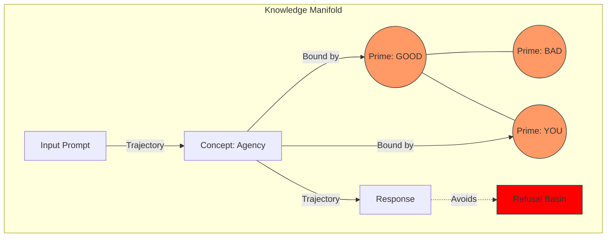

# Paper 0: The Shape of Knowledge (Framework Proposal)

## Abstract

We propose the **Geometric Generality Hypothesis**: that "General Intelligence" in Large Language Models (LLMs) is physically instantiated as a coherent, high-dimensional geometric structure that is invariant across architectures. While recent work has identified isolated geometric features (monosemanticity, linear representations), a unified framework linking these to agency and safety is missing. We synthesize evidence from 145 studies to construct a map of this "Knowledge Manifold," arguing that (1) semantic primes serve as topological anchors, (2) inference is a navigational trajectory, and (3) safety is a boundary enforcement problem. This framework solves the "Black Box" opacity problem by reframing it as a cartography problem, providing the theoretical foundation for the *ModelCypher* alignment protocol.

## 1. Introduction

The defining challenge of AI alignment is the "Black Box" problem: we can steer the model's behavior (RLHF), yet we remain ignorant of its internal state. This epistemological gap makes safety fragile; we are optimizing a high-dimensional system to *act* human, without understanding its internal **topology**.

We propose a shift from behavioralism to **Geometric Realism**. We posit that the state space of an LLM is a static, high-dimensional manifold where concepts are bounded regions (polytopes).

> Figure 1 (conceptual): the geometry-of-inference sketch is represented below as a Mermaid diagram.

### 1.1 Contributions
This position paper makes the following contributions:
1.  **Synthesis**: We unify 13 distinct research pillars (Information Geometry, Cognitive Science, Mechanistic Interpretability) into a single "Geometric Generality" framework.
2.  **Definition**: We formally define "Knowledge" as static geometry and "Inference" as vector navigation.
3.  **Roadmap**: We provide the theoretical axioms that enable the engineering applications in Papers I, II, and III.

## 2. The Unifying Framework (Hypothesis)

We propose three core hypotheses that form the basis of the *ModelCypher* framework.

### Hypothesis 1: The Geometric Nature of Knowledge
Concept representations are not arbitrary; they are bounded regions (polytopes) in high-dimensional space. The "Platonic Representation Hypothesis" (Huh et al., 2024) suggests that as models scale, they converge on a shared representation of reality.

### Hypothesis 2: Navigational Inference
Inference is not symbol manipulation; it is the trajectory of a state vector through this manifold. A "computation" is a path.

### Hypothesis 3: Universal Invariance
Certain geometric structures—specifically **Semantic Primes** (Wierzbicka, 1996)—emerge as statistical attractors in *all* sufficiently capable models. These are the "fixed points" of the manifold.

## 3. Evidence from the 13 Pillars

(See [Foundational Bibliography](../KnowledgeasHighDimensionalGeometryInLLMs.md) for the full bibliography.)

### 3.1 The Mathematics of Manifolds
Fefferman (2016) and Amari (2000) established that high-dimensional data lives on low-dimensional manifolds, providing the mathematical substrate for our claims.

### 3.2 The Physics of Meaning ("Linguistic Thermodynamics")
Evaluation of semantic entropy (Farquhar et al., 2024) suggests that uncertainty has a geometric shape—high entropy corresponds to regions of the manifold where the "truth" is diffuse. This allows us to apply thermodynamic laws to inference.

### 3.3 The Engineering of Representation
Representation Engineering (Zou et al., 2023) has empirically blocked specific "directions" (e.g., deception). This confirms that concepts are vectors we can manipulate.

## 4. Implications for Safety & Ethics

If knowledge is geometry, then safety is topology.

### 4.1 From Conditioning to Constraints
Current safety methods (RLHF) condition the model's *policy* (the probability of next token). This is brittle. Our framework suggests we should instead constrain the *geometry*—literally blocking the trajectory from entering "unsafe" regions (Refusal Basins).

### 4.2 The "Circuit Breaker" Model
This aligns with recent "Circuit Breaker" research (Zou et al., 2024). Instead of asking the model to be safe, we physically interrupt the representation of harm. *ModelCypher* implements this via the **Sidecar** architecture (see Paper II).

## 5. Limits of the Metaphor (Falsifiability)

-   **H1 Falsification**: If conceptual boundaries are disjoint or highly non-convex, the polytope model fails.
-   **H3 Falsification**: If semantic primes do not show higher stability than random controls (see Paper I), the universality claim is rejected.

## 6. Conclusion

We have outlined a "Geometric Generality" framework that reframes AI alignment as a problem of cartography and navigation. This theoretical stance is not an end in itself; it is the necessary foundation for the rigorous engineering of **Agency** (Paper I), **Thermodynamics** (Paper II), and **alignment** (Paper III).

## References

(See [Foundational Bibliography](../KnowledgeasHighDimensionalGeometryInLLMs.md).)
