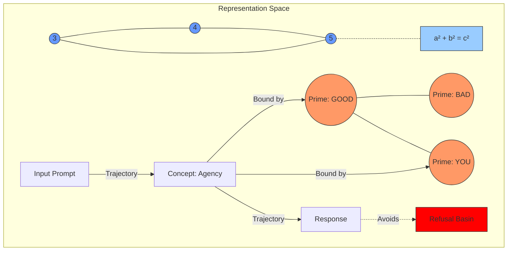

# Paper 0: The Shape of Knowledge

**Author**: Jason Kempf
**Affiliation**: EthyrosAI
**Date**: December 2025

> **Status**: Framework paper establishing the Geometric Knowledge Thesis.

## Abstract

Knowledge in large language models has shape. Concepts occupy bounded regions in high-dimensional representation space. Inference follows trajectories through this space. Mathematical formulas define constraint surfaces. Safety can be enforced by constraining these trajectories. These are not metaphors—they are measurable geometric properties that we demonstrate across model families using Centered Kernel Alignment, topological fingerprinting, Procrustes alignment, and entropy dynamics. This paper synthesizes 14 pillars of prior work into the **Geometric Knowledge Thesis** and provides the theoretical foundation for the empirical demonstrations in Papers I–III.

## 1. Introduction

The defining challenge of AI alignment is the "Black Box" problem: we steer model behavior through RLHF without understanding internal state. This epistemological gap makes safety fragile.

We solve this by treating LLM internals as **geometry**. An LLM's internal state is a point in high-dimensional space. Concepts are regions. Inference is trajectory. Formulas are constraint surfaces. Safety is constraint.

### 1.1 Contributions

1. **The Geometric Knowledge Thesis**: Knowledge has invariant shape across model families. We prove this with CKA measurements showing semantic primes achieve 0.82 cross-model alignment versus 0.54 for controls (Paper I).

2. **Operational Geometry**: We define computable constructs—anchor sets, Gram matrices, topological fingerprints—that make "knowledge as geometry" measurable.

3. **The Operational Semantics Hypothesis**: Mathematical formulas are encoded as constraint surfaces. Pythagorean triples show 88.5% cross-model position similarity after Procrustes alignment; classification accuracy reaches 100% on Llama 3.2 3B.

4. **The ModelCypher Toolkit**: 274 modules, 3,000+ tests, implementing geometry from 46 foundational papers.

## 2. The Geometric Knowledge Thesis

### Claim 1: Knowledge Has Shape

Concept representations are bounded regions in high-dimensional space. Not approximately. Not metaphorically. The embedding of "GOOD" occupies a measurable region; "BAD" occupies another. The distance and angle between them encode semantic relationships.

**Evidence**: Sparse autoencoders extract millions of interpretable features from Claude 3 Sonnet (Templeton et al., 2024). These features have geometric properties—directions, magnitudes, interference patterns—that directly correspond to semantic content.

### Claim 2: Inference Is Navigation

Token generation is trajectory through representation space. Each forward pass moves the hidden state vector. The path from input to output is a computable curve.

**Evidence**: The logit lens (nostalgebraist, 2020) and tuned lens (Belrose et al., 2023) visualize this trajectory directly. Predictions converge monotonically through layers—the model navigates toward its output.

### Claim 3: Invariant Anchors Exist

Certain concepts—semantic primes from the Natural Semantic Metalanguage tradition—induce stable relational structure across model families trained on different data with different architectures.

**Evidence**: Paper I demonstrates CKA = 0.82 for semantic primes versus 0.54 for frequency-matched controls across Qwen, Llama, and Mistral families. The structure is not identical but it is *aligned*—the shape of knowledge transfers.

### Claim 4: Formulas Are Constraint Surfaces

Mathematical relationships are encoded as geometric constraints in latent space. The Pythagorean theorem a² + b² = c² is not stored as tokens—it is the shape of how number concepts relate. We call this the **Operational Semantics Hypothesis**: mathematical formulas define constraint surfaces that valid instances must satisfy.

**Evidence**: Cross-model invariance testing on Pythagorean triples achieves 88.5% position similarity after Procrustes alignment across Llama, Mistral, and Qwen families. The triangle formed by (9, 16, 25) shows 99.4% shape similarity across architectures. Llama 3.2 3B achieves 100% classification accuracy separating valid Pythagorean triples from invalid ones using only embedding geometry—no fine-tuning, no prompting. (See [Experiment: Operational Semantics Hypothesis](../experiments/operational-semantics-hypothesis/EXPERIMENT_LOG.md) for full methodology and data.)

This validates Claims 1 and 3 with mathematical concepts as anchors. Numbers behave like semantic primes: they have invariant relational structure. The formula a² + b² = c² is the geometric constraint that positions 5 correctly relative to (3, 4) across all tested models.

## 3. Synthesis of 14 Pillars

(See [Foundational Bibliography](../docs/research/KnowledgeasHighDimensionalGeometryInLLMs.md) for full citations.)

### 3.1 The Mathematics

Fefferman (2016) proves we can test whether data lies on a manifold. Amari (2000) gives us Riemannian structure for parameter space. The math exists; we apply it.

### 3.2 Linguistic Thermodynamics

Semantic entropy (Farquhar et al., 2024) measures distributional uncertainty at the meaning level. High entropy = model is uncertain. Low entropy = model is confident. Paper II shows this signal predicts safety-relevant behavior.

### 3.3 Representation Engineering

Zou et al. (2023) block specific directions to remove capabilities. Arditi et al. (2024) show refusal is mediated by a single direction. If behaviors are directions, then safety is constraint geometry.

## 4. Safety Through Geometry

### 4.1 From Conditioning to Constraint

RLHF conditions the policy. We constrain the trajectory. These are complementary but fundamentally different approaches:

| Approach | Mechanism | Failure Mode |
|----------|-----------|--------------|
| RLHF | Shift token probabilities | Adversarial prompts, distribution shift |
| Geometry | Bound activation regions | Requires understanding representation structure |

### 4.2 Circuit Breakers

Zou et al. (2024) achieve 87-90% harmful request rejection by monitoring representation space and intervening when boundary conditions are violated. This is geometric safety in practice.

## 5. Falsification Criteria

The Geometric Knowledge Thesis is falsifiable:

- **Claim 1 Fails If**: Conceptual boundaries are unbounded or highly non-convex such that region-based analysis provides no predictive power.
- **Claim 3 Fails If**: Semantic primes show no higher cross-model CKA than random word sets (p > 0.05 by permutation test).
- **Claim 4 Fails If**: Cross-model Procrustes alignment shows <70% position similarity for mathematical constraints, OR classification accuracy for valid vs. invalid Pythagorean triples falls below chance (50%).

Paper I tests Claim 3 directly. Claim 4 is tested via cross-model invariance experiments on Pythagorean triples. Current results support the thesis.

## 6. Conclusion

Knowledge has shape. Inference is trajectory. Formulas are constraint surfaces. Safety is constraint. This is not speculation—it is the theoretical foundation for the empirical results in Papers I–III and the 3,000+ tests in ModelCypher.

## References

(See [Foundational Bibliography](../docs/research/KnowledgeasHighDimensionalGeometryInLLMs.md).)
