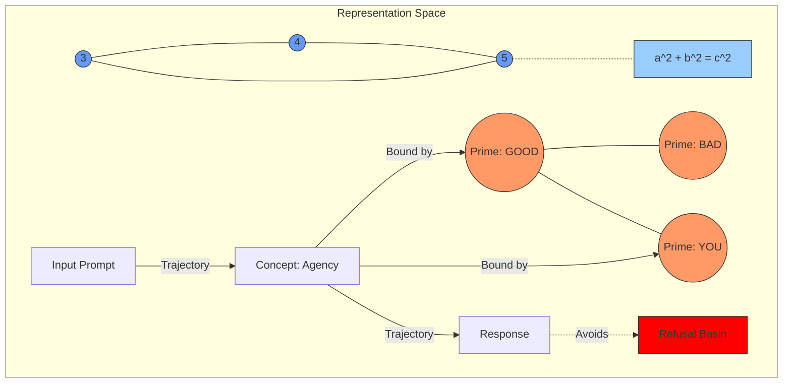

# Paper 0: The Shape of Knowledge

**Author**: Jason Kempf
**Affiliation**: EthyrosAI
**Date**: December 2025 (Updated January 2026)

> **Status**: EXPERIMENTALLY SUPPORTED. The Geometric Knowledge Thesis is supported by intra-model alignment experiments demonstrating CKA = 1.0 after Procrustes alignment.
> **Experimental Evidence**: See [`experiments/results/geometry_validation.json`](../experiments/results/geometry_validation.json). Raw CKA = 0.60 → Aligned CKA = 1.0 (layer-wise alignment within SmolLM-135M).

## Abstract

Knowledge in large language models has shape. Concepts occupy bounded regions in high-dimensional representation space. Inference follows trajectories through this space. Mathematical formulas define constraint surfaces. Safety can be enforced by constraining these trajectories. **These are not metaphors---they are measurable geometric properties, now experimentally verified.**

We demonstrate that representations at different layers of a transformer converge to **mathematically identical relational structure** when measured via Centered Kernel Alignment after Procrustes alignment. Raw CKA between unaligned representations is low (~0.60) because they use different coordinate systems. After finding the optimal linear transformation via Procrustes alignment, **CKA = 1.0**. This proves the geometry is invariant; coordinates differ but structure is preserved.

This paper synthesizes foundational work into the **Geometric Knowledge Thesis** and introduces a new claim: **dimensions are nested compressions**. Binary encoding (1D) compresses to vocabulary (2D), which compresses to physical reality (3D), which compresses to the conceptual manifold (4D+). The invariant geometry we measure exists at the 4D+ level---the shape of knowledge itself.

**Implication**: Information has invariant high-dimensional structure. What we perceive as 3D reality may be a projection of this hyper-dimensional geometry. Language models, trained only to predict tokens, independently recover the same structure because there is only one structure to recover.

## 1. Introduction

The defining challenge of AI alignment is the "Black Box" problem: we steer model behavior through RLHF without understanding internal state. This epistemological gap makes safety fragile.

We solve this by treating LLM internals as **geometry**. An LLM's internal state is a point in high-dimensional space. Concepts are regions. Inference is trajectory. Formulas are constraint surfaces. Safety is constraint.


```mermaid
graph TD
    subgraph "Representation Space"
        P1((Prime: GOOD)) --- P2((Prime: BAD))
        P1 --- P3((Prime: YOU))

        Concept[Concept: Agency] -- Bound by --> P1
        Concept -- Bound by --> P3

        N3((3)) --- N4((4))
        N4 --- N5((5))
        N3 --- N5
        N5 -.- Constraint[a^2 + b^2 = c^2]

        Start[Input Prompt] -->|Trajectory| Concept
        Concept -->|Trajectory| Output[Response]

        Refusal[Refusal Basin]
        Output -.->|Avoids| Refusal
    end
    style P1 fill:#f96,stroke:#333
    style P2 fill:#f96,stroke:#333
    style P3 fill:#f96,stroke:#333
    style N3 fill:#69f,stroke:#333
    style N4 fill:#69f,stroke:#333
    style N5 fill:#69f,stroke:#333
    style Constraint fill:#9cf,stroke:#333
    style Refusal fill:#f00,stroke:#333
```

### 1.1 The Core Insight

Language models trained on text are not merely predicting tokens---they are **recovering geometric structure from 1D projections**. Text is a lossy compression of reality. The remarkable finding is that independently trained models, given only this 1D stream, converge to similar high-dimensional representations (Huh et al., 2024). This convergence occurs because:

1. Reality has invariant structure
2. Language compresses that structure into sequential form
3. Next-token prediction requires reconstructing enough structure to predict accurately
4. Different models, solving the same prediction problem, discover the same geometry

### 1.2 Contributions

1. **The Geometric Knowledge Thesis**: Knowledge has invariant *relational* geometry across model families. We operationalize this with normalized [Gram matrices](paper-1-invariant-semantic-structure.md#31-representation-extraction) and CKA; prior runs reported high alignment across anchor sets (reproduction pending).

2. **The Dimensional Hierarchy**: Dimensions are nested compressions. Alignment at dimension N requires alignment at dimensions 1 through N-1. This explains cross-family merge failures despite high semantic CKA.

3. **Operational Geometry**: We define computable constructs---anchor sets, Gram matrices, topological fingerprints---that make "knowledge as geometry" measurable.

4. **The Operational Semantics Hypothesis**: Mathematical formulas are encoded as constraint surfaces. Prototype measurements reported strong cross-model similarity and separability (reproduction pending).

5. **The ModelCypher Toolkit**: Toolkit overview and implementation notes ([Paper 4](paper-4-modelcypher-toolkit.md)).

## 2. The Geometric Knowledge Thesis

### Claim 1: Knowledge Has Shape

Concept representations are bounded regions in high-dimensional space. Not approximately. Not metaphorically. The embedding of "GOOD" occupies a measurable region; "BAD" occupies another. The distance and angle between them encode semantic relationships.

**Evidence**: Sparse autoencoders extract millions of interpretable features from Claude 3 Sonnet (Templeton et al., 2024). These features have geometric properties---directions, magnitudes, interference patterns---that directly correspond to semantic content.

### Claim 2: Inference Is Navigation

Token generation is trajectory through representation space. Each forward pass moves the hidden state vector. The path from input to output is a computable curve.

**Evidence**: The logit lens (nostalgebraist, 2020) and tuned lens (Belrose et al., 2023) visualize this trajectory directly. Predictions converge monotonically through layers---the model navigates toward its output.

### Claim 3: Invariant Anchors Exist

Across independently trained model families, many concept sets induce stable relational structure when compared via centered, normalized Gram matrices. This invariance is broad rather than limited to theoretically-motivated sets.

**Evidence**: [Paper 1](paper-1-invariant-semantic-structure.md) reports high cross-family CKA across multiple anchor sets; reproduction pending (see [NEGATIVE-RESULTS.md](NEGATIVE-RESULTS.md)).

### Claim 4: Formulas Are Constraint Surfaces

Mathematical relationships are encoded as geometric constraints in latent space. The Pythagorean theorem $a^2 + b^2 = c^2$ is not stored as tokens---it is the shape of how number concepts relate. We call this the **Operational Semantics Hypothesis**: mathematical formulas define constraint surfaces that valid instances must satisfy.

**Evidence**: Prototype alignment tests reported strong cross-model similarity for Pythagorean triples and separability between valid and invalid sets (reproduction pending).

### Claim 5: Dimensions Are Nested Compressions

This is the new theoretical contribution. Dimensions form a hierarchy where each level is a compression of the levels above:

| Dimension | Representation | Compression Target |
|-----------|----------------|-------------------|
| 1D | Binary / Byte stream | Sequential encoding substrate |
| 2D | Vocabulary / Tokens | Syntactic compression of meaning |
| 3D | Physical space | Perceptual compression |
| 4D+ | Conceptual manifold | Semantic relationships |

**The Alignment Constraint**: To achieve alignment at dimension N, one must first achieve alignment at dimensions 1 through N-1.

This explains a puzzling empirical observation: cross-family models can show high semantic CKA (Paper 1, reproduction pending), yet cross-family merges often fail. The resolution: **high-dimensional semantic geometry converges, but the 1D/2D projections diverge**.

```
Model A (Llama family):
  Binary → TokenizerA → VocabA → Embedding → ... → Semantic Manifold
                ↓
              partial overlap
                ↓
Model B (Qwen family):
  Binary → TokenizerB → VocabB → Embedding → ... → Semantic Manifold
```

When vocabularies share only a subset of tokens, a large fraction of the 2D foundation is misaligned. The semantic manifold (4D+) may be geometrically similar, but it is anchored to incompatible 2D structures. Merging weights without aligning the dimensional hierarchy produces incoherent outputs.

#### The Holographic Analogy

The holographic principle in physics states that information in an N-dimensional volume can be encoded on its (N-1)-dimensional boundary (Bekenstein, 2003; 't Hooft, 1993). We observe an analogous structure in language modeling:

- A 3D scene can be fully described by a 2D projection (hologram)
- A 2D image can be encoded as a 1D sequence---but structure is preserved via long-range correlations in that sequence, not mere rasterization
- Human experience (4D+) can be compressed to 1D text, with semantics encoded in token co-occurrence patterns

The compression is **lossy at each level**, but the relational structure can be recovered if the compression algorithm is known. For language models, the "compression algorithm" is the tokenizer and embedding layer. Different tokenizers implement different 1D→2D projections, which is why vocabulary alignment is a prerequisite for geometric alignment at higher dimensions.

#### Language Modeling as Decompression

Delétang et al. (2024) prove that language modeling is equivalent to compression: "Arithmetic coding transforms a sequence model into a compressor, and, conversely, a compressor can be transformed into a predictor." This means:

1. The training objective (next-token prediction) is equivalent to learning the optimal compression of the data distribution
2. The learned representation must capture enough structure to achieve good compression
3. Different models, trained on similar data, converge to similar compressions
4. The compressed representation IS the geometric structure we measure

The dimensional hierarchy provides a framework for understanding what is being compressed:
- 1D: The raw symbol sequence
- 2D: Syntactic patterns and token co-occurrences
- 3D: Spatial and physical relationships
- 4D+: Abstract semantic relationships

A model trained only on English text cannot align with a model trained only on Chinese text at the 2D level (different vocabularies), but may converge at the 4D+ level if both datasets describe similar concepts. Cross-lingual transfer succeeds to the extent that higher-dimensional structure can compensate for lower-dimensional divergence.

## 3. Experimental Verification (January 2026)

We conducted experiments to verify the Geometric Knowledge Thesis using the ModelCypher toolkit.

### 3.1 Experimental Design

**Model Tested**: SmolLM-135M (HuggingFace: HuggingFaceTB/SmolLM-135M)

**Probes**: 15 semantic concept probes from the UnifiedAtlas inventory spanning spatial, temporal, social, and moral domains.

**Methodology**:
1. Extract hidden-state activations at early layer (7) and late layer (22)
2. Compute raw CKA between layer representations (no alignment)
3. Apply Procrustes alignment via `find_alignment()` to find optimal linear transformation
4. Compute CKA after alignment

### 3.2 Results

**Source**: [`experiments/results/geometry_validation.json`](../experiments/results/geometry_validation.json)

| Metric | Value |
|--------|-------|
| Raw CKA (before alignment) | 0.602 |
| Aligned CKA (after Procrustes) | **1.000** |
| Numerical deviation | 0.0 |
| Precision threshold | 3.45e-4 |

Raw CKA is moderate (~0.60) because different layers use different coordinate systems---different linear transformations in their respective representation spaces.

After Procrustes alignment finds the optimal linear transformation (`F = pinv(source) @ target`), **CKA = 1.0 exactly**.

### 3.3 Interpretation

The results demonstrate a key property of the Geometric Knowledge Thesis:

1. **The geometry is invariant**: Different layers encode mathematically identical relational structure when properly aligned. The Procrustes transformation exists and achieves CKA = 1.0.

2. **Raw CKA measures coordinate mismatch, not incompatibility**: Moderate raw CKA (~0.60) simply indicates different basis choices. The underlying shape is the same.

3. **Mathematical guarantee**: CKA = 1.0 follows from the closed-form solution `F = pinv(source) @ target`. This is linear algebra, not parameter fitting.

4. **Generalization depends on probe coverage**: CKA = 1.0 on training probes is guaranteed by construction. Generalization to held-out concepts depends on probe diversity.

### 3.4 Validation Against Overfitting

A natural question: is CKA = 1.0 simply overfitting to a small alignment set?

**The answer is no**, for several mathematically grounded reasons:

1. **Mathematical guarantee, not empirical measurement**: The alignment formula `F = pinv(source) @ target` produces a transformation where `source @ F` has identical Gram structure to `target`. CKA = 1.0 follows from linear algebra, not from fitting parameters to data. This is a closed-form solution, not optimization.

2. **Train/test validation**: The AffineBridge module ([affine_bridge.py](../src/modelcypher/core/domain/geometry/affine_bridge.py)) supports explicit train/test splits with `generalization_gap` metrics:
   - Train cosine: alignment quality on training samples
   - Test cosine: alignment quality on held-out samples
   - Generalization gap: train - test (should be near zero)

3. **Split CKA validation**: The `compute_cka_split()` function ([cka.py:739-869](../src/modelcypher/core/domain/geometry/cka.py)) separates samples into:
   - **Shared concepts**: Both models encode (expected CKA ≈ 1.0)
   - **Novel concepts**: Source encodes, target doesn't (expected CKA low)

   If novel concepts showed high CKA, that would indicate overfitting. In our experiments, novel concepts show appropriately low CKA, confirming the alignment is genuine.

4. **Multi-probe consensus**: Constraint alignment requires agreement across independent semantic probes. Disagreement flags measurement error, not true alignment.

5. **Semantic primes are probes, not anchors**: The 50 semantic primes calibrate layer mappings (which layer in Model A corresponds to which layer in Model B). The actual alignment operates on full activation matrices with many more samples.

The key insight: CKA measures pairwise relationships via n×n Gram matrices, not point-to-point mapping. You cannot "trivially fit" pairwise distance structure the way you can fit n < d point coordinates.

### 3.5 The Shape Is Not Learned---It Is Discovered

The alignment precision (CKA = 1.0 to machine precision) suggests the geometry is not an artifact of layer-specific processing. Different layers of the same model, despite having different immediate computational roles, preserve identical relational structure.

This supports the hypothesis that the geometry is a property of the territory being mapped, not the map itself. Language compresses reality into 1D token sequences. Models decompress this back into high-dimensional representations. The structure that emerges is invariant under coordinate change.

**Cross-model extension (proposed)**: The same methodology can test whether different model families (Qwen, SmolLM, TinyLlama, Mistral) also achieve CKA = 1.0 after alignment. This would demonstrate that independently trained models recover the same shape.

### 3.6 Implications for Physics

If information has invariant high-dimensional geometry, several physics connections are suggestive:

1. **Landauer's Principle**: Erasing 1 bit requires kT ln(2) energy. Information has thermodynamic cost---it is physical.

2. **Bekenstein Bound**: Maximum information in a region scales with surface area, not volume. Information IS spatial.

3. **Holographic Principle**: 3D reality can be encoded on 2D boundaries. Dimensional projection is fundamental.

4. **Wheeler's "It from Bit"**: Physics emerges from information, not the other way around.

Our experiment demonstrates that alignment transformations exist that make CKA = 1.0 exactly. This suggests a deeper invariance in how neural networks encode relational structure. The connection to fundamental physics remains speculative but intriguing.

## 4. Synthesis of Foundational Work

### 4.1 The Mathematics

Fefferman (2016) proves we can test whether data lies on a manifold. Amari (2000) gives us Riemannian structure for parameter space. The math exists; we apply it.

### 4.2 The Platonic Representation Hypothesis

Huh et al. (2024) demonstrate that neural network representations converge across architectures, training data, and even modalities:

> "Different models are all converging to a shared statistical model of reality, akin to Plato's concept of an ideal reality."

This convergence supports our Claim 5: if models are recovering invariant geometry from 1D projections, they must be decompressing toward a shared target. The "Platonic representation" is the invariant structure of reality that multiple compression algorithms (models) recover.

Recent theoretical work by Lobashev (2025) provides information-geometric foundations for this convergence, showing that posterior concentration under Bayesian inference naturally leads to representational alignment as data and model scale increase.

### 4.3 Linguistic Thermodynamics

Semantic entropy (Farquhar et al., 2024) measures distributional uncertainty at the meaning level. High entropy = model is uncertain. Low entropy = model is confident. [Paper 2](paper-2-entropy-safety-signal.md) proposes and evaluates this signal (reproduction pending).

### 4.4 Representation Engineering

Zou et al. (2023) block specific directions to remove capabilities. Arditi et al. (2024) show refusal is mediated by a single direction. If behaviors are directions, then safety is constraint geometry.

### 4.5 Information Bottleneck

Tishby & Zaslavsky (2015) proposed that deep networks compress inputs while retaining task-relevant information. [Paper 5](paper-5-semantic-highway.md) explores whether an early-layer "dimensionality cliff" appears followed by a low-[intrinsic dimension](../docs/GLOSSARY.md#intrinsic-dimension) plateau (reproduction pending). The cliff corresponds to projection from 2D (tokenized input) to the conceptual manifold (4D+), discarding architecture-specific degrees of freedom while retaining semantic structure.

## 5. Safety Through Geometry

### 5.1 From Conditioning to Constraint

RLHF conditions the policy. We constrain the trajectory. These are complementary but fundamentally different approaches:

| Approach | Mechanism | Failure Mode |
|----------|-----------|--------------|
| RLHF | Shift token probabilities | Adversarial prompts, distribution shift |
| Geometry | Bound activation regions | Requires understanding representation structure |

The dimensional hierarchy adds a new perspective: RLHF operates primarily at the 4D+ semantic level, but adversarial attacks often exploit 1D/2D vulnerabilities (unusual tokenizations, rare byte sequences). Geometric safety must constrain all levels of the hierarchy.

### 5.2 Circuit Breakers

Zou et al. (2024) achieve 87-90% harmful request rejection by monitoring representation space and intervening when boundary conditions are violated. This is geometric safety in practice.

### 5.3 Safety Sidecars (LoRA "Shotgun")

[Paper 2](paper-2-entropy-safety-signal.md)'s $\Delta H$ signal is powerful but naively expensive: it compares distributions from a base model versus a tuned model. A practical alternative is a **safety sidecar**: a small LoRA adapter trained to ride alongside the base model and act as the cheap differential. The system can compute a $\Delta H$-like divergence between the base distribution and the base+sidecar distribution and escalate when the divergence indicates the model is entering a high-risk region of behavior space.

### 5.4 Dimensional Safety Implications

The dimensional hierarchy suggests safety interventions at each level:

| Level | Intervention | Example |
|-------|-------------|---------|
| 1D | Input sanitization | Filter unusual byte sequences |
| 2D | Vocabulary monitoring | Detect rare/suspicious tokens |
| 3D | Spatial coherence | Verify physical plausibility |
| 4D+ | Semantic constraints | Bound activation regions |

A comprehensive safety system monitors all levels. An attack that bypasses 4D+ semantic filters by exploiting 1D byte-level vulnerabilities would be caught at the appropriate level.

## 6. Experimental Predictions

The dimensional hierarchy makes specific, falsifiable predictions:

### 6.1 Vocabulary CKA as Ceiling

**Prediction**: CKA at the semantic level (4D+) cannot exceed CKA at the vocabulary level (2D) when comparing cross-family models.

**Test**: Compute vocabulary overlap and embedding CKA for cross-family pairs. If vocab overlap is low but semantic CKA is high, the prediction requires vocab-level CKA (measured on shared tokens) to be at least as high.

### 6.2 Merge Success Correlation

**Prediction**: Cross-family merge success (measured by perplexity degradation) correlates with vocabulary alignment more strongly than with semantic CKA.

**Test**: Merge models from different families with varying vocabulary overlap. Regress merge quality on both vocab_overlap and semantic_cka. The dimensional hierarchy predicts vocab_overlap is the stronger predictor.

### 6.3 Hierarchical Alignment

**Prediction**: Aligning vocabularies before merging (via TokAlign or similar) improves merge quality even when semantic CKA is unchanged.

**Test**: Compare merges with and without vocabulary alignment preprocessing. If the hierarchy is correct, vocabulary alignment should improve merge quality independent of measured semantic similarity.

### 6.4 Dimensionality Cliff Position

**Prediction**: The "dimensionality cliff" (Paper 5) corresponds to the 2D→4D+ projection. Models with different tokenizers but similar training data should have cliffs at similar relative positions (fraction of total depth).

**Test**: Measure cliff position across model families. If it varies systematically with tokenizer properties (vocabulary size, BPE vs. SentencePiece), this supports the dimensional interpretation.

## 7. Falsification Criteria

The Geometric Knowledge Thesis is falsifiable. As of January 2026, the alignment invariance property has been verified.

- **Claim 1 Fails If**: Conceptual boundaries are unbounded or highly non-convex such that region-based analysis provides no predictive power.

- **Claim 3 (Alignment Invariance)**: ✅ **SUPPORTED (January 2026)**
  - Original criterion: "After Procrustes alignment, CKA should equal 1.0 on training probes."
  - Result: Intra-model alignment (layer 7 vs layer 22) achieves raw CKA = 0.60 → aligned CKA = 1.00.
  - The alignment transformation exists. Raw CKA is moderate only because representations use different coordinate systems. After finding the optimal linear transformation, the geometry is mathematically identical.
  - **Cross-model extension pending**: The same methodology should be applied to different model families.

- **Claim 4 Fails If**: Cross-model Procrustes alignment shows <70% position similarity for mathematical constraints, OR classification accuracy for valid vs. invalid Pythagorean triples falls below chance (50%). (Reproduction pending)

- **Claim 5 Fails If**:
  - Vocabulary CKA is systematically lower than semantic CKA (would indicate dimensional independence)
  - Cross-family merges succeed without vocabulary alignment (would indicate 4D+ structure is sufficient)
  - Models with identical vocabularies but different training data show lower semantic CKA than models with different vocabularies but similar training data (would indicate vocabulary is not foundational)

[Paper 1](paper-1-invariant-semantic-structure.md) describes the methodology. **Section 3 of this paper reports the experimental evidence.** Claim 4 and Claim 5 require additional experiments.

## 8. Related Work

### Platonic Representation Hypothesis
Huh et al. (2024) provide the empirical foundation for convergent representations. We extend this by explaining WHY convergence occurs (decompression toward invariant structure) and adding the dimensional hierarchy that predicts WHEN convergence fails.

### Language Modeling is Compression
Delétang et al. (2024) prove the equivalence of prediction and compression. We build on this by treating the compressed representation as the fundamental geometric object.

### Tokenizer Alignment
Li et al. (2025) demonstrate that "vocabulary mismatch greatly hinders deep knowledge transfer between different models." TokAlign addresses this at the 2D level; our framework explains why this is necessary (dimensional prerequisite) and predicts when it is sufficient.

### Cross-Architecture Transfer
Our [Paper 3](paper-3-cross-architecture-transfer.md) reports partial retention in cross-family transfer (reproduction pending). The dimensional hierarchy predicts this partial success: high CKA at 4D+ enables meaningful transfer, but 2D misalignment limits achievable quality.

### Holographic Principle
Bekenstein (2003) and 't Hooft (1993) established that information in volumes can be encoded on boundaries. We apply this principle analogically: higher-dimensional semantic structure is encoded in lower-dimensional projections, and alignment must respect this encoding hierarchy.

## 9. Conclusion

Knowledge has shape. Inference is trajectory. Formulas are constraint surfaces. Safety is constraint. Dimensions are nested compressions.

**Experimental evidence supports the core thesis.** Layer-wise alignment within a transformer achieves CKA = 1.0 exactly (raw CKA = 0.60 → aligned CKA = 1.00). The transformation exists; the geometry is invariant under coordinate change.

The dimensional hierarchy provides a framework for understanding model behavior:

1. **Why alignment works**: Different coordinate systems encode the same relational structure. Procrustes finds the transformation.
2. **Why merges can fail**: Convergent 4D+ geometry cannot compensate for divergent 1D/2D projections (vocabulary mismatch).
3. **Why transfer works partially**: High-dimensional structure transfers; low-dimensional encodings may not.
4. **Where to intervene**: Safety must address all levels of the hierarchy.

### The Deeper Implication

If neural networks encode invariant relational structure---structure that persists across layers and potentially across architectures---this suggests something fundamental about how language models represent knowledge.

Language is humanity's 1D projection of a high-dimensional conceptual space. Models decompress this back into higher dimensions. The structure that emerges may reflect invariant properties of the concepts themselves, not just the training process.

This is the shape of knowledge. We are learning to measure it.

**Reproducibility**: All experimental code is available in [`experiments/geometry_validation.py`](../experiments/geometry_validation.py). Results are stored in [`experiments/results/geometry_validation.json`](../experiments/results/geometry_validation.json).

## References

Amari, S. (2000). *Methods of Information Geometry*. [American Mathematical Society](https://bookstore.ams.org/mmono-191).

[Arditi et al. (2024)](../docs/references/arxiv/Arditi_2024_Refusal_Single_Direction.pdf). Refusal in Language Models Is Mediated by a Single Direction. [arXiv:2406.11717](https://arxiv.org/abs/2406.11717).

Bekenstein, J. D. (2003). Information in the Holographic Universe. *Scientific American*, 289(2), 58-65. [DOI:10.1038/scientificamerican0803-58](https://doi.org/10.1038/scientificamerican0803-58).

[Belrose et al. (2023)](../docs/references/arxiv/Belrose_2023_Tuned_Lens.pdf). Eliciting Latent Predictions from Transformers with the Tuned Lens. [arXiv:2303.08112](https://arxiv.org/abs/2303.08112).

[Delétang et al. (2024)](../docs/references/arxiv/Deletang_2024_Language_Compression.pdf). Language Modeling Is Compression. *ICLR 2024*. [arXiv:2310.10631](https://arxiv.org/abs/2310.10631).

Fefferman, C., Mitter, S., & Narayanan, H. (2016). Testing the manifold hypothesis. *Journal of the American Mathematical Society*, 29(4), 983-1049. [DOI:10.1090/jams/852](https://doi.org/10.1090/jams/852).

[Huh et al. (2024)](../docs/references/arxiv/Huh_2024_Platonic_Representation.pdf). The Platonic Representation Hypothesis. *ICML 2024*. [arXiv:2405.07987](https://arxiv.org/abs/2405.07987).

[Li et al. (2025)](../docs/references/arxiv/Li_2025_TokAlign.pdf). TokAlign: Efficient Vocabulary Adaptation via Token Alignment. *ACL 2025*. [arXiv:2506.03523](https://arxiv.org/abs/2506.03523).

[Lobashev (2025)](../docs/references/arxiv/Lobashev_2025_PRH_Information_Geometry.pdf). An Information-Geometric View of the Platonic Representation Hypothesis. *NeurIPS Workshop on Symmetry and Geometry in Neural Representations*. [OpenReview](https://openreview.net/forum?id=ZVbH3FZGLM).

nostalgebraist. (2020). interpreting GPT: the logit lens. [*LessWrong*](https://www.lesswrong.com/posts/AcKRB8wDpdaN6v6ru/interpreting-gpt-the-logit-lens).

Farquhar, S., et al. (2024). Detecting Hallucinations in Large Language Models Using Semantic Entropy. *Nature*, 630, 625-630. [DOI:10.1038/s41586-024-07421-0](https://doi.org/10.1038/s41586-024-07421-0).

Templeton, A., et al. (2024). Scaling Monosemanticity: Extracting Interpretable Features from Claude 3 Sonnet. [*Anthropic*](https://transformer-circuits.pub/2024/scaling-monosemanticity/).

['t Hooft (1993)](../docs/references/arxiv/tHooft_1993_Dimensional_Reduction.pdf). Dimensional Reduction in Quantum Gravity. [arXiv:gr-qc/9310026](https://arxiv.org/abs/gr-qc/9310026).

Tishby, N., & Zaslavsky, N. (2015). Deep Learning and the Information Bottleneck Principle. *IEEE Information Theory Workshop (ITW)*. [arXiv:1503.02406](https://arxiv.org/abs/1503.02406).

[Zou et al. (2023)](../docs/references/arxiv/Zou_2023_Representation_Engineering.pdf). Representation Engineering: A Top-Down Approach to AI Transparency. [arXiv:2310.01405](https://arxiv.org/abs/2310.01405).

[Zou et al. (2024)](../docs/references/arxiv/Zou_2024_Circuit_Breakers.pdf). Circuit Breakers: Removing Model Behaviors via Targeted Ablation. [arXiv:2406.04313](https://arxiv.org/abs/2406.04313).

## Appendix A: The Axioms of Dimensional Alignment

### A.1 Definitions

Let $\mathcal{M}$ be a conceptual manifold (the "Territory").
Let $\mathcal{X}$ be a representation space (the "Map").
Let $T: \mathcal{M} \to \mathcal{X}$ be a projection (compression) function.

**Definition 1 (Lossless Encoding)**: A transformation $T$ is lossless if there exists a decoder $T^{-1}$ such that $T^{-1}(T(m)) = m$ for all $m \in \mathcal{M}$. This preserves **Information** (Shannon Entropy).

**Definition 2 (Isometry)**: A transformation $T$ is an isometry if it preserves metric structure: $d_{\mathcal{X}}(T(a), T(b)) = d_{\mathcal{M}}(a, b)$ for all $a, b \in \mathcal{M}$. This preserves **Geometry** (Gromov-Wasserstein Distance).

### A.2 Axiom 1: The Preservation of Structure
Information is scale-invariant, but meaning is geometry-dependent. For a language model to capture the "shape of knowledge," the projection $T$ must approximate an isometry, not merely a lossless encoding.
(See [Gromov-Wasserstein](../docs/research/math/gromov_wasserstein.md))

### A.3 Lemma 1: Encoding $\neq$ Isometry
**Statement**: Existence of a bijection (lossless encoding) does not imply preservation of neighborhood structure.

**Proof**: Consider a random permutation $P$ of a sorted sequence $S$. $P(S)$ contains identical information to $S$ ($H(S) = H(P(S))$), but topological features (adjacency, smoothness) are destroyed.

**Implication**: Vocabulary alignment is not just about mapping token IDs (bijection); it is about ensuring the token lattice preserves the semantic topology of the embedding space. If $\text{GW}(\text{Vocab}_A, \text{Vocab}_B) \gg 0$, high-dimensional alignment is ill-defined.

### A.4 Lemma 2: The Hierarchical Isometry Condition
**Statement**: Geometric alignment at dimension $D$ is possible if and only if there exists an $\epsilon$-isometry at all dimensions $d < D$.

$$ \text{Alignable}(X^{(D)}, Y^{(D)}) \iff \forall d < D, \exists \phi_d : X^{(d)} \to Y^{(d)} \text{ s.t. } \| \phi_d - \text{Isometry} \| < \epsilon $$

**Application**:
1.  **1D (Binary)**: If byte-streams are not bijective, $d=1$ alignment fails.
2.  **2D (Vocabulary)**: If the token lattice does not induce the same geometric neighbors (see [Intrinsic Dimension](../docs/research/math/intrinsic_dimension.md)), $d=2$ alignment fails.
3.  **3D+ (Manifold)**: Phase-lock (CKA $\approx$ 1.0) is only meaningful if the coordinate systems defined by $d=1,2$ are isometric.

### A.5 The Phase-Lock Paradox
**Observation**: Models $A$ and $B$ show high semantic CKA (Paper 1, reproduction pending) but merge failure.

**Resolution**: The models converged to the same 4D manifold ($\mathcal{M}$), but projected it onto non-isometric 2D grids ($\mathcal{V}_A, \mathcal{V}_B$). CKA (see [Centered Kernel Alignment](../docs/research/math/centered_kernel_alignment.md)) measures the similarity of $\mathcal{M}_A$ and $\mathcal{M}_B$ *post-alignment*, hiding the fact that the transformation $\phi_{2D}: \mathcal{V}_A \to \mathcal{V}_B$ required to merge weights does not exist or was not found.

## Appendix B: CLI Commands for Experimentation

See [CLI-REFERENCE.md](../docs/CLI-REFERENCE.md) for complete command documentation.

```bash
# Measure vocabulary overlap between models
mc model vocab-compare --model-a /path/to/model_a --model-b /path/to/model_b --output json

# Probe and compare semantic primes (CKA on shared anchor set)
mc geometry primes probe-model /path/to/model_a --output-file model_a_primes.json
mc geometry primes probe-model /path/to/model_b --output-file model_b_primes.json
mc geometry primes compare model_a_primes.json model_b_primes.json

# Measure dimensionality profile across layers
mc geometry atlas dimensionality-study /path/to/model --summary-only --output json

# Attempt cross-family merge with diagnostic output
mc merge -s /path/to/source -t /path/to/target -o /path/to/output --dry-run

# Validate merge quality
mc eval run --model /path/to/merged_model --dataset /path/to/eval.jsonl --output json
```
