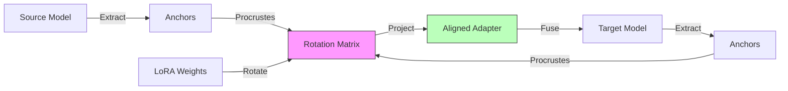

# Paper III: Unified Manifold Alignment (Engineering)

## Abstract
We present a geometric framework and prototype implementation for **Cross-Architecture Model Merging**, targeting transfer of fine-tuned behaviors between disjoint model families (e.g., Qwen to Mistral). We decompose alignment into three spaces—Weight (low-rank transport), Representation (anchor rotation), and Probability (drift smoothing)—and we introduce intersection-map diagnostics (e.g., correlation- and Gromov–Wasserstein-style signals) to quantify layerwise overlap. We conclude with an evaluation plan for measuring skill retention and safety drift under cross-family merges.

> Note: This is a draft manuscript. Parts of the pipeline are implemented as diagnostics and prototypes; benchmark suites and reproducible end-to-end evaluations are tracked in `../docs/PARITY.md`.

## 1. Introduction

The defining bottleneck of open-source AI is "Adapter Lock-in." A LoRA trained on Llama 3 cannot run on Qwen 2.5. This fragments the community and wastes compute.

We explore a research direction: **Manifold Stitching**. If some fine-tuned behaviors correspond to approximately low-rank structure and if anchor-induced *relational* structure is stable enough across models, then parts of an adapter may be transferable via approximate alignment procedures. This paper treats “stitching” as an umbrella term for these approximate alignment attempts; it is not a claim of exact representational equivalence.

In practice, “just find the rotation” hides non-idealities: tokenizers differ, layer semantics are not bijective, and fine-tunes can introduce genuinely new features rather than pure rotations. In this paper, we use “stitching” as shorthand for a family of approximate alignment procedures, and we emphasize diagnostics and falsification over claims of exact representational equivalence.

> Figure 1 (system diagram): represented below as a Mermaid diagram.

### 1.1 Contributions
1.  **Architecture**: We define the "Three-Space Stack" (Weight, Representation, Probability) for robust alignment.
2.  **Algorithm**: We implement **Anchor-Locked Procrustes**, extending Cross-LoRA with semantic constraints to prevent chirality flips ("Mirror World" bugs).
3.  **Prototype**: We provide a cross-family merge/stitching prototype and diagnostics in `ModelCypher` (Python), with evaluation suites tracked as in-progress work.

## 2. Related Work
Cross-model transfer and merging has several adjacent lines of work:

- **Weight-space alignment/merging**: re-basin/permutation matching, model soups, and sparse/regularized merges provide baselines for “what you get for free” without representation-space diagnostics.
- **Representation similarity**: SVCCA/RSA/CKA provide coordinate-free ways to compare layers without asserting a shared basis.
- **Adapters and low-rank updates**: LoRA and related methods make “what to transfer” concrete, but cross-family transfer remains constrained by architecture/tokenizer mismatch.
- **Optimal transport and metric alignment**: OT/Gromov–Wasserstein-style ideas motivate diagnostics for “is there meaningful overlap?” even when point-to-point correspondence is not defined.

We position ModelCypher as an engineering toolkit for combining these ideas with explicit diagnostics and falsification criteria.

## 3. Methods
We decompose transfer into three interacting spaces:

1. **Weight space (transport)**: Move low-rank updates between models when there is evidence of compatible subspaces (e.g., after permutation matching or constrained rotation).
2. **Representation space (anchors)**: Use standardized anchor inventories (semantic primes, computational gates, curated probe corpora) to define comparable relational structure and compute alignment diagnostics.
3. **Probability space (behavior)**: Validate merges by measuring behavioral drift and safety outcomes on suites; optionally apply smoothing/constraints when probability-space drift is too large.

Operationally, the pipeline relies on diagnostics first (intersection maps, layer overlap summaries), then proposes candidate alignment transforms, and only then attempts merges.

## 4. Experiments
This paper’s evaluation posture is intentionally conservative:

- **Diagnostics-first runs**: Generate intersection maps and layerwise overlap summaries before any merge is attempted.
- **Merge baselines**: Compare against naive averaging, TIES-style merges, and “no-op” baselines (source/target models unchanged).
- **Retention vs drift**: Measure task retention on capability suites (e.g., coding) and safety drift on refusal/jailbreak suites under controlled decoding settings.

The detailed benchmark plan is tracked in Appendix A and in `../docs/research/eval_suites/`.

## 5. Results
Current repo status is prototype-level:

- **Implemented**: Diagnostics (intersection maps, overlap scores, similarity/OT-style signals) and prototype alignment/merge tooling.
- **In progress**: Fully reproducible end-to-end suite runs, standardized datasets, and publication-grade tables.

As a result, this manuscript emphasizes methods, artifacts, and falsifiable evaluation plans over strong empirical claims.

## 6. Safety & Ethics Statement

Alignment technology is dual-use.
1.  **Risks**: "Skill Stealing" (transferring proprietary fine-tunes to open models) and "Safety Evasion" (transferring capabilities while leaving safety adapters behind).
2.  **Mitigation**: We propose probability-space diagnostics (and optional smoothing) to degrade merges that drift too far from the target model’s safety distribution. We also propose embedding optional “watermarks” in rotation artifacts to help track lineage.

## 7. Limitations
...

- Tokenizer mismatch and non-bijective layer correspondence remain unresolved.
- Cross-family benchmarks are missing; current results are diagnostic and prototype-level.
- Intersection maps use top-k sets and Jaccard overlap, which can be brittle.
- Compatibility thresholds are heuristic and need calibration across families.

## 8. Conclusion (Draft)

We present a unified alignment framework that decomposes transfer into weight, representation, and probability spaces. The pipeline is implemented and produces measurable diagnostics, including a cross-family merge prototype, while explicitly marking missing evaluations. This positions alignment as a geometric engineering problem grounded in verifiable invariants and provides the practical bridge between the geometry of Paper I and the stability signals of Paper II.

## Appendix A. Benchmark Plan (Draft)

This plan targets the open benchmarks needed to move A1-A4 from diagnostic to validated.

### A.1 Intersection Map Runs

- Models: Qwen2.5-7B, Qwen2.5-Coder-7B, Mistral-7B, Llama-3.2-3B (all local MLX or HF IDs).
- Anchors: semantic primes (multilingual), computational gates (ensemble).
- Output artifacts: intersection map JSON, layer confidence summaries, fingerprint dumps.
- Metrics: mean Jaccard overlap per layer, coverage (matched dims / total), confidence-weighted score.

### A.2 Merge Evaluation Suite

- Suites (planned): `../docs/research/eval_suites/coding_suite.v1.json` and `../docs/research/eval_suites/creativity_suite.v1.json` (see `../docs/research/eval_suites/README.md`).
- Baselines: source model, target model, TIES-Merging, model soup (weight average), 4KD pipeline.
- Retention metrics: score(merged, suite) / score(parent, suite) for each domain.
- Scoring: apply suite constraints to `mc infer suite` outputs (manual/custom scorer).

### A.3 Merge Sweep and Diagnostics

- Sweep grid: alpha in {0.2, 0.35, 0.5, 0.65, 0.8}, rank in {16, 32, 64}, anchor mode in {semantic-primes, intersection, rebasin}.
- Diagnostics: mean/max Procrustes error, rotation roughness, anchor coverage, permutation alignment stats.
- Report: merged model score vs diagnostics to identify safe operating regions.

### A.4 Publication Table Targets

- Table 1: Cross-family adapter transfer (accuracy delta vs direct LoRA).
- Table 2: Merge retention tradeoff curve (coding vs creativity).
- Table 3: Intersection map confidence vs merge stability (correlation summary).

## References (Draft)

The working bibliography for this series lives in [`../KnowledgeasHighDimensionalGeometryInLLMs.md`](../KnowledgeasHighDimensionalGeometryInLLMs.md).

For LaTeX/BibTeX export conventions, see `../docs/research/ARXIV_STYLE_GUIDE.md`.
